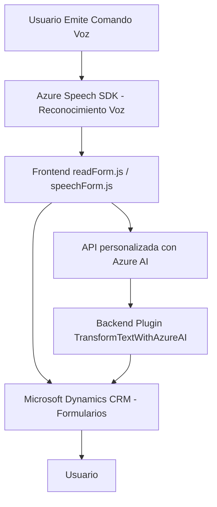

### Breve Resumen Técnico:

El repositorio representado describe varias funcionalidades relacionadas con formularios y servicios de voz e inteligencia artificial (IA). Combina tres partes principales: lógica de frontend en JavaScript (manejo de formularios y reconocimiento de voz), un plugin en C# para integrar Microsoft Dynamics CRM, y acceso a servicios externos como Azure Speech SDK y Azure OpenAI. Esta solución utiliza patrones comunes de desarrollo, servicios gestionados en la nube y arquitectura basada en integración modular.

---

### Descripción de Arquitectura:

**Tipo de Solución**: 
- Es un sistema híbrido, compuesto por dos frentes principales: una aplicación de frontend (JavaScript) que integra funcionalidades del navegador para interacción con el usuario, y una capa backend que utiliza un plugin en C# para extender las funcionalidades de Microsoft Dynamics CRM.

**Arquitectura**: 
- **Frontend**: Basado en N capas y modularidad. 
- **Backend**: Arquitectura basada en plugins (compatible con Dynamics CRM) y patrones SOA (Service-Oriented Architecture), dado que delega responsabilidades de procesamiento a servicios externos.
  
La solución fomenta una arquitectura descentralizada en la capa de IA y síntesis de voz, utilizando servicios de Azure como elementos externos que actúan como microservicios para la solución.

---

### Tecnologías Usadas:

1. **Frontend (JavaScript)**:
   - Azure Speech SDK: Reconocimiento de voz y síntesis de voz.
   - ECMAScript: Funciones modulares para formularios (CRUD y manejo de eventos del usuario).
   - Modular JavaScript: Separación de responsabilidades por archivo.

2. **Backend (Microsoft Dynamics Plugin)**:
   - C# y .NET Framework: Desarrollo de plugins compatibles con Dynamics CRM.
   - Azure OpenAI API: Procesamiento avanzado de texto basado en IA.
   - Microsoft Dynamics SDK: Interactuar con los datos del CRM mediante `IPluginExecutionContext`.

3. **Dependencias Externas**:
   - API de Azure Speech SDK.
   - API de Azure OpenAI.
   - Manejo de solicitudes HTTP (`System.Net.Http` en C#).
   - Serialización/deserialización JSON (System.Text.Json y Newtonsoft.Json).

---

### Diagrama Mermaid (100 % compatible con GitHub Markdown):

---

### Conclusión Final:

La solución presentada está dirigida a formularios en entornos CRM, con un énfasis en la interacción basada en voz. Utiliza servicios externos de Azure (Speech SDK y OpenAI API) para mejorar la experiencia del usuario y procesar datos dinámicamente. La arquitectura modular y los patrones usados (SOA, Plugin Architecture, modularidad en el frontend) aseguran escalabilidad y adaptabilidad en ambientes corporativos.

Sin embargo, existen dos consideraciones clave:
1. **Seguridad**: Debe mejorar el manejo de claves API, ya que pueden ser expuestas en archivos fuente.
2. **Scalabilidad**: Aunque las APIs son gestionadas (cloud-native), es importante medir el costo asociado si la carga del sistema crece considerablemente.

En conjunto, esta es una solución robusta y bien diseñada para automatizar tareas y mejorar la interacción basada en voz dentro de un entorno CRM sistematizado.