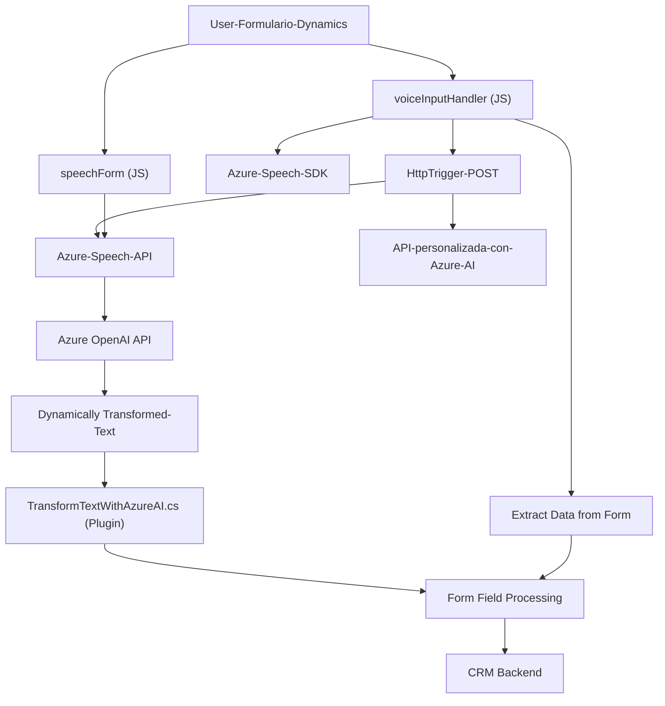

### Breve Resumen Técnico
El repositorio contiene componentes tecnológicos para integrar funcionalidades de voz y procesamiento de texto, implementadas principalmente en una solución basada en **Microsoft Dynamics CRM** y **Azure Cognitive Services**. Los archivos proporcionan lógica de frontend (JavaScript) y backend (C#) para interactuar con formularios dinámicos y servicios de inteligencia artificial.

---

### Descripción de la Arquitectura
La arquitectura general corresponde a un modelo **n capas** dentro del marco de **Microsoft Dynamics CRM**:
1. **Capa de presentación (frontend)**: Implementada con archivos JavaScript (`readForm.js` y `speechForm.js`). Encargada de habilitar funcionalidades de entrada/salida de voz en los formularios del CRM, utilizando el Azure Speech SDK para síntesis y reconocimiento de voz.
2. **Capa de lógica de negocio (backend)**: Implementada mediante el plugin `TransformTextWithAzureAI.cs`, que extiende las funcionalidades del CRM para procesar texto utilizando servicios de IA (Azure OpenAI). Este componente utiliza un patrón de **plugin-based architecture** común en sistemas Dynamics.
3. **Capa de integración**: Interacción con Azure Speech SDK (JS frontend) y Azure OpenAI (plugin backend), realizando solicitudes HTTP mediante servicios y APIs previamente configurados.

---

### Tecnologías Usadas
1. **Frontend (JavaScript):**
   - **Azure Cognitive Services Speech SDK**: Para la sintetización y reconocimiento de voz.
   - **Pattern**: Modular design, lógica basada en eventos y carga condicional de recursos (`ensureSpeechSDKLoaded`).

2. **Middle/Backend (C# Plugin):**
   - **Microsoft Dynamics CRM SDK**: Implementación de `IPlugin` para manejar eventos de Dynamics CRM.
   - **Azure OpenAI Service**: Usado para transformar texto según reglas específicas.
   - **Newtonsoft.Json.Linq**: Procesamiento de las respuestas JSON de APIs externas.
   - **HTTP Communication Library**: Integración con servicios externos mediante `System.Net.Http`.

---

### Dependencias y Componentes Presentes
1. **Azure Cognitive Services Speech SDK (`SpeechSDK`)** para el reconocimiento y síntesis de voz. Cargado como dependencia externa a través de un CDN.
2. **Microsoft Dynamics CRM SDK**, que permite la integración del plugin como lógica extendida en CRM.
3. **Azure OpenAI API** para la transformación avanzada de texto mediante inteligencia artificial.
4. **Newtonsoft.Json.Linq** para el manejo de datos JSON complejos en el backend.
5. **Xrm.WebApi** para operaciones CRUD y llamadas a APIs personalizadas desde Dynamics CRM.

---

### **Diagrama Mermaid**

---

### Conclusión Final
1. La solución completa se configura como un **API y componente integrado** especializado en mejorar la interacción hombre-máquina a través de tecnología de reconocimiento de voz y AI en un sistema de CRM (Dynamics).
2. La arquitectura se alinea con el patrón **n-capas**, diferenciando la lógica en frontend, backend, y servicios externos de integración.
3. La solución utiliza de manera eficiente los servicios de **Azure Cognitive Services**, con énfasis en recargar scripts según las necesidades de ejecución del flujo.
4. Es una solución apropiada para entornos CRM empresariales, pudiendo escalar hacia infraestructuras más complejas, como microservicios, en caso de ser necesario en el futuro.