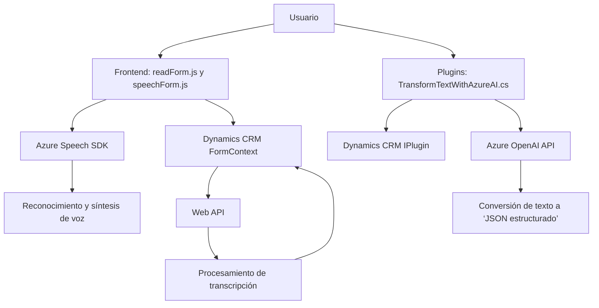

### Resumen Técnico:
El repositorio contiene archivos diseñados para una solución integrada que emplea **Microsoft Dynamics CRM** junto con servicios externos de **Microsoft Azure Speech SDK** y **Azure OpenAI**. La funcionalidad incluye **reconocimiento de voz**, **síntesis de voz**, y **transformación de datos mediante IA**, además de la gestión dinámica de formularios.

---

### Descripción de Arquitectura:
- **Tipo de solución:** La solución es una combinación de frontend cliente-prefijo (`JS`) y plugins (`C#`) que interactúan con Dynamics CRM, formando una arquitectura híbrida centrada en la extensión de una plataforma SaaS.
- **Arquitectura:** Predominantemente una **arquitectura n-capas**:
  - **Presentación (Frontend):** Scripts en JavaScript interactúan directamente con formularios de Dynamics CRM y servicios de reconocimiento/síntesis de voz de Azure.
  - **Lógica de negocio:** Plugins en C# añaden funcionalidad para procesar datos en Dynamics CRM, integrándose con servicios de OpenAI.
  - **Servicios externos:** Azure Speech SDK y OpenAI REST API como servicios SaaS.

- **Patrones usados:**
  - **Modularidad:** Las funciones están claramente segmentadas por propósito en los archivos JS y C#.
  - **Plugins:** Extensión de funcionalidades siguiendo las reglas de Dynamics CRM con `IPlugin`.
  - **Servicio-Oriented Architecture (SOA):** Uso de SDKs y servicios externos (REST APIs).
  - **Carga dinámica:** Carga del Speech SDK solo cuando es necesario, optimizando recursos.

---

### Tecnologías Usadas:
1. **Frontend:**
   - **JavaScript** para interacción con formularios y SDKs.
   - **Azure Speech SDK**: Para reconocimiento y síntesis de voz.
   - **Dynamics CRM Web API** para manejo de datos empresariales.

2. **Backend/Plugins:**
   - **C#** en el ecosistema de Microsoft Dynamics CRM.
   - **Azure OpenAI API** para procesamiento de texto basado en IA.
   - **Newtonsoft.Json** para la manipulación de JSON.
   - **HttpClient** para llamadas a APIs RESTful.

3. **Dependencias Externas:**
   - Azure Speech SDK (`window.SpeechSDK`).
   - Azure OpenAI REST API.
   - Microsoft Dynamics CRM Web API (`Xrm.WebApi`).

---

### Diagrama Mermaid Compatible con GitHub Markdown:

---

### Conclusión Final:
Este repositorio implementa una **solución altamente modular y extensible** que apoya la interacción avanzada entre formularios dinámicos en **Microsoft Dynamics CRM** y servicios basados en **Azure**. Los scripts de frontend gestionan reconocimiento/síntesis de voz y manipulación de datos en tiempo real, mientras que los plugins en C# se encargan de extender la funcionalidad CRM mediante integración con **IA en OpenAI**. La arquitectura n-capas garantiza separabilidad de responsabilidades y un modelo escalable, ideal para aplicaciones empresariales modernas que combinan IA con soluciones SaaS.