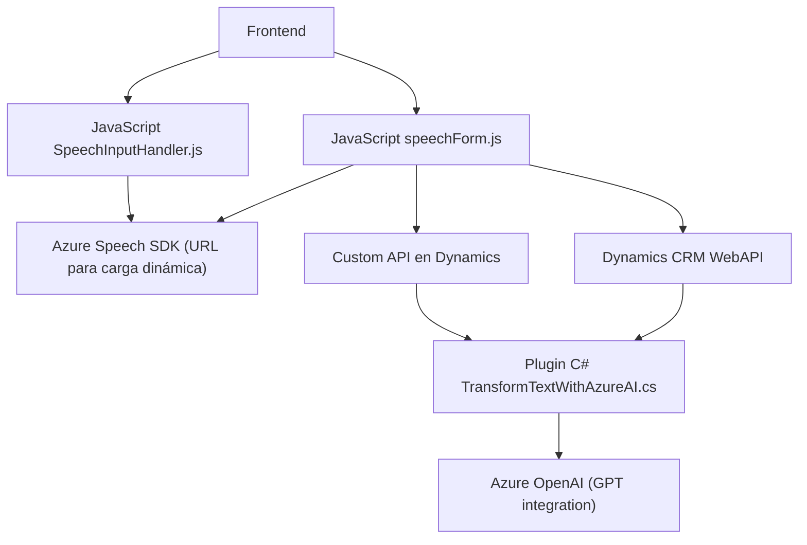

### Breve resumen técnico

Este repositorio está orientado a una solución que facilita interacciones por voz y procesamiento de datos en formularios, integrándose con **Dynamics CRM** y tecnologías de **Azure**. Se divide en componentes frontend y plugins backend que trabajan juntos para lograr transcripciones dinámicas y sintetización de texto, con soporte de IA.

---

### Descripción de arquitectura

La arquitectura está basada en **n capas**, donde:
1. El frontend maneja la interfaz y lógica de usuario mediante JavaScript.
2. Azure Speech SDK se utiliza para reconocimiento y síntesis de voz.
3. La capa backend, mediante plugins (`TransformTextWithAzureAI.cs`), integra con **Dynamics CRM** para el procesamiento avanzado del texto mediante API de **Azure OpenAI GPT-4**.

Esto presenta una arquitectura modular con separación clara de responsabilidades, además de integración de microservicios externos como Azure Speech y OpenAI.

---

### Tecnologías usadas
- **Frontend**:
  - **JavaScript** (ES6) para manipulación del DOM y lógica de la experiencia del usuario.
  - **Azure Speech SDK** para reconocimiento y síntesis de voz.
  - **Dynamics CRM Context** (`executionContext` y `formContext`) para interacción directa con formularios CRM.
  
- **Backend**:
  - **C#** para la implementación de lógica en un plugin basado en Dynamics CRM (`IPlugin`).
  - **Azure OpenAI GPT-4** para procesamiento y transformación avanzada de texto.
  - Librerías: `Newtonsoft.JSON`, `System.Text.Json` para estructuras JSON, y SDKs proporcionados por Dynamics CRM.

---

### Dependencias o componentes externos presentes
1. **Azure Speech SDK**: Reconocimiento y síntesis de voz en tiempo real.
2. **Dynamics CRM**:
   - Contexto de ejecución de formularios para manipulación.
   - APIs personalizadas (`CustomPlugin` y WebAPI) para extender su funcionalidad.
3. **Azure OpenAI**:
   - Provee la lógica avanzada de transformación de texto mediante integración con GPT-4.
4. **Librerías externas** para construcción JSON (`Newtonsoft.Json`) y manipulación avanzada.
5. **DOM Manipulation** para integración en el navegador.

---
  
### Diagrama Mermaid 100 % compatible con GitHub Markdown

---

### Conclusión final

Este repositorio implementa una solución de **n capas** basada en **Dynamics CRM** con integración de servicios en la nube, incluyendo **Azure Speech SDK** y **Azure OpenAI GPT-4**. La arquitectura sigue patrones de modularización, integración de microservicios y separación de responsabilidades entre frontend (input por voz) y backend (transformaciones automáticas de texto).