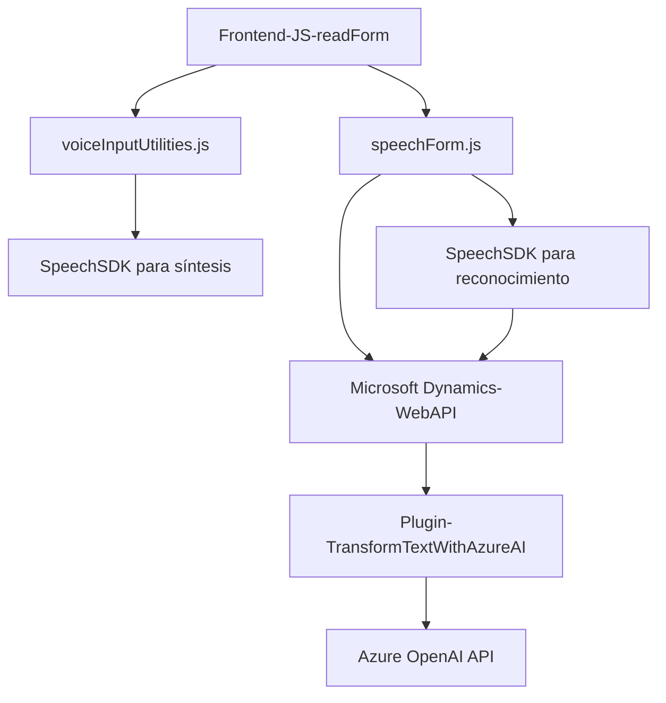

### Breve resumen técnico
Este repositorio incluye diferentes archivos organizados en tres ámbitos principales:
1. **Frontend en JavaScript**: Implementación de funciones para manipulación DOM, integración con SDK externos como Azure Speech, y procesamiento local de datos en formularios.
2. **Integración con reconocimiento de voz y OpenAI usando SDK Azure**: Lógica que permite captura, procesamiento y síntesis/transcripción de texto y voz.
3. **Plugin para Microsoft Dynamics CRM**: Extiende el sistema CRM para incorporar llamadas a Azure OpenAI y realizar transformaciones en texto de entrada.

La solución es altamente integrada con plataformas Microsoft (Dynamics CRM y Azure) y utiliza servicios externos para funciones específicas (convertir texto en voz, interpretar texto mediante IA).

---

### Descripción de arquitectura
La solución tiene una arquitectura de **varias capas**:
1. **Frontend**: Implementa lógica de negocio para capturar datos y manejar voz.
2. **Backend/Plugins para Dynamics CRM**: Contiene procesos que interactúan con servicios internos dentro de Dynamics CRM y APIs externas para transformar datos utilizando IA.

Por estructura, la solución se asemeja a una **arquitectura de n capas**, con integración de servicios externos (Azure Speech SDK, OpenAI API).

---

### Tecnologías usadas
1. **JavaScript**: Para habilitar funcionalidades en el lado cliente.
2. **Azure Speech SDK**: Sintetización y reconocimiento de voz.
3. **Microsoft Dynamics CRM**: Integración de los formularios con lógica CRM y plugins personalizados.
4. **Azure OpenAI Services**: Para procesar contenido textual en lenguaje natural.
5. **HTTP integrations**: Realización de solicitudes a APIs externas como Azure.
6. **JSON (System.Text.Json, Newtonsoft)**: Para manejar datos en forma estructurada y establecer la comunicación entre micro-componentes.

---

### Diagrama Mermaid

---

### Conclusión final
Esta solución presenta una arquitectura **n-capas** con fuerte integración a servicios Microsoft y Azure. El frontend interactúa con `JavaScript` y el SDK de Azure Speech para realizar síntesis y reconocimiento de texto/voz, mientras que el backend en `C#` integra la funcionalidad extendida utilizando plugins para Microsoft Dynamics CRM. Además, el uso de Azure OpenAI como API externa agrega capacidades de procesamiento IA, orientando la solución hacia automatización y manipulación inteligente de datos.