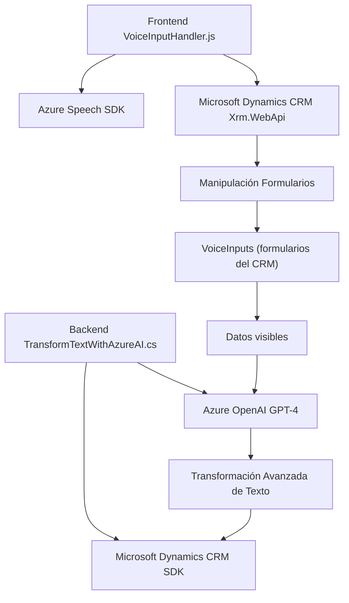

### **Breve Resumen Técnico**
Este repositorio implementa una solución integrada de reconocimiento y síntesis de voz junto con procesamiento avanzado de texto en un contexto de **Microsoft Dynamics CRM**, utilizando **Azure SDKs** y APIs externas. Los archivos indicados se distribuyen entre el frontend en JavaScript y un plugin en C#, formando una arquitectura integrada que extiende las capacidades de CRM con servicios de Azure.

### **Descripción de Arquitectura**
La solución tiene una arquitectura híbrida distribuyendo su funcionalidad entre:
1. **Frontend (JS)**: Encargado de la manipulación del formulario en tiempo de ejecución (lectura de datos y entrada de voz). Utiliza la técnica **event-driven** (detonación de flujos por eventos como interacción del usuario).
2. **Plugin Backend (C#)**: Responsable de las transformaciones avanzadas de texto utilizando IA en Azure OpenAI. Implementa el patrón **plugin-based** para extender funcionalidad directamente dentro del sistema CRM.
3. **Integración con servicios externos**:
   - **Azure Speech SDK** para entrada y salida de voz.
   - **Azure OpenAI GPT-4** para transformación avanzada de texto.

La arquitectura general puede describirse como un **modelo n-capas** con separación entre frontend, backend y servicios externos.

### **Tecnologías Usadas**
1. **Frontend (JS):**
   - **JavaScript** para lógica del cliente.
   - Azure Speech SDK para reconocimiento y síntesis de voz.
   - DOM para interacción dinámica con el CRM.
   - Promesas/async para manejar operaciones asincrónicas como cargas dinámicas y procesamiento de datos.

2. **Backend (C# Plugin):**
   - Microsoft Dynamics CRM SDK (`Microsoft.Xrm.Sdk`) para manipulación de datos.
   - Azure OpenAI Service para procesar texto con GPT-4.
   - Librerías de .NET (System.Net.Http, System.Text.Json) para solicitud de servicios externos.
   - Evento `IPlugin` basado en CRM.

### **Diagram Mermaid 100 % compatible**

### **Conclusión Final**
Este repositorio demuestra una solución entrelazada que mejora las capacidades de Microsoft Dynamics CRM mediante tecnologías modernas como integración de voz con **Azure Speech SDK** y procesamiento textual avanzado con **Azure OpenAI GPT-4**. La solución es ideal para sistemas CRM que requieran accesibilidad por voz y transformación de texto dinámica basada en servicios IA. Su estructura modular, distribuida en el frontend y un plugin backend, combina patrones como **n-capas**, **plugin-based** y **servicio-orientado**, asegurando escalabilidad y mantenibilidad.