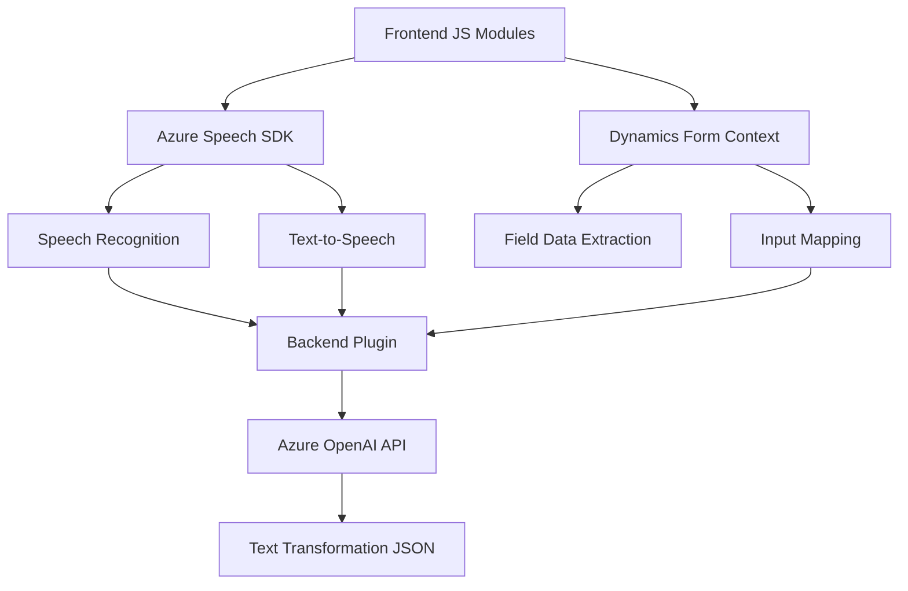

### Resumen Técnico
El repositorio parece implementar una solución compuesta por un frontend (con funciones de interacción y síntesis de voz) y un backend basado en plugins para Microsoft Dynamics CRM. La solución destaca por utilizar tecnologías como **Azure Speech SDK** y **Azure OpenAI**, integradas para facilitar reconocimiento de voz, síntesis de audio, y procesamiento escalable en entornos CRM.

### Descripción de la Arquitectura
La arquitectura está orientada hacia **microservicios híbridos**. El frontend actúa como un consumidor directo de servicios como Azure Speech SDK y el backend extiende Dynamics CRM mediante plugins. El flujo general utiliza patrones como **SDK Wrappers**, **Event-driven Architecture**, y **Service-Oriented Architecture (SOA)** para gestionar eventos (e.g., voz reconocida o texto transformado). Se divide en:
1. **Frontend**: Enfocado en la interacción directa con el usuario (reconocimiento de voz y síntesis).
2. **Backend**: Procesamiento avanzado de texto con OpenAI integrado a través de servicios CRM.

La solución adopta patrones **modulares** donde cada bloque realiza funciones específicas (e.g., cargar SDK, transformar texto, sintetizar datos). Aunque no se detalla explicitamente, se favorece mantener **desacoplamiento** entre frontend y backend.

### Tecnologías Usadas
1. **Frontend**:
   - JavaScript para funciones del lado del cliente.
   - SDK Azure Speech para reconocimiento de voz y síntesis.
   - Integración con Dynamics CRM para lectura y mapeo de datos de formularios.

2. **Backend**:
   - **C#:** Base para escribir plugins en Dynamics CRM.
   - **Azure OpenAI:** API para transformar texto mediante IA.
   - **Microsoft Xrm SDK**: Herramientas para manipular datos de CRM.
   - **HTTP Requests:** Para la interacción con servicios externos (OpenAI).

### Dependencias y Componentes Externos
La solución utiliza los siguientes componentes:
1. **Servicios en la nube**:
   - Azure Speech SDK (para síntesis y reconocimiento de voz).
   - Azure OpenAI (para transformación de texto).

2. **Librerías externas**:
   - En backend: Newtonsoft.Json para manejar JSON avanzado.
   - En frontend: recursos dinámicos cargados desde URLs públicas (`https://aka.ms/csspeech/jsbrowserpackageraw`).

3. **Integración con entornos internos**:
   - Microsoft Dynamics CRM: Extendido mediante plugins y personalizado para interacción directa con formularios.

### Diagrama Mermaid

### Conclusión Final
La solución es un **ecosistema de servicios integrados** que fusiona interacción de voz (frontend con Azure Speech SDK y Dynamics) con procesamiento avanzado de texto (backend mediante Dynamics plugins y Azure OpenAI). La arquitectura modular y bien definida permite un desacoplamiento significativo, favoreciendo el mantenimiento y escalabilidad del sistema.

Se destaca el uso de patrones robustos, como **SOA** (a través de llamadas a servicios externos) y **SDK Wrappers**, para encapsular el comportamiento de componentes complejos como Azure SDKs. Adicionalmente, la aplicación jerárquica entre frontend y backend simplifica el flujo lógico y facilita la extensión futura.