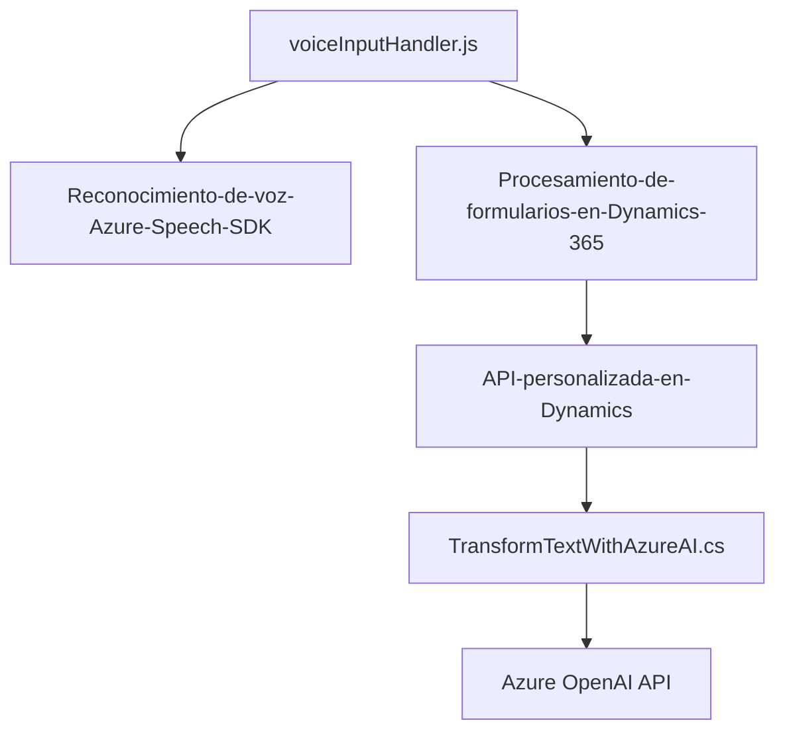

### Resumen técnico
Este repositorio forma parte de una solución diseñada para interactuar con formularios en Microsoft Dynamics 365, integrando funcionalidad de inteligencia artificial y reconocimiento de voz. Incluye tanto una capa de frontend basada en JavaScript como una capa backend en C# que extiende Dynamics CRM mediante plugins.

### Descripción de la arquitectura
La arquitectura sigue el patrón **cliente-servidor** y utiliza una combinación de diferentes tecnologías y patrones:
- **Frontend (JavaScript):** Maneja la entrada y salida de datos formulados mediante el reconocimiento y síntesis de voz. Se basa en el Azure Speech SDK y apoya el procesamiento de formularios en Dynamics 365.
- **Backend (C# plugin):** Amplía la funcionalidad de Dynamics CRM invocando servicios externos (Azure OpenAI) para transformaciones de texto avanzadas.

En general, la solución se organiza en la arquitectura **n-capas**, donde:
1. **Frontend:** Procesa voz y texto en el cliente.
2. **Backend:** Ejecuta lógica empresarial personalizada en forma de plugins.
3. **Servicios externos:** Azure Speech SDK para voz y Azure OpenAI para procesamiento avanzado de texto.

### Tecnologías usadas
- **Frontend:**
  - Lenguaje: JavaScript.
  - SDK: Azure Speech.
  - Entorno: Microsoft Dynamics 365 (manipulación de formularios).

- **Backend (plugins):**
  - Lenguaje: C#.
  - Framework: Dynamics CRM SDK, .NET Framework/Core.
  - API externa: Azure OpenAI.

### Dependencias o componentes externos
1. **Azure Speech SDK:** Para reconocimiento y síntesis de voz.
2. **Azure OpenAI API:** Para transformación avanzada de texto.
3. **Microsoft Dynamics CRM:** Utilizada como base para manipular datos en formularios.
4. **HttpClient:** Para integración de APIs externas.

---

### Diagrama Mermaid

### Conclusión final
La solución está diseñada para automatizar procesos en una plataforma CRM como Microsoft Dynamics 365 utilizando capacidades avanzadas de inteligencia artificial y reconocimiento de voz. Su arquitectura de n-capas asegura modularidad y reutilización, permitiendo que cada aspecto de la funcionalidad (voz, procesamiento de formularios y transformación de texto) actúe de manera separada pero coordinada. Los patrones utilizados proporcionan robustez y flexibilidad, mientras las dependencias en Azure (Speech SDK y OpenAI API) garantizan funcionalidad avanzada.