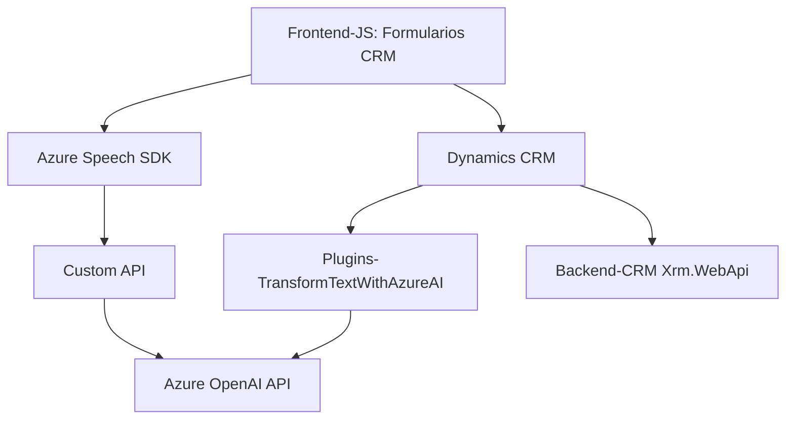

# Resumen Técnico

Este repositorio implementa una solución enfocada en la interacción entre el frontend y Dynamics CRM utilizando tecnologías de Azure. Incluye módulos de frontend para síntesis y reconocimiento de voz, comunicación con APIs externas, y un plugin en el backend que usa Azure OpenAI para procesar datos. La solución facilita la ejecución de tareas automatizadas y la mejora de la interacción entre usuarios y la plataforma CRM.

---

# Descripción de la Arquitectura

La arquitectura combina **cliente-servidor** y **n-capas**:
1. **Frontend (Cliente)**:
    - Módulos JavaScript procesan datos del formulario, reconocimiento de voz y síntesis de texto, integrados con Azure Speech SDK.
    - Se comunica directamente con APIs externas y Dynamics CRM.

2. **Backend (Servidor)**:
    - Plugin en Dynamics CRM (TransformTextWithAzureAI.cs) ejecuta lógica específica y conecta con Azure OpenAI para transformar datos.
    - Esto le da un enfoque de **arquitectura basada en servicios**, con integración de microservicios como Azure (Speech y OpenAI).

El flujo de datos usa una arquitectura **modular** con delegación clara de responsabilidades entre funciones. Además, hay asincronismo en la carga de SDKs y el uso de APIs externas, optimizando el procesamiento de tareas.

---

## Tecnologías Usadas

- **Frontend**:
  - JavaScript (modular y asincrónico).
  - **Azure Speech SDK**: Reconocimiento y síntesis de voz.
  - Integración con **Dynamics CRM**.
  - Uso de APIs internas de Dynamics CRM (Xrm.WebApi).

- **Backend**:
  - **C#**: Desarrollo de plugins con el framework de Dynamics CRM.
  - **Microsoft.Xrm.Sdk**: API oficial de Dynamics CRM.
  - **Azure OpenAI**: Procesamiento avanzado de texto.
  - **Newtonsoft.Json.Linq** y **System.Text.Json**: Manejo JSON para comunicación con APIs.

- **General**:
  - Integración dinámica entre el cliente y los servicios externos, con patrones de carga condicionada y asincronismo en SDKs y API.

---

# Diagrama **Mermaid**

A continuación, una representación del flujo simplificado entre componentes:

---

# Conclusión Final

Este repositorio presenta una solución orientada a integrar tecnologías de AI con Dynamics CRM para mejorar la interacción entre usuarios y plataformas empresariales. Su arquitectura combina un diseño modular en el frontend con un backend basado en servicios usando plugins. El uso de Azure Speech SDK y OpenAI proporciona capacidades avanzadas de voz y procesamiento de texto que complementan un flujo práctico y eficiente para entornos CRM.

A pesar de su potencial, algunas áreas de mejora son evidentes:
- **Seguridad**: Es necesario externalizar las claves de API y configuraciones sensibles.
- **Escalabilidad**: Para arquitecturas que escalen mejor, considerar un enfoque completo de microservicios para el backend, más allá de Dynamics CRM.
- **Mantenimiento**: Centralizar los modelos de datos para evitar duplicación de lógica.

En general, la solución está bien estructurada para automatización empresarial, con una sólida integración con servicios de Azure y un uso práctico de las capacidades de Dynamics CRM.