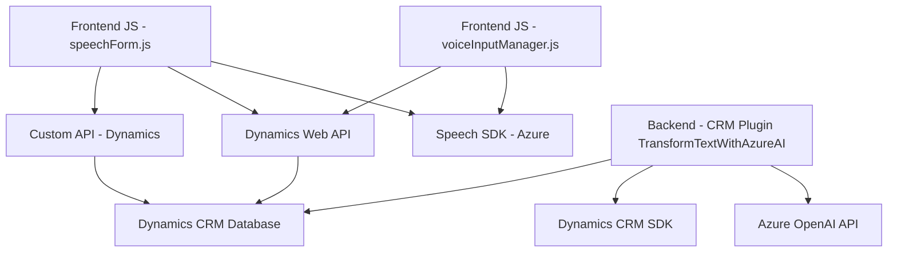

### Breve resumen técnico:
El repositorio proporcionado implementa múltiples funcionales orientadas a la integración entre tecnologías Azure (Speech SDK y OpenAI) y Dynamics 365 CRM. Los archivos presentados incluyen componentes frontend para interacción con formularios mediante voz, backend para procesamiento avanzado de texto utilizando Azure OpenAI, y plugins desarrollados para extender Dynamics 365.

---

### Descripción de arquitectura:
La solución combina varias arquitecturas:
1. **Frontend Modular** con interacción dinámica:
   - Los archivos JavaScript implementan módulos especializados para interacción con voz (Azure Speech SDK), procesamiento de datos y manipulación de formularios en el cliente.
2. **Plugin CRM**:
   - El archivo C# (`TransformTextWithAzureAI.cs`) sigue el patrón Plugin proporcionado por Dynamics CRM SDK para extensibilidad. Este diseño permite transformar texto utilizando el servicio Azure OpenAI mediante reglas personalizables.
3. **Integración distribuidora**:
   - El uso directo de APIs externas como Azure Speech SDK y OpenAI indica una arquitectura de integración de microservicios externos.

### Tecnologías usadas:
1. **Frontend**:
   - JavaScript.
   - Azure Speech SDK.
   - Dynamics Web API (Xrm.WebApi).
2. **Backend/CRM Plugin**:
   - C# sobre Dynamics 365 CRM SDK.
   - Azure OpenAI API.
   - Newtonsoft.Json y System.Text.Json para manejo de datos JSON.
   - .NET Framework/SDK diseñado para plugins.
3. **Externos**:
   - Servicios Azure: OpenAI y Speech SDK.
   - Dynamics 365 CRM.

### Dependencias o componentes externos:
1. **Azure OpenAI API**: para procesamiento avanzado de texto.
2. **Azure Speech SDK**: para reconocimiento y síntesis de voz.
3. **Dynamics Web API**: para interacción interna con el CRM.
4. **Plugin server-side dependencies**:
   - CRM SDK.
   - .NET Framework.

---

### Diagrama Mermaid 100 % compatible con **GitHub Markdown**:

---

### Conclusión final:
La solución es una integración completa entre módulos cliente, servicios cloud (Azure), y extensiones backend de Dynamics 365 CRM. Cuenta con una arquitectura modular y altamente distribuida que aprovecha servicios externos de Microsoft Azure para voz y procesamiento de lenguaje natural. Los patrones de diseño aplicados (modularidad, desacoplamiento y Gateway) facilitan la escalabilidad y mantenibilidad.