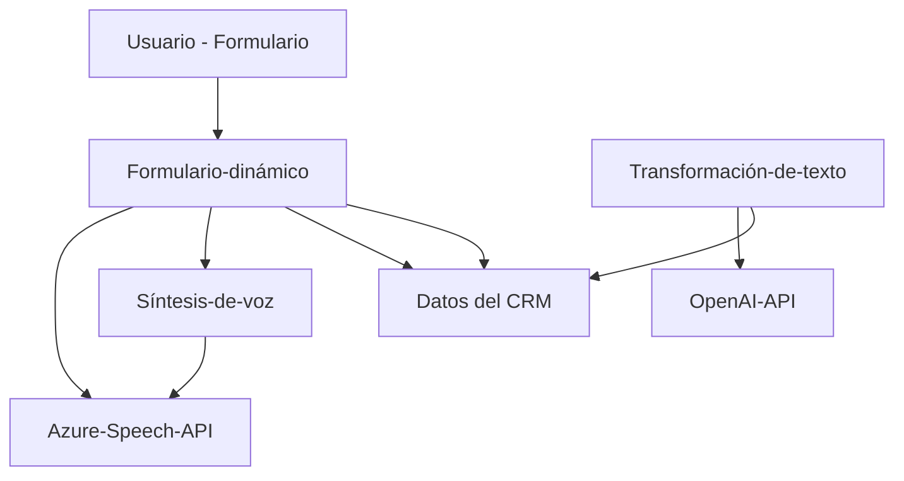

### Breve resumen técnico

El repositorio presentado implementa una solución integrada para gestionar formularios en Microsoft Dynamics CRM y utilizar los servicios de Azure (Speech SDK y OpenAI) para análisis y conversión de datos en tiempo real. Incluye funcionalidad tanto para la síntesis y captura de voz como para la transformación avanzada de texto. La solución abarca tres aspectos principales: generación de voz a partir de formularios, entrada de voz para rellenar formularios y un plugin para transformar texto con Azure OpenAI.

---

### Descripción de arquitectura

1. **Tipo de solución**:  
   Combinación híbrida de arquitectura de SaaS con componentes integrados:
   - **Frontend** en JavaScript: gestiona funcionalidades del cliente y se conecta con el SDK de Azure.
   - **Backend**: plugin para Dynamics CRM desarrollado en C#, conectado con Azure OpenAI.

2. **Arquitectura principal**:  
   **N-capas con integración de Service-Oriented Architecture (SOA)**.  
   - **Datos (Data Layer)**: 
     Usa el contexto del formulario de Dynamics CRM para acceder a datos capturados del usuario, junto con peticiones HTTP para integrar Azure OpenAI.  
   - **Lógica empresarial (Business Logic):**
     La capa donde reside el plugin de Dynamics CRM y la lógica de transformación de textos mediante servicios externos.  
   - **Presentación (UI Layer):**
     El código del frontend facilita la interacción directa del usuario con los formularios visuales y la captura de voz.  
   - **Integración de servicios externos (Service Layer):**  
     Reflejada en la carga dinámica del SDK de Azure Speech y el consumo de APIs externas (Azure OpenAI).  

3. **Principales patrones utilizados**:
   - Modularización de lógica: con funciones de responsabilidad única orientadas a la reutilización.
   - Interacción *SDK wrapper*: Wrapper para encapsular el uso del Azure Speech SDK.
   - Event-driven architecture: Respuestas activadas por acciones de usuario (entrada de voz, carga de SDK, etc.).
   - Service orchestration: Interacción estructurada entre estructura empresarial interna y servicios externos (Azure OpenAI, Speech SDK).

---

### Tecnologías, frameworks y patrones

1. **Frontend:**
   - Lenguaje: JavaScript.
   - SDK: Azure Speech SDK.
   - Framework: Integración con Dynamics CRM Frontend APIs (`executionContext`, `formContext`).
   - Patrón: Modularidad, orientación a eventos, data-binding en formularios.

2. **Backend Plugin:**
   - Lenguaje: C# (.NET Framework).
   - SDK: Microsoft Dynamics CRM SDK (interacción con datos y servicios).
   - Cliente HTTP: `System.Net.Http` para conectarse con la API de Azure OpenAI.
   - JSON: `System.Text.Json` y `Newtonsoft.Json.Linq` para manejar respuestas JSON.
   - Patrón: Plugin Architecture, integración con servicios externos, métodos asincrónicos.

3. **Servicios externos:**
   - API de Azure Speech para texto a voz y reconocimiento de voz.
   - API de Azure OpenAI para transformación de texto.

---

### Diagrama Mermaid

Diagrama explicativo de cómo los componentes y servicios del repositorio interactúan, cumpliendo las reglas dadas:

---

### Conclusión final

El repositorio implementa una solución avanzada basada en la integración de servicios de Azure y Dynamics CRM, siguiendo un enfoque de **arquitectura N capas con integración de SOA**. Utiliza tecnologías modernas como **JavaScript, C#, Azure Speech SDK y OpenAI API** para optimizar la interacción y el procesamiento de datos en tiempo real. La solución está diseñada modularmente, facilitando mantenimiento y extensibilidad.

Una posible mejora sería aumentar la flexibilidad para manejar idiomas y agregar una capa robusta de tratamiento de errores. También se podría extender la funcionalidad para contextos multilingües y formularios más complejos conformados por valores jerárquicos.

Es una implementación ideal para entornos en los que se requieran automatización avanzada de voz y texto junto con aplicaciones empresariales como Dynamics CRM.