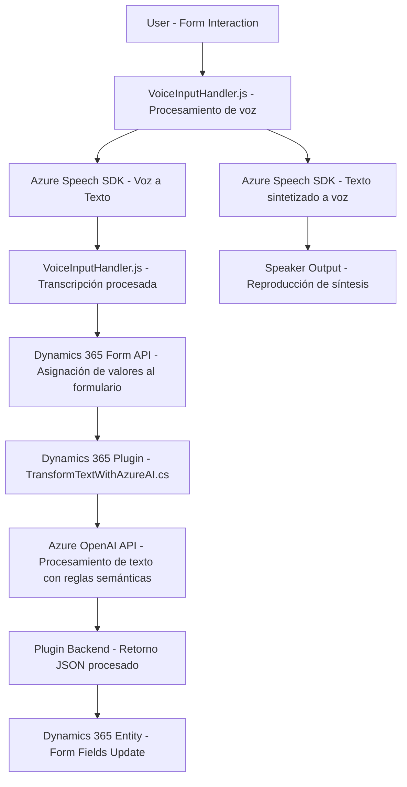

### Breve Resumen Técnico
El repositorio contiene varios archivos orientados al desarrollo de soluciones para la interacción de voz y procesamiento de entradas en aplicaciones empresariales basadas en Dynamics 365 y Azure. Los archivos analizados, especialmente en las categorías `Frontend/JS` y `Plugins`, están diseñados para integrar funcionalidades de voz y OpenAI con Dynamics CRM, utilizando software como los SDK de Azure y APIs personalizadas.

---

### Descripción de la Arquitectura
La solución presenta una **arquitectura híbrida**, donde:

1. **Frontend JavaScript:** Se utiliza para habilitar el reconocimiento de voz, síntesis de texto hablado y procesamiento de datos dinámicos del formulario.
   - **Patrones utilizados:** Modularización, asincronismo y uso de APIs externas (Azure SDK).
   - **Tecnologías clave:** JavaScript, Azure Speech SDK, Dynamics 365 API.

2. **Backend Plugin (.NET/C#):** Desarrollado como un plugin para Dynamics CRM que transforma texto utilizando Azure OpenAI y responde a eventos dentro del sistema.
   - **Patrones utilizados:** Service-Oriented Architecture (SOA) para interactuar con Azure OpenAI.
   - **Tecnologías clave:** C#, Dynamics CRM SDK, Azure OpenAI, JSON.

Este enfoque utiliza servicios **microcontrolados**, donde la responsabilidad clave está distribuida entre el frontend, los plugins de backend y los servicios externos como Azure Speech SDK y Azure OpenAI.

---

### Tecnologías y Frameworks Usados
1. **Frontend:**
   - **JavaScript (ES6+):** Base para el código del frontend y manejo del DOM/formulario.
   - **Azure Speech SDK:** Para las capacidades de reconocimiento de voz y síntesis de texto hablado.
   - **Dynamics 365 Client API:** Para la manipulación de datos en formularios.
2. **Backend:**
   - **C#:** Lenguaje utilizado para el desarrollo del plugin.
   - **Dynamics 365 SDK:** Para integración directa con el sistema CRM.
   - **Azure OpenAI:** Procesamiento semántico avanzado de texto.
   - **HTTP Client:** Para la comunicación entre el plugin y Azure OpenAI.

---

### Dependencias o Componentes Externos
1. **Azure Speech SDK:** Proporciona funcionalidades de síntesis de voz y reconocimiento de texto hablado.
2. **Azure OpenAI (GPT-4):** Procesa y transforma texto mediante normas predefinidas.
3. **Dynamics 365 Web API:** Se utiliza para manipulación y actualización de datos en formularios y entidades del CRM.
4. **Newtonsoft.Json:** Para trabajar eficientemente con JSON en el plugin backend.
5. **Sistema de formularios y entidades de Dynamics 365.** Posiblemente configurado con roles o permisos específicos.

---

### Diagrama Mermaid

---

### Conclusión Final
El repositorio aporta una solución robusta que combina el poder del reconocimiento de voz, procesamiento semántico de texto y sistemas empresariales de gestión (Dynamics 365). Destaca por su arquitectura modular híbrida que garantiza la separación de responsabilidades y facilita la integración con servicios externos en la nube como Azure Speech SDK y Azure OpenAI.

La solución está orientada a mejorar la accesibilidad y automatizar tareas complejas, como la interacción vía voz y el procesamiento semántico avanzado con la IA de OpenAI. Esto revela un enfoque moderno y orientado a la funcionalidad empresarial avanzada, utilizando capacidades clave de plataformas en la nube.