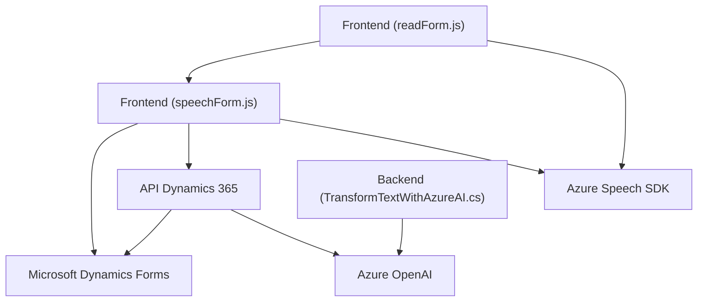

### Análisis General

En base a los archivos analizados y su descripción funcional, el repositorio tiene distintas soluciones orientadas a la interacción y procesamiento de datos entre formularios de Microsoft Dynamics CRM y servicios de Azure. En esencia, la solución incluye capas **frontend** (JavaScript), **backend** (plugins y APIs) y servicios externos (Azure Speech SDK, Azure OpenAI). A continuación, se desglosa la arquitectura y tecnologías utilizadas.

---

### Descripción de la Arquitectura

La solución muestra características de una arquitectura basada en **n-capas**, complementada con integración API y servicios externos. Se organiza en:

1. **Frontend**: Proporciona interacción directa con usuarios vía formularios, utilizando JavaScript para procesar datos de voz, transcripción y síntesis de texto. 
   - Los archivos `readForm.js` y `speechForm.js` manejan la lógica de entrada por voz, síntesis de texto y comunicación con Microsoft Dynamics CRM y servicios de Azure.
   
2. **Backend**: Implementado a través de un **plugin** (`TransformTextWithAzureAI.cs`) de Microsoft Dynamics CRM. Este plugin opera sobre la plataforma de CRM, extendiendo sus capacidades mediante la API de Azure OpenAI.

3. **Comunicación API**:
   - Se utiliza una **Custom API** de Dynamics para interactuar con servicios externos como Azure Speech SDK y Azure OpenAI.
   
4. **Servicios Externos**:
   - **Azure Speech SDK**: Captura y procesa la entrada por voz en tiempo real, con soporte multilingüe (incluído español).
   - **Azure OpenAI**: Genera objetos JSON estructurados a partir de texto utilizando IA.

---

### Tecnologías, Frameworks y Patrones Utilizados

#### Tecnologías/FW:
1. **Frontend (JavaScript)**: Desarrollo con ES6+.
2. **Backend (C#)**: Extensiones desarrolladas para Microsoft Dynamics CRM.
3. **Services**:
   - Azure Speech SDK: Para síntesis de texto y transcripción de voz.
   - Azure OpenAI SDK: Para texto estructurado basado en IA.
4. Microsoft Dynamics 365 Web API: Interacción con formularios, entidades, y Custom APIs.

#### Arquitectura y Patrones:
1. **N-Capas**: Organización del proyecto en diferentes capas de interacción: presentación (JavaScript), negocio (Dynamics API/Plugins) y datos (formularios).
2. **SDK Integration**: Usos de SDK externos (Azure Speech y OpenAI) para extender la funcionalidad.
3. **Facade**: Implementación de métodos que actúan como "frentes" para coordinar funcionalidades complejas, por ejemplo, jugar el papel de servicios que integran múltiples acciones.
4. **Dynamic Dependency Loading**: Se utiliza carga dinámica del SDK de Azure según necesidad.
5. **Extensibilidad (Plugin Pattern)**: Plugins CRM como capa extendida del negocio.

---

### Dependencias o Componentes Externos Presentes

Los siguientes elementos son externos y están integrados en el sistema:
1. **Azure Speech SDK**:
   - Para entrada y síntesis por voz en formularios (JavaScript).
   - URL de carga dinámica: `https://aka.ms/csspeech/jsbrowserpackageraw`.

2. **Azure OpenAI API**:
   - Para procesamiento de texto y generación de JSON estructurado.
   - Requiere `API Key` y `endpoint`.

3. **Microsoft Dynamics 365 Web API**:
   - Comunicaciones HTTP con Custom APIs dentro del entorno de Dynamics.
   - Dependencias proporcionadas por `Xrm.WebApi.online`.

4. **Libraries**:
   - `Newtonsoft.Json` (C#) para manejo de JSON en la capa backend.
   - `System.Net.Http` para llamadas internas obligatorias (Azure OpenAI).

---

### Diagrama Mermaid (Compatible con GitHub Markdown)

El siguiente diagrama representa las relaciones internas y externas del sistema.

---

### Conclusión Final

La solución es una **arquitectura basada en integración de servicios n-capas con soporte externo.** Presenta módulos de frontend en JavaScript para capturar y sintetizar voz, comunicación con APIs personalizadas y un plugin desarrollado en **C#** para manejo lógico en Dynamics CRM. Los servicios de Azure son el punto clave que habilita capacidades avanzadas como síntesis de voz y procesamiento por inteligencia artificial, lo que facilita tareas como interacción fluida mediante voz y generación de datos automáticos en formularios de CRM. La arquitectura es eficiente y extensible, adecuada para entornos empresariales que utilizan integraciones dinámicas.