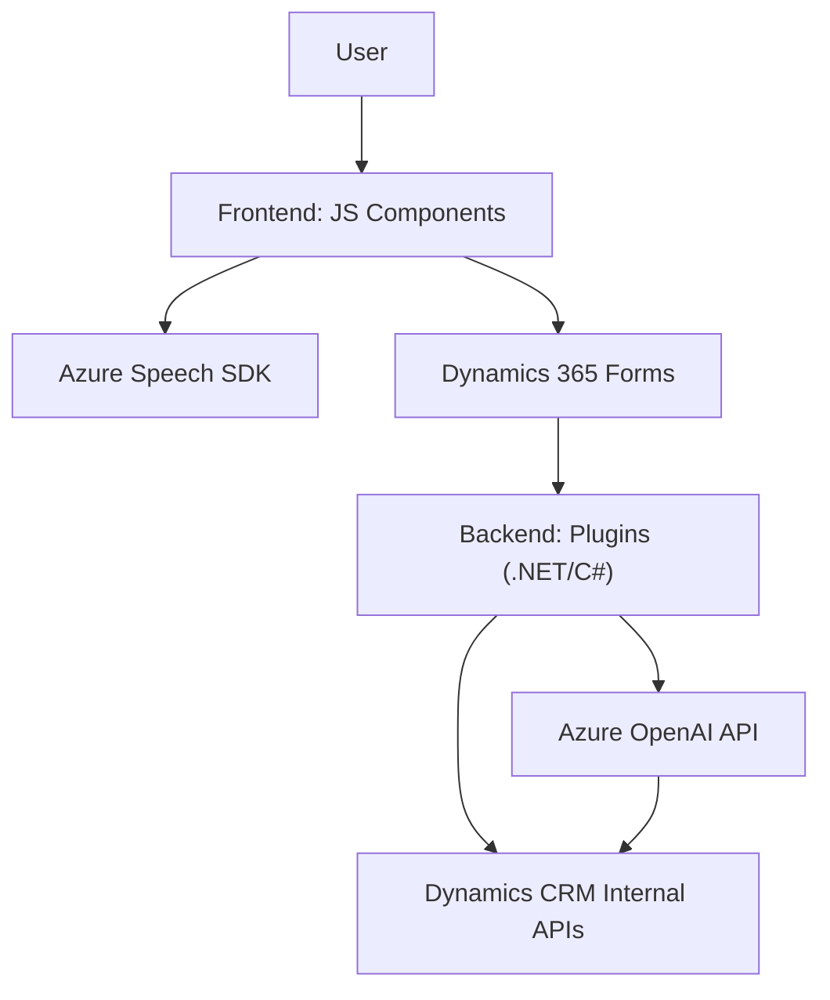

### Breve resumen técnico:

El repositorio contiene aplicaciones centradas en la interacción entre Dynamics 365 CRM y servicios de Microsoft Azure, específicamente Speech SDK y OpenAI API. Las funcionalidades principales incluyen el procesamiento de formularios digitales mediante entrada de voz, síntesis de texto a voz, análisis de datos ingresados por usuarios, y transformación de texto en formato JSON utilizando IA. Los componentes están segregados en módulos frontend y backend.

---

### Descripción de arquitectura:

1. **Tipo de solución:**
   - Se trata de una arquitectura **cliente-servidor** con funcionalidades distribuidas. El frontend utiliza JavaScript para interactuar con formularios y APIs basadas en Azure Speech SDK. El backend, específicamente un plugin de Dynamics CRM desarrollado en C#, utiliza Azure OpenAI para procesar texto.

2. **Patrón arquitectónico:**
   - **N capas:**  
     Las operaciones se dividen entre:
     - **Frontend:**  
       Con enfoque en interacción con usuario, captura y transformación de datos.  
     - **Backend:**  
       Para procesamiento avanzado y manipulación de datos con Azure y Dynamics CRM.
   - **Integración de servicios:** Uso de APIs externas (Azure Speech SDK y OpenAI) para habilitar funcionalidades de reconocimiento y síntesis de voz, así como transformación de texto.

3. **Modularidad y Lazy Loading:**
   - Los scripts del frontend cargan dependencias dinámicamente, como `SpeechSDK`.

---

### Tecnologías usadas:

1. **Frontend:**
   - **JavaScript:** Para lógica del formulario y client-side scripting.  
   - **Azure Speech SDK:** Para entrada y síntesis de voz.
   - **Dynamics 365 SDK:** Para manipular formularios CRM (usando `executionContext`).

2. **Backend:**
   - **C# con Dynamics SDK:** Para plugin de procesamiento.
   - **Azure OpenAI API:** Para transformación avanzada de texto.
   - **HttpClient y JSON:** Para llamadas HTTP y formato de datos estructurados (JSON).

3. **Otros patrones:**
   - **Lazy Loading:** Condicionalidad en la carga de SDK en runtime (en `ensureSpeechSDKLoaded`).
   - **Plugin Architecture:** En el backend con Dynamics CRM.
   - **Factory:** Métodos como `getFieldMap` generan datos dinámicos para procesar los atributos del formulario.

---

### Dependencias o componentes externos presentes:

1. **Azure Speech SDK:** Para entrada de voz y síntesis de texto a voz.
2. **Microsoft Dynamics CRM SDK:** Integración nativa del frontend y backend.
3. **Azure OpenAI API:** Para procesamiento de texto con inteligencia artificial.
4. **Libraries:** 
   - `Newtonsoft.Json`
   - `System.Net.Http` para solicitudes HTTP hacia Azure OpenAI.
5. **API personalizada:** Extensión de Dynamics CRM mediante Custom APIs (`callCustomApi()`).

---

### Diagrama Mermaid:

El diagrama representa la interacción entre frontend, backend, APIs de servicios externos y Dynamics CRM.

---

### Conclusión final:

La solución integra funcionalidades avanzadas mediante servicios de Microsoft Azure en una arquitectura cliente-servidor. El frontend aprovecha la entrada de voz y síntesis de texto con Azure Speech SDK, mientras el backend procesa datos con la ayuda del plugin de Dynamics CRM y el Azure OpenAI API. Todo se organiza según principios de **n capas**, asegurando modularidad, extensibilidad y alineación con los principios de diseño moderno para aplicaciones empresariales. Esto proporciona un sistema escalable y adecuado para transformar y analizar datos de usuario en tiempo real.