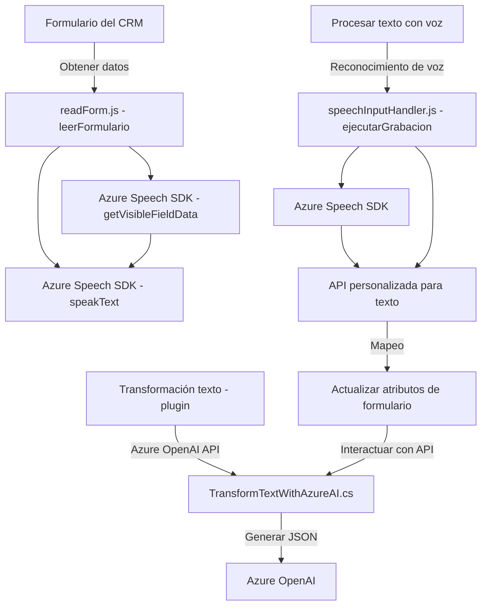

### Análisis y Explicación Técnica

#### 1. Breve resumen técnico:
El repositorio contiene componentes interrelacionados orientados a la integración de voz y transformación de texto mediante el SDK de **Azure Speech** y **Azure OpenAI** en un sistema **Dynamics CRM**. Las funcionalidades incluyen lectura y síntesis de voz, transcripción de audio a texto, transformación de texto mediante IA, y manejo dinámico de formularios CRM.

---

#### 2. Descripción de arquitectura:
La solución tiene una arquitectura basada en **servicios distribuidos**, en donde cada componente juega un rol específico:

- **JavaScript Frontend**: Scripts como `readForm.js` y `speechInputHandler.js` actúan como capas funcionales sobre la estructura de formularios en Dynamics CRM. Siguen una arquitectura **modular** con funciones independientes que interactúan con el **Azure Speech SDK** para procesamiento de voz y texto.
- **Plugin en C#**: `TransformTextWithAzureAI.cs` es un microservicio que opera bajo el modelo de **plugin** en Dynamics CRM, realizando consultas asincrónicas a **Azure OpenAI**.
- **Integración con la nube**: La solución depende fuertemente de componentes de **Microsoft Azure**, particularmente **Azure Speech** y **Azure OpenAI**, para elevar la accesibilidad y automatización del CRM.

---

#### 3. Tecnologías usadas:
- **Frontend (JavaScript)**:
  - Azure Speech SDK para síntesis y reconocimiento de voz.
  - Nativas de Dynamics CRM como `formContext` y `Xrm.WebApi`.

- **Backend (C#)**:
  - Framework **Microsoft Dynamics CRM SDK** (Microsoft.Xrm.Sdk) para desarrollo de plugins.
  - Acceso a APIs externas mediante `HttpClient`.
  - Librerías para manipulación de JSON (`Newtonsoft.Json`, `System.Text.Json`).

- **Servicios Azure**:
  - **Azure Speech SDK**: Procesamiento de voz, transcripción y síntesis en tiempo real.
  - **Azure OpenAI API**: Transformación de texto con modelos GPT.

---

#### 4. Arquitectura:
El sistema muestra un diseño orientado a servicios con fuerte interconexión entre frontend y backend. Puede catalogarse como una arquitectura de **microservicios**, donde la funcionalidad se distribuye modularmente entre componentes y dependencias externas:

- **Frontend**:
  - Modularización de funciones con interacción directa con CRM y servicios como Azure Speech SDK.
  - Operaciones asincrónicas mediante promesas para el manejo de SDK externo y API personalizada.

- **Backend Plugin**:
  - Interfaz directa con CRM (`IPlugin`) para transformación de datos, delegando tareas de IA a servicios externos como **Azure OpenAI**.
  - Evidencia de comunicación desacoplada con el servicio de IA gracias a la API.

---

#### 5. Dependencias y componentes externos:
- **Azure Speech SDK**:
  - Reconocimiento y síntesis de voz.
  - Cargado dinámicamente desde URL pública.

- **Microsoft Dynamics CRM SDK**:
  - Interfaz nativa para manipulación de formularios dentro del sistema CRM.

- **Azure OpenAI API**:
  - Endpoint de interacciones GPT para transformar texto según reglas específicas.

- **JavaScript únicamente cliente**: No se observa uso de frameworks frontend específicos como React ni Angular; las interacciones son nativas.

---

### Diagrama Mermaid

---

### Conclusión final:
La solución en cuestión corresponde a una **integración de voz y texto mediante servicios externos**, con foco en mejorar la accesibilidad y productividad en entornos Dynamics CRM. Se utiliza arquitectura modular para separación de responsabilidades y estructura de **microservicios** para integración con APIs externas. Las dependencias principales son **Azure Speech SDK** para reconocimiento y síntesis de voz, y **Azure OpenAI** para procesamiento avanzado de lenguaje natural.

El diseño general está alineado con las mejores prácticas del desarrollo de servicios distribuidos, aunque se identifican posibles puntos de mejora como el manejo de credenciales sensibles (`apiKey`) y la optimización de operaciones asincrónicas en el plugin.