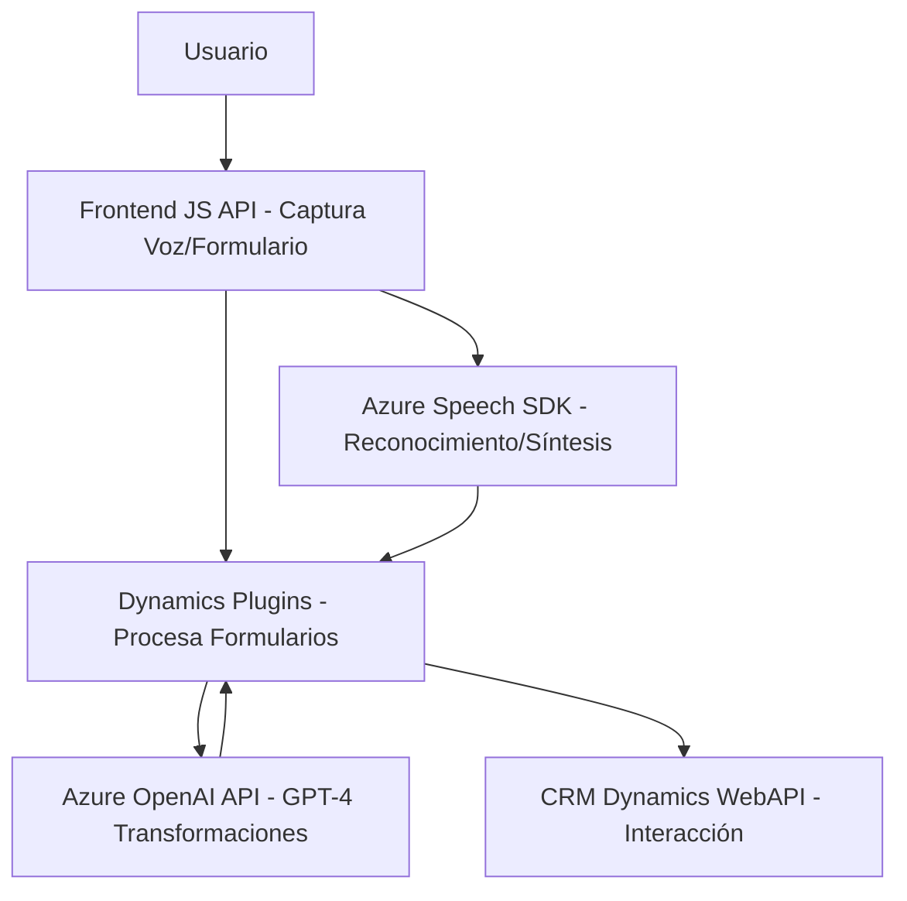

### Breve resumen técnico:
El repositorio describe un sistema vinculado a formularios interactivos que usa reconocimiento y síntesis de voz, texto a través de la integración con Azure Speech y Azure OpenAI, y amplía funcionalidades de sistemas CRM como Microsoft Dynamics. Las distintas partes del código implementan procesos de lectura, captura y transformación para mejorar la interacción entre el usuario y los formularios en un contexto dinámico usando reconocimiento de voz y procesamiento AI.

---

### Descripción de arquitectura:
Este sistema tiene una arquitectura de **n capas**, donde se observa una separación conceptual entre una capa de presentación (cliente frontend en JavaScript), capa de lógica (utilizando plugins de Dynamics CRM) y capa de servicios (servicios externos de Microsoft Azure Speech y Azure OpenAI). Aunque interacciona con servicios externos y APIs, sigue siendo un sistema monolítico extendido mediante el uso de plugins.

La arquitectura consiste en:
1. **Capa de presentación (frontend)**, que interactúa con el usuario, captura datos de formularios y delega tareas al backend.
2. **Capa lógica (plugins en el backend)**, que aplica reglas de negocio avanzadas y realiza transformaciones utilizando servicios como Azure OpenAI.
3. **Capa de servicios externos**, que maneja la integración con Microsoft Azure para síntesis de voz, reconocimiento de texto y procesamiento avanzado con IA.

---

### Tecnologías usadas:
#### **Frontend:**
- **JavaScript**: Construcción de lógica interactiva y manejo dinámico de datos.
- **Microsoft Azure Speech SDK**: Reconocimiento y síntesis de voz.

#### **Backend:**
- **C# (Microsoft Dynamics CRM Plugins)**: Extensión y personalización de funcionalidades de Dynamics.
- **Azure OpenAI Service (GPT-4)**: Procesamiento avanzado de texto.

#### **Herramientas y librerías generales:**
- **.NET Framework**: Base para los plugins.
- **Newtonsoft.Json**: Procesamiento de datos en formato JSON dinámico.
- **Microsoft Dynamics CRM SDK**: Integración directa con sistemas CRM.

---

### Dependencias o componentes externos:
- **Azure Speech Services**: Para reconocimiento y síntesis de voz.
- **Azure OpenAI Service**: Para transformación de datos y procesamiento de texto avanzado.
- **Microsoft Dynamics CRM**: Base del sistema CRM para interacción y mapeo de datos.

---

### Diagrama Mermaid válido para GitHub:

---

### Conclusión final:
El repositorio integra frontend interactivo, servicios de reconocimiento/síntesis de voz y procesamiento avanzado mediante IA, junto con extensiones backend destacadas para Microsoft Dynamics CRM. La arquitectura, aunque está basada en plugins y dependiente de servicios externos, es un **monolito extendido** con integración de servicios externos y APIs. Su diseño modular, escalable y estratégico con tecnologías como Azure y Dynamics permite una solución potente adaptada a entornos empresariales modernos.