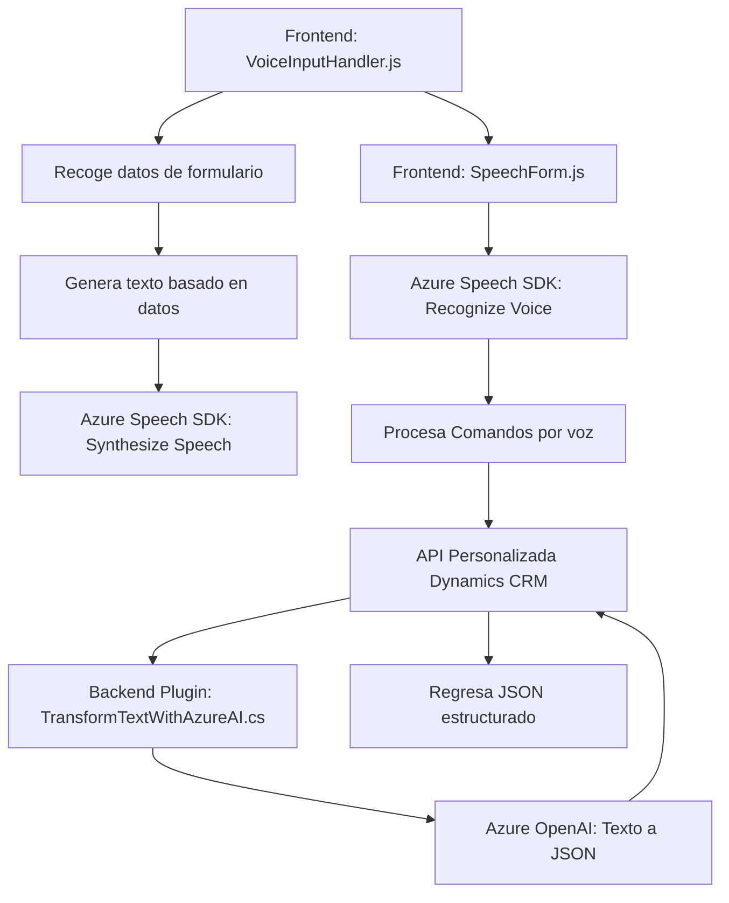

### Breve resumen técnico

Este repositorio incluye componentes para integrar funcionalidades avanzadas de captura, procesamiento y síntesis de voz en aplicaciones empresariales basadas en **Dynamics 365**. La solución aprovecha servicios externos como **Azure Speech SDK** y **Azure OpenAI**, trabajando en conjunto para habilitar interacciones basadas en formación y asignación de comandos mediante voz, además de transformar texto utilizando modelos de Inteligencia Artificial.

---

### Descripción de arquitectura

La arquitectura del software parece seguir los principios de una solución **n-capas**, donde se dividen las responsabilidades en:
- **Frontend**: Manejo de la interacción de voz con el usuario, reconocimiento y síntesis.
- **Middle layer**: Lógica de negocio como procesamiento de comandos y generación de texto empleando APIs personalizadas.
- **Backend** (Plugin): Procesamiento avanzado del texto utilizando IA (Azure OpenAI) y respuestas JSON estructuradas que se integran directamente con Dynamics CRM.

Cada componente tiene un enfoque modular con claras divisiones de responsabilidad (Single Responsibility Principle, SRP). La integración entre estas capas se realiza mediante servicios externos y patrones de programación asincrónicos.

---

### Tecnologías usadas

1. **Frontend:**
   - **JavaScript** para funciones cliente.
   - **Azure Speech SDK** para síntesis y reconocimiento de voz.
   - **Dynamics 365 Web APIs**, usado para la interacción directa con los formularios del CRM.

2. **Backend Plugin (.NET):**
   - **C# y .NET Framework (IPlugin)** para ejecución dentro de Dynamics CRM.
   - **Azure OpenAI Service** para transformación y generación de texto.
   - **HttpClient**, **System.Text.Json** y **Newtonsoft.Json** para manejar solicitudes HTTP y procesar respuestas en JSON.

3. **Servicios externos:**
   - **Azure Speech SDK** habilita reconocimiento de voz y síntesis.
   - **Azure OpenAI (GPT)** para transformar texto con reglas dinámicas.

4. **Patrones arquitectónicos:**
   - **N-Capas**: División lógica entre frontend, middle y backend.
   - Modularidad aplicando principios como el "Single Responsibility Principle".
   - **Plugin Pattern** para integrar lógica personalizada con Dynamics CRM.
   - **Integración API Wrapper** para encapsular las llamadas específicas al servicio OpenAI y Dynamics.
   - **Callback e integración de eventos asíncronos** para cargar dinámicamente SDKs y realizar llamadas a APIs.

---

### Diagrama Mermaid

---

### Conclusión final

La solución descrita en el repositorio es un sistema de procesamiento de datos basado en **n-capas** con especialización en integración multilateral de funcionalidades de procesamiento y síntesis de voz. Utiliza servicios avanzados de **Azure Speech SDK** y **OpenAI** para crear un flujo interactivo entre los usuarios y los formularios de Dynamics CRM en un entorno empresarial. Gracias a los patrones de modularidad y separación de responsabilidades, esta aplicación es escalable, mantenible y robusta, permitiendo su extensión en el futuro mientras garantiza un eficaz manejo de la lógica de negocio. 

Se recomienda incluir documentación completa sobre la configuración de dependencias como la API personalizada y los servicios de Azure, especialmente la autenticación y el manejo de regiones en Azure. Esto facilitará la adopción de este sistema en entornos similares o nuevos proyectos empresariales.