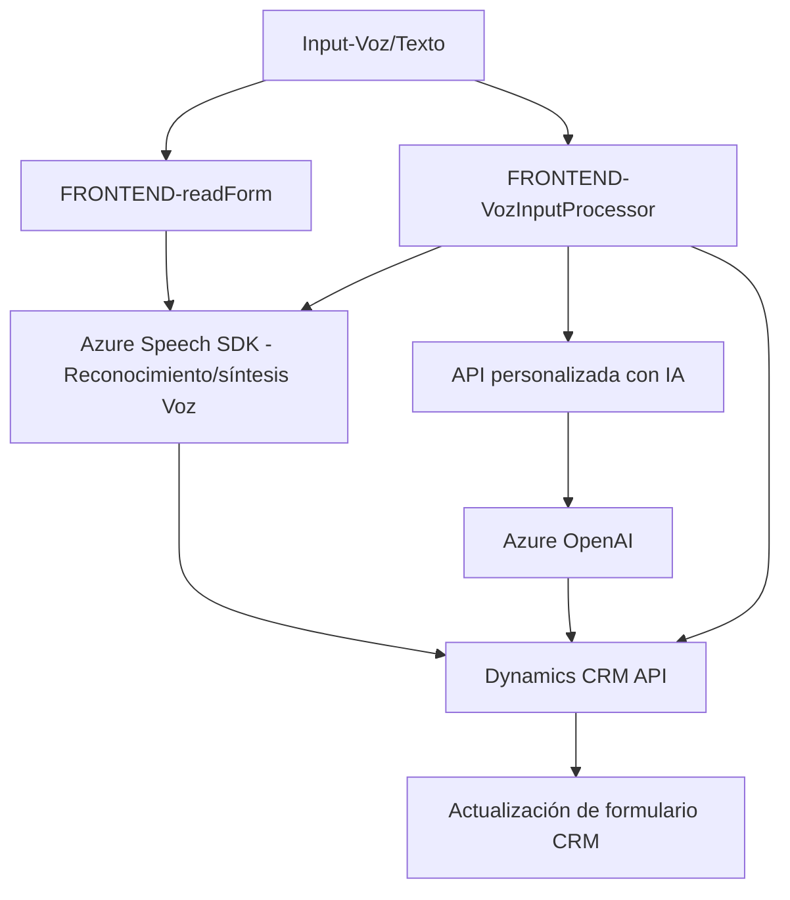

# Breve resumen técnico

El repositorio parece estar organizado bajo un enfoque relacionado con aplicaciones de CRM (Dynamics 365), empleando tanto soluciones front-end basadas en JavaScript como plugins back-end en C# para extender su funcionalidad. En concreto, está orientado a integrar capacidades de **Azure Speech SDK** y **Azure OpenAI API** para el reconocimiento de voz y la transformación de texto, permitiendo interactuar con formularios de manera dinámica por medio de voz y texto generado por inteligencia artificial.

---

# Descripción de arquitectura

### 1. Tipo de arquitectura: 
La solución utiliza una arquitectura **orientada a servicios (SOA)**, con microservicios específicos. Este se divide claramente en dos segmentos:
1. **Front-End (cliente CRM):**
    - Está enfocado en la interacción del usuario y habilidades de entrada y síntesis de voz en tiempo real para formularios de Dynamics 365.
    - Contiene funciones responsables de carga dinámica de dependencias externas (SDK) y procesamiento de datos en los campos.
2. **Back-End (plugin Dynamics CRM):**
    - Define la integración de un plugin que utiliza la **Azure OpenAI API** para el procesamiento inteligente de textos con reglas específicas.
    - Este módulo encapsula la comunicación con APIs externas y realiza actualizaciones en el sistema basado en la respuesta procesada.
 
### 2. Patrones principales:
- **Adapter**: Usado para adaptar datos (por ejemplo, transformar valores de los atributos del formulario en formatos legibles).
- **Facade**: Crea una capa simplificada entre los módulos externos de Azure Speech SDK/OpenAI API y el resto del código.
- **Plugin-Based Architecture**: Integración profunda en Microsoft Dynamics CRM mediante un plugin.
- **External SDK Injectable Pattern**: Carga dinámica de dependencias externas como el Azure Speech SDK.

### 3. Componentes externos:
1. **Azure Speech SDK**: Para reconocimiento y síntesis de voz.
2. **Azure OpenAI API**: Procesamiento de texto con modelos GPT, usado en el plugin de CRM.
3. **Dynamics 365 API**: Utilizada tanto para actualizar campos de formularios como para ejecutar servicios personalizados (API customizadas).
4. **Newtonsoft.Json y System.Text.Json**: Manipulación eficiente de JSON en el back-end.
5. **Interacción con formularios (Xrm SDK)**: Manejo de los datos y controles asociados al contexto de formularios dinámicos.

---

# Tecnologías usadas

### Frontend:
- Lenguaje: **JavaScript**
- Frameworks/Librerías:
  - **Azure Speech SDK**: Para la síntesis y reconocimiento de voz.
  - **Xrm.Page API**: Para manipular el contexto de formularios en Dynamics CRM.
- Arquitectura: **Modular y función independiente** (alto nivel de desacoplamiento).
- Métodos de procesamiento:
  - Promesas (`async/await`) para manejo asincrónico.
  - Transformaciones de datos con estructuras personalizadas.

### Backend:
- Lenguaje: **C#**
- Frameworks/Librerías:
  - **Microsoft Xrm SDK**: Modelos y servicios de Dynamics CRM.
  - **Newtonsoft.Json** y **System.Text.Json**: Para manejo JSON.
  - **Azure OpenAI API (GPT)**: Procesamiento inteligente de datos textuales.
  - **HttpClient**: Para realizar solicitudes HTTP.
- Arquitectura: Plugin para Dynamics CRM, basado en **plug-ins asincrónicos** vinculados a eventos específicos.

---

# Diagrama Mermaid

---

# Conclusión final

El repositorio presenta una solución implementada principalmente para realizar procesamiento de datos en un entorno CRM, mediante integración de herramientas avanzadas de reconocimiento y generación de voz (Azure Speech SDK) además de inteligencia artificial (Azure OpenAI). La arquitectura modular, orientada a servicios y API externas, permite escalabilidad y una integración adaptable. Estas capacidades facilitan una interacción más natural y eficiente entre los usuarios y el sistema CRM, pero a costa de depender de múltiples servicios externos como Azure Speech y OpenAI.