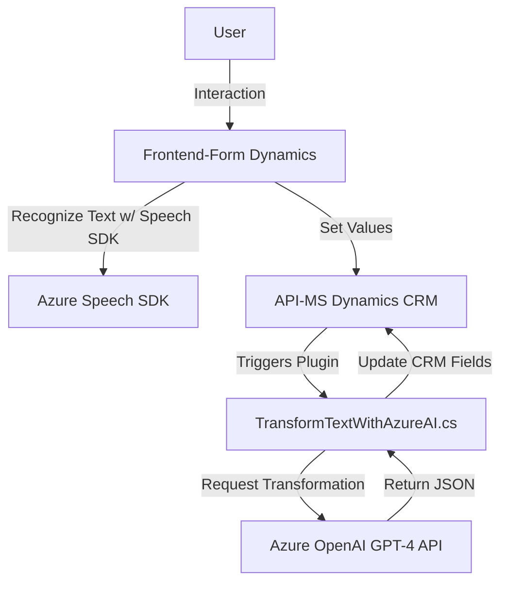

### Breve resumen técnico:
El repositorio cuenta con tres componentes principales:
1. **Frontend**: Implementa interacciones con formularios y el reconocimiento de entrada de voz mediante el **SDK de Azure Speech** para realizar síntesis de voz y transcripción.
2. **Plugin (backend)**: Define una lógica de negocio personalizada en **Dynamics CRM**, que se integra con **Azure OpenAI GPT-4** para transformar texto según normas específicas.
3. **API externa**: Se utilizan APIs de Microsoft (SDK de Azure Speech y Azure OpenAI) para IA y procesamiento de voz.

---

### Descripción de arquitectura:
1. **Arquitectura general**:
   - **Híbrida (cliente-servidor)** basada en **n capas**. Desde la interacción del usuario vía reconocimiento/entrada de voz en el *frontend*, hasta la lógica dinámica en *backend*.
   - Patrones de integración: Se utilizan integraciones con SDKs externos (Azure Speech y Azure OpenAI).
   - La interacción entre capas sigue una filosofía **orientada a servicios**, con desacoplamiento entre presentación (frontend), negocio (plugin en Dynamics) y servicios externos (Azure APIs).

2. **Frontend**:
   - Modular, con funciones separadas para manejo de datos del formulario y síntesis de voz utilizando el **Azure Speech SDK**.
   - Patrones utilizados: Modularización, integración con SDK externo.

3. **Backend (Plugin)**:
   - La clase `TransformTextWithAzureAI` está diseñada con **plugin-based architecture** que aplica lógica de negocio en Dynamics CRM.
   - Cumple principios de **integración externa**, comunicándose con **Azure OpenAI GPT** para la excursión computacional de IA, y luego mapea resultados a objetos del CRM.

---

### Tecnologías usadas:
1. **Frontend**:
   - **JavaScript**: Lenguaje principal para el manejo del DOM del formulario.
   - **Azure Speech SDK**: Usado para reconocimiento y síntesis de voz.

2. **Backend (Plugin)**:
   - **Dynamics CRM SDK**: Para interacción con formularios CRM y manejo de lógica de negocio en respuesta a eventos.
   - **Azure OpenAI GPT-4**: Procesamiento y transformación avanzada de texto.
   - **.NET Core** y **C#**: Implementación del código.

---

### Dependencias o componentes externos:
1. **Azure Speech SDK**:
   - URL: `https://aka.ms/csspeech/jsbrowserpackageraw`.
   - Funcionalidad: Reconocimiento y síntesis de voz.
   - Clases usadas: `SpeechConfig`, `AudioConfig`, `SpeechRecognizer`.

2. **Azure OpenAI GPT-4 Service**:
   - URL: `https://openai-netcore.openai.azure.com/openai/deployments/`.
   - Modelo: GPT-4, para transformar texto con reglas específicas.
   - Autenticación: Gestión mediante `api-key`.

3. **Dynamics CRM SDK**:
   - Objeto de contexto: `IPluginExecutionContext`.
   - Servicios de organización: `IOrganizationService`.

4. **.NET Libraries**:
   - `System.Net.Http`: Realizar peticiones HTTP.
   - `System.Text.Json` y `Newtonsoft.Json.Linq`: Manipulación y parseo de JSON.

---

### Diagrama Mermaid:

---

### Conclusión Final:
El repositorio utiliza una arquitectura de **n-capas** con una fuerte integración a servicios **cloud-hosted** de Azure, combinando **frontend modularity** para manejo del cliente y un **backend plugin-based structure** en Dynamics CRM. Destaca por su uso de servicios distribuidos como **Azure Speech** y **OpenAI** para inteligencia artificial, siguiendo principios de desarrollo basado en componentes para facilitar su extensibilidad y mantenimiento.