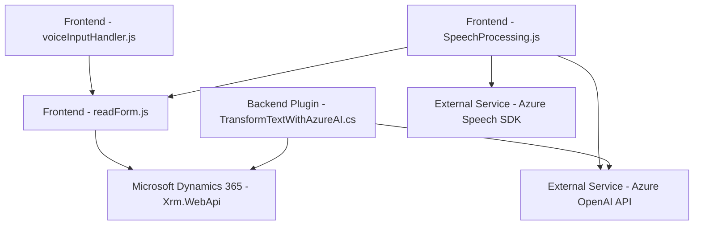

### Breve resumen técnico
La solución encontrada en el repositorio parece enfocarse en la integración de una funcionalidad híbrida para gestionar formularios en Microsoft Dynamics 365 utilizando entrada/salida de voz y el procesamiento avanzado de texto con OpenAI GPT modelos. Utiliza tanto componentes frontend como plugins backend para lograr una experiencia integral y dinámica.

---

### Descripción de la arquitectura
La solución adopta una **arquitectura de n capas** con integración de servicios externos. Las capas están organizadas de la siguiente forma:
1. **Frontend (`readForm.js`, `voiceInputHandler.js`, `SpeechProcessing.js`)** utiliza JavaScript para la interacción con el usuario y lectura/síntesis/formateo de datos de formularios.
2. **Backend (`TransformTextWithAzureAI.cs`)** contiene un plugin basado en Microsoft Dynamics CRM que transforma datos mediante servicios de Azure OpenAI y actualiza las entidades CRM correspondientes.

El diseño modular del frontend, junto con la separación del backend por plugin, sigue un patrón **cliente-servidor**, mientras que los servicios de Azure (Speech SDK y OpenAI API) enfatizan un enfoque **API externa como servicio**.

---

### Tecnologías utilizadas
1. **Frontend:**
   - *Lenguaje*: JavaScript (para funciones frontend).
   - *Frameworks/Librerías*: 
     - Microsoft Dynamics SDK: `Xrm.WebApi` para integración con Dynamics 365 desde el frontend.
     - Azure Speech SDK: Para síntesis y reconocimiento de voz.
   
2. **Backend:**
   - *Lenguaje*: C# (para desarrollo de plugins).
   - *Librerías/Servicios*: 
     - `Microsoft.Xrm.Sdk` y `Newtonsoft.Json` para manipulación de datos y JSON.
     - `System.Net.Http` y Azure OpenAI API (para procesamiento avanzado de texto mediante GPT).

3. **Servicios Externos:**
   - **Azure Speech SDK**: Captura y síntesis de voz.
   - **Azure OpenAI API**: Procesamiento avanzado de texto según normas personalizadas.

4. **Patrones arquitectónicos:**
   - **Modularidad**: Organización del frontend en funciones independientes para tareas específicas.
   - **Carga dinámica**: Implementación en `ensureSpeechSDKLoaded` para carga condicional del SDK en tiempo de ejecución.
   - **Plugin Backend**: Integración personalizada mediante la interfaz `IPlugin` de Dynamics CRM.

---

### Diagrama Mermaid válido para GitHub

---

### Conclusión final
Este repositorio presenta una solución híbrida para sistemas como Microsoft Dynamics 365, integrando funciones de entrada y salida de voz junto con procesamiento avanzado de texto mediante modelos GPT de Azure OpenAI. Está estructurado en una arquitectura de **n capas** con una separación clara entre frontend y backend. Además, aprovecha servicios externos como Azure Speech SDK y OpenAI para enriquecer la funcionalidad, integrándolos dinámicamente en tiempo de ejecución.

El diseño modular asegura extensibilidad, mientras que una clara influencia de patrones como **cliente-servidor** y **API externa como servicio** ofrecen flexibilidad y escalabilidad. Idealmente, esta solución puede ser expandida para soportar otros servicios de IA o personalizaciones avanzadas en entornos empresariales basados en Dynamics.