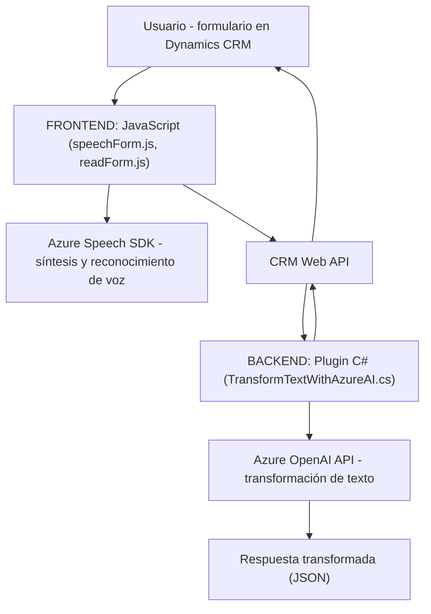

### Breve resumen técnico

El repositorio analiza tres componentes clave relativos a una solución que interactúa con Microsoft Dynamics CRM para procesar datos de formularios mediante reconocimiento de voz y síntesis de texto, así como un plugin que introduce funcionalidades de procesamiento avanzado a través de Azure OpenAI. Los archivos proporcionados detallan una integración entre un frontend en **JavaScript** que interactúa con el **Azure Speech SDK** y un backend en **C#** que implementa un plugin para procesamiento en Dynamics 365.

---

### Descripción de la arquitectura

La solución parece estar diseñada con una arquitectura de **n capas**:
1. **Capa de presentación (Frontend)**: Se encuentra implementada en **JavaScript** con funciones que permiten realizar la síntesis y reconocimiento de voz usando el SDK de Azure Speech. Además, esta capa gestiona la interacción directa con la UI de formularios en Dynamics.
   
2. **Capa de lógica de negocio (Plugins)**: Los plugins desarrollados en **C#**, como el archivo `TransformTextWithAzureAI.cs`, extienden las capacidades en Dynamics 365. La lógica incluye procesamiento de texto con **Azure OpenAI** para transformar la información recibida y devolverla como JSON para el sistema CRM.
   
3. **Capa de integración**:
   - **Servicios Azure**:
     - **Azure Speech Service SDK**: Procesa síntesis y reconocimiento de voz.
     - **Azure OpenAI (via HTTP)**: Realiza operaciones de procesamiento de texto avanzado y respuesta en JSON.
   - **CRM Dynamics Web API (XRM)**: Se utiliza para obtener información de los formularios y realizar actualizaciones en sus datos directamente desde el reconocimiento y procesamiento de voz.

### Tecnologías utilizadas

1. **Frontend**:
   - **JavaScript**: Uso de funciones modulares y directas.
   - **Azure Speech Service SDK**: Reconocimiento y síntesis de voz.

2. **Backend/plugin**:
   - **C#**: Desarrollo de la lógica en una clase que implementa los servicios de Dynamics 365.
   - **Microsoft Dynamics 365 SDK (`Microsoft.Xrm.Sdk`)**: Manejo del contexto CRM y atributos de los formularios.
   - **Azure OpenAI API**: Lógica para la transformación de texto combinada con servicios cloud avanzados.
   - **Newtonsoft.Json y System.Text.Json**: Trabajo con estructuras JSON para entradas/salidas.

3. **Patrones de arquitectura**:
   - Modularidad: Separación de funciones para realizar tareas específicas.
   - Encapsulación: Aislamiento de procesos clave (e.g., carga SDK, solicitud a APIs externas).
   - Plugin-Based Architecture: Extensión de funcionalidades de Dynamics 365 mediante plugins.

---

### Diagrama Mermaid válido para GitHub

---

### Conclusión final

Este repositorio contiene una solución orientada al procesamiento con inteligencia artificial basada en servicios de la nube. Su arquitectura sigue un enfoque **n capas** donde la capa frontend gestiona la interacción del usuario y la síntesis de texto, mientras que la capa backend extiende capacidades de CRM mediante un plugin que usa Azure OpenAI para transformación avanzada de datos.

**Fortalezas**:
- Uso extensivo de **Azure Speech SDK** para habilitar reconocimiento y síntesis de voz.
- Implementación clara y modular de funciones en el frontend.
- Extensibilidad del sistema CRM mediante un plugin basado en **Dynamics 365 SDK**.

**Debilidades y mejoras posibles**:
- Mayor robustez en seguridad para manejar credenciales y API keys (usar secretos en configuración externa).
- Optimización de dependencias JSON para evitar redundancias entre `Newtonsoft.Json` y `System.Text.Json`.
- Implementar patrones avanzados (por ejemplo, **Clean Architecture** o **Hexagonal**) en el backend para una mayor escalabilidad y claridad en la separación de las responsabilidades.

La solución ejemplifica una conexión eficiente con servicios en la nube y presenta un diseño inicial que puede evolucionar hacia una arquitectura más escalable.