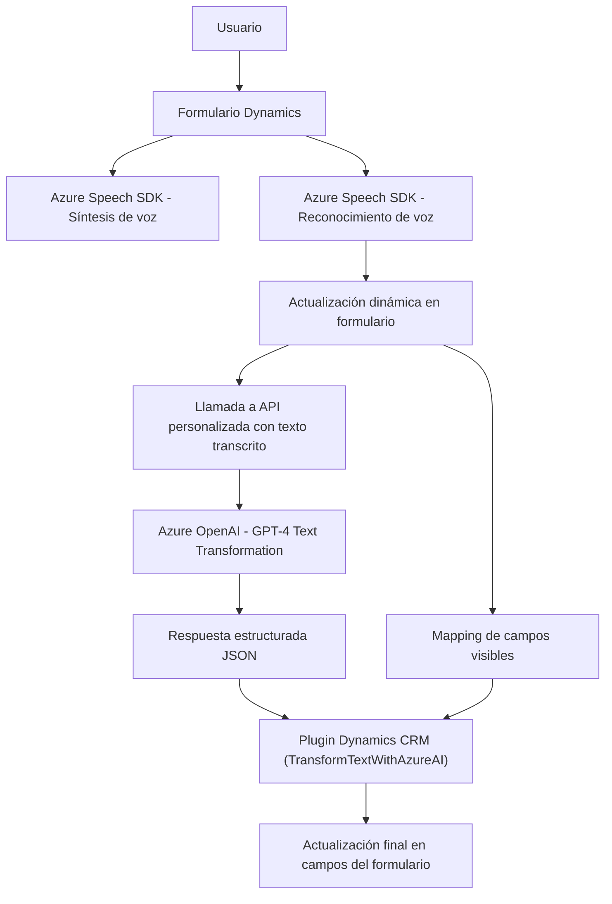

### Breve resumen técnico
El repositorio contiene una solución híbrida que combina frontend (JavaScript y plugins en Dynamics CRM) y backend interactuando con Azure Speech SDK y Azure OpenAI. La solución está orientada principalmente a la transformación de datos (procesamiento de texto y voz en tiempo real), manipulación de formularios de Dynamics 365, y generación de respuestas para la experiencia de usuario.

---

### Descripción de arquitectura
La solución tiene una arquitectura **n capas** enfocada en integrar varias tecnologías en módulos descentralizados:

1. **Capa de presentación (JavaScript en frontend)**:
   - Interacción directa del usuario a través de formularios dinámicos de Dynamics.
   - Procesamiento de voz mediante el Azure Speech SDK.
   - Actualización de campos en tiempo real con transcripciones y datos procesados por IA.

2. **Capa de lógica de negocios (Plugins y validaciones)**:
   - Manipulación y procesamiento de datos ingresados por el usuario.
   - Transformación avanzada de texto mediante el servicio Azure OpenAI, encapsulado en un plugin.

3. **Capa de acceso a datos**:
   - Acceso y manipulación directa de los atributos y datos del formulario en Dynamics 365.
   - Integración con APIs externas como Azure Speech SDK y OpenAI.

---

### Tecnologías usadas
1. **Frontend**:
   - JavaScript (con estructuras modulares y enfoque basado en funciones).
   - Dynamics 365 Client API (`Xrm.WebApi`, `Form Context`).

2. **Backend**:
   - C#, .NET para plugins personalizados de Dynamics CRM (`IPlugin`).
   - Azure OpenAI API (llamada directa a modelos GPT-4).
   - HTTP Requests (para integración con APIs externas).

3. **Dependencias externas**:
   - Azure Speech SDK: Para sintetización y reconocimiento de voz.
   - Azure OpenAI: Procesamiento de lenguaje natural y generación de texto predictivo.
   - Dynamics 365 APIs: Acceso y manipulación de datos del CRM.
   - Newtonsoft.Json para procesamiento JSON en C#.

---

### Diagrama Mermaid válido para GitHub

---

### Conclusión final
La solución presentada en el repositorio tiene una arquitectura **n capas** orientada a la modularidad y reutilización de funciones. Está diseñada para procesar información de formularios dinámicos en Dynamics 365, utilizando servicios externos para reconocimiento y síntesis de voz (Azure Speech SDK) y procesamiento avanzado de texto (Azure OpenAI). Este enfoque se adapta bien a entornos corporativos que buscan mejorar la accesibilidad y la automatización de procesos mediante herramientas inteligentes y servicios basados en la nube.