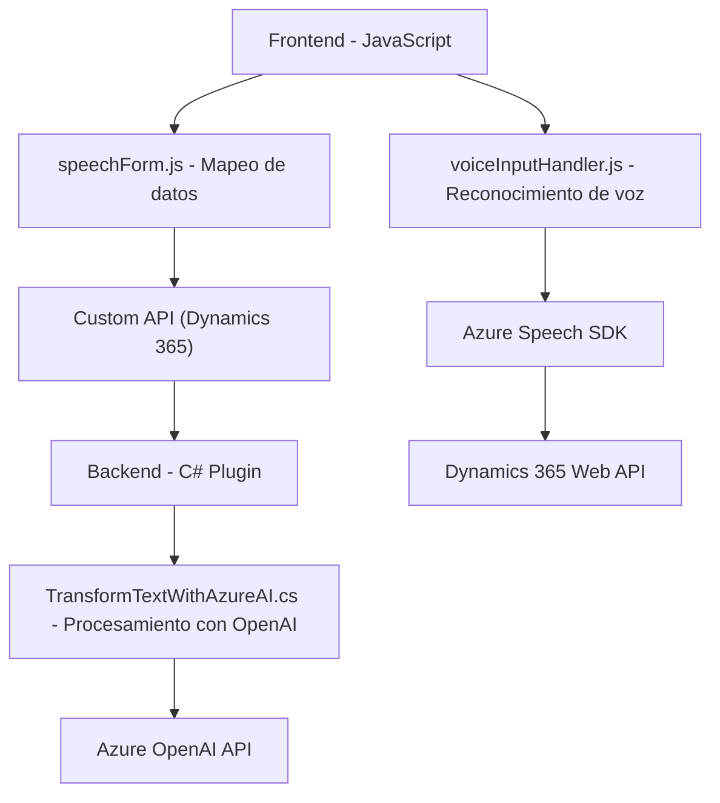

### Breve Resumen Técnico
La solución representa una integración entre una frontend en JavaScript y un plugin en C#, orientada a la interacción por voz con formularios de Dynamics 365. Utiliza Azure Speech SDK para reconocimiento y síntesis de voz, además de Azure OpenAI para transformar texto en un formato JSON estructurado, que luego se manipula en Dynamics CRM. La arquitectura combina un enfoque de frontend modular con capacidades backend desacopladas para procesamiento avanzado.

---

### Descripción de Arquitectura
- **Tipo de solución**: Se trata de una solución híbrida que combina frontend y backend. El frontend actúa como interfaz para la entrada y salida de interacción por voz, mientras que el backend complementa la lógica de procesamiento mediante un plugin en Dynamics 365.
- **Arquitectura**: Modular, orientada a servicios.
  - En el frontend: Una lógica JavaScript implementada en funciones modulares que interactúan con servicios como Azure Speech SDK y la API propia de Dynamics 365.
  - En el backend: Un plugin desarrollado en C# que aplica el patrón de `Plugin` específico de Dynamics CRM. Este plugin se comunica directamente con Azure OpenAI para el procesamiento de datos.

La solución no corresponde estrictamente a un monolito ni a microservicios, sino a una arquitectura orientada a servicios (SOA), donde se agrupan módulos reutilizables para integraciones externas.

---

### Tecnologías Usadas
1. **Frontend (JS)**:
   - Azure Speech SDK: Para reconocimiento y síntesis de voz.
   - Web API de Dynamics 365: Manipulación de datos en formularios.
   - Generalmente orientado a uso en navegadores actuales (JS ES6).

2. **Backend (C#)**:
   - Dynamics CRM SDK (`IPluginExecutionContext`, `IOrganizationServiceFactory`, etc.).
   - Azure OpenAI API (GPT-4): Procesamiento avanzado de textos.
   - Newtonsoft.Json.Linq: Manejo de JSON.
   - HttpClient (.NET): Para solicitudes HTTP al servicio de Azure OpenAI.

3. **Herramientas externas**:
   - Cloud services (Azure).
   - Microsoft Dynamics 365 como plataforma de integración.

4. **Patrones**:
   - Modularidad en la frontend.
   - Plugin extensible en el backend.
   - SOA: Interacción directa con APIs externas.

---

### Diagrama Mermaid

---

### Conclusión Final
La solución es una implementación orientada a servicios (SOA), que conecta un frontend basado en JavaScript con un backend en C#. La arquitectura aprovecha capacidades de inteligencia artificial (Azure OpenAI y Speech SDK) para mejorar la interacción con los formularios de Dynamics 365. La modularidad y separación de responsabilidades en los diferentes componentes reflejan buenas prácticas de desarrollo, aunque mejoras como una mejor gestión de credenciales son recomendables para el plugin. Esto la hace ideal para contextos empresariales donde la automatización y la precisión en la interacción son clave.