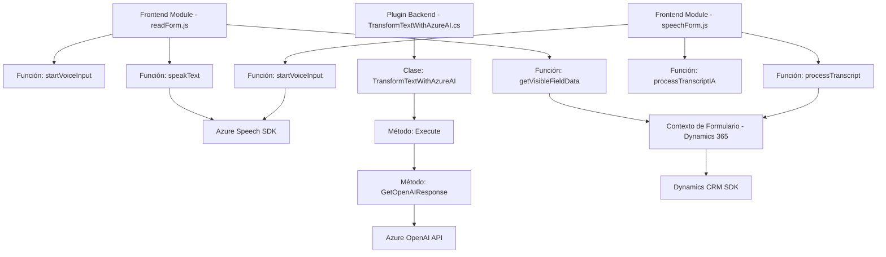

### Breve resumen técnico

El repositorio contiene tres módulos principales:
1. Implementaciones en JavaScript para el frontend en formularios de Microsoft Dynamics 365 (`readForm.js` y `speechForm.js`).
2. Plugins para procesamiento de texto con IA como extensión de Dynamics CRM (`TransformTextWithAzureAI.cs`).

Estos módulos trabajan en conjunto para proporcionar una interfaz interactiva mediante formularios y capacidades avanzadas de procesamiento y síntesis de voz, aprovechando servicios externos como Azure Speech SDK y Azure OpenAI.

---

### Descripción de arquitectura

La arquitectura del repositorio combina:
1. **Frontend modular:** Dividido en múltiples scripts para funciones como lectura, síntesis de voz y reconocimiento de voz a través del SDK de Azure.
2. **Backend orientado a microservicios:** Se integra con un servicio externo (Azure OpenAI API) para realizar procesamiento avanzado de texto y transformación en un formato JSON óptimo.
3. **Plug-in Architecture:** El archivo `TransformTextWithAzureAI.cs` extiende la lógica de Dynamics CRM integrándose con el servicio de IA.

Esto refleja una arquitectura de tipo **modular** en el frontend y **híbrida** en el backend, con características propias de los microservicios por la separación de responsabilidades y delegación a APIs externas para funciones especializadas.

---

### Tecnologías usadas

1. **Frontend:**
   - **JavaScript:** Amplio uso para el manejo de funciones relacionadas con formularios.
   - **Azure Speech SDK:** Para la síntesis y reconocimiento de voz.
   - **Microsoft Dynamics CRM APIs:** Para manipulación de formularios y datos dinámicos.
   - **Promesas y callbacks:** Para manejar flujos asincrónicos con SDKs y APIs.

2. **Backend:**
   - **Azure OpenAI API:** Integra IA para transformar texto en JSON estructurado.
   - **Microsoft Dynamics CRM SDK:** Extiende funcionalidades para integraciones y manejos organizativos.
   - **C# (Plugins):** Se utiliza para lógica empresarial en formato de plugins que interactúan con Dynamics CRM.
   - **JSON toolkits:** Manejo de estructuras JSON mediante `Newtonsoft.Json`.

3. **Patrones de diseño:**
   - Modular design principles (con separación clara de responsabilidades por archivo/método).
   - Callback/Promise-based asynchronous programming.
   - Microservicio/API integration pattern.
   - Plugin architecture for CRM.

---

### Diagrama Mermaid válido para GitHub

---

### Conclusión final

El análisis indica que el repositorio es una **integrated solution** que surge de la combinación de tecnologías modernas para el reconocimiento, procesamiento y síntesis de datos no estructurados. Utiliza una arquitectura **modular** y extensible, con componentes frontend que interactúan con APIs y un plugin backend que añade funcionalidades avanzadas a Dynamics CRM mediante servicios de IA en Azure.

El diseño modular permite extender y personalizar la solución fácilmente, mientras que la integración con servicios externos garantiza escalabilidad y acceso a herramientas avanzadas (e.g., Speech SDK y OpenAI).