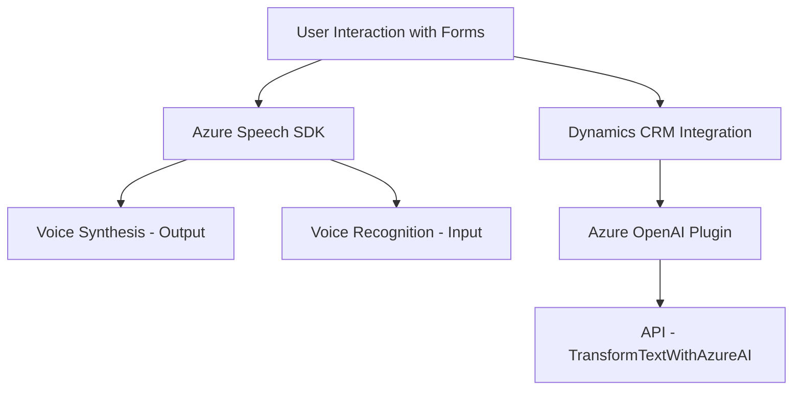

### Breve resumen técnico

La solución presentada tiene una funcionalidad orientada a trabajar con formularios y procesamiento de voz mediante la integración de Azure Speech SDK y Azure OpenAI. Los módulos están diseñados para gestionar reconocimiento y síntesis de voz, procesar inputs textuales, y transformar datos mediante APIs externas.

---

### Descripción de arquitectura

La arquitectura adopta un enfoque modular y basado en eventos dentro de un ecosistema de formularios en Dynamics CRM. El diseño muestra una segmentación entre:

1. **Frontend**: Interacción directa con el usuario (entradas en formularios) y manejo de voz mediante SDK externo.
2. **Backend** (Plugins): Procesamiento del texto generado desde el frontend utilizando Azure OpenAI para enriquecer los datos procesados en la solución.

El sistema muestra patrones distribuidos. La dependencia de Azure OpenAI y Dynamics CRM indica la presencia de una **arquitectura orientada a servicios/microservicios**, donde ciertas funcionalidades críticas se delegan en APIs o SDKs externos.

---

### Tecnologías usadas

1. **Frontend (JavaScript):**
   - Azure Speech SDK: Para reconocimiento y síntesis de voz.
   - APIs de Dynamics CRM: Acceso y manipulación de formulaciones en sistemas CRM.
   - Modularidad en diseño: Con funciones dedicadas a tareas específicas como carga dinámica de SDKs, reconocimiento de voz, síntesis, y mapeo de campos.

2. **Backend (.NET con C#):**
   - Dynamics CRM Plugin Tools: Extensibilidad de CRM para ejecución en eventos del sistema.
   - Azure OpenAI (GPT-4): Conversión avanzada de texto a JSON estructurado.
   - Librerías .NET para integración: JSON Serialization (Newtonsoft y System.Text.Json) y procesamiento HTTP (System.Net.Http).

3. **Integraciones claves:**
   - Gestión dinámica de dependencias con carga de SDKs (en tiempo de ejecución).
   - Llamadas a servicios externos (Azure Speech SDK, Azure OpenAI API).

---

### Diagrama Mermaid válido para GitHub

---

### Conclusión final

La solución implementa un sistema robusto que combina procesamiento de voz y transformación de texto mediante servicios externos (Azure Speech SDK y Azure OpenAI) dentro del ecosistema de Dynamics CRM. Utiliza arquitectura modular en el frontend y una arquitectura orientada a plugins y servicios en el backend. Aunque es posible implementarla en un esquema de monolito, la alta integración con API y servicios externos muestra una evolución hacia un diseño **microservicios/cloud-native**.