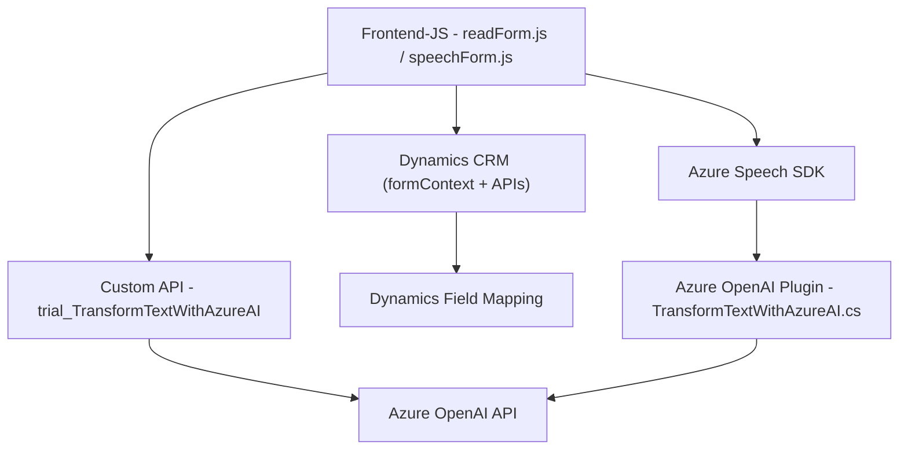

### Breve Resumen Técnico
El repositorio contiene archivos relacionados con una solución integrada entre un sistema CRM (Dynamics 365), el SDK de Azure Speech, y la API Azure OpenAI. La solución realiza reconocimiento y síntesis de voz, transformación de datos ingresados en formularios, y operaciones de procesamiento de texto basado en IA. 

Los principales componentes son:
1. **Frontend (JavaScript)**: Maneja entrada, salida de voz y datos de formularios, integrándose con Azure Speech.
2. **Backend (C#)**: Plugins de Dynamics CRM que transforman texto utilizando la API de Azure OpenAI.

---

### Descripción de Arquitectura
La arquitectura del repositorio es **n capas**:
1. **Capa de Presentación (Frontend/JavaScript)**:
   - Interactúa con formularios de CRM y gestiona entradas/salidas de voz mediante el **Azure Speech SDK**.
   - Incluye procesamiento de datos/formularios y manipulación mediante APIs de CRM o servicios externos.
   
2. **Capa de Lógica de Negocio (Plugins en C#)**:
   - Define acciones específicas dentro de Dynamics CRM (ejecutadas como eventos en el sistema) y transforma datos formateándolos con normativas predefinidas mediante **Azure OpenAI API**.

3. **Servicios Externos**:
   - Comunicación con **Azure Speech** y **Azure OpenAI** para tareas cognitivas (entrada/salida de voz, procesamiento de lenguaje natural).

---

### Tecnologías Usadas
1. **Frontend**:
   - **JavaScript** con funciones organizadas para manejar datos y comunicar con APIs de voz (**Azure Speech SDK**).
   - Dynamics 365 SDK (`Xrm.Page`/`Xrm.WebApi.online`) para la interacción con formularios y datos CRM.

2. **Backend**:
   - **C#** como lenguaje principal con:
     - Microsoft Dynamics CRM SDK (`IPlugin`, `IOrganizationService`).
     - Libraries internas como `System.Net.Http` y `Newtonsoft.Json.Linq` para integración con la API de Azure OpenAI.
     - Azure OpenAI API para transformación avanzada de datos.

3. **Servicios Externos**:
   - **Azure Speech SDK:** Reconocimiento y síntesis de voz.
   - **Azure OpenAI API (GPT-4)** para estructuración de texto según normas.

---

### Dependencias o Componentes Externos
1. **Azure Speech SDK**: Para procesamiento de voz.
2. **Dynamics CRM API**: Gestión dinámica de formularios y entidades.
3. **Azure OpenAI API**: Manipulación y transformación de texto.
4. **Browser/DOM scripts**: Dinámica de formularios y carga condicional/Scripts de SDK externos.
5. **HttpClient (C#)**: Para realizar solicitudes HTTP a APIs.

---

### Diagrama Mermaid

---

### Conclusión Final
Este repositorio implementa una solución **n capas** que combina procesamiento frontend, interacción dinámica con un sistema CRM (Dynamics 365), y servicios cognitivos en la nube (Azure Speech y Azure OpenAI). La arquitectura está orientada a la integración entre varias capas y servicios, con un enfoque modular. Es una solución robusta que utiliza patrones como **Adapter** y consumo de APIs, permitiendo una alta flexibilidad y escalabilidad para sistemas empresariales.