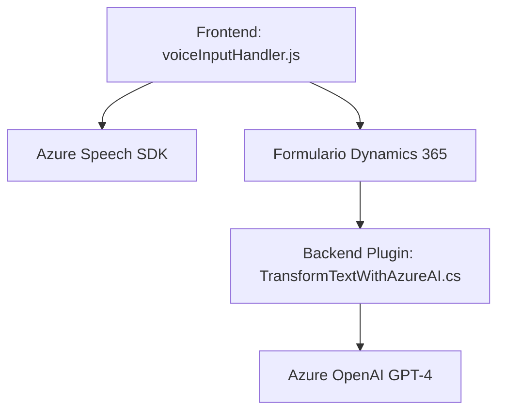

# **Análisis técnico del repositorio**

## **Breve resumen técnico**
El repositorio refleja una solución orientada a la integración entre **Microsoft Dynamics 365**, componentes de accesibilidad basada en voz, y servicios externos de Azure como **Azure Speech SDK** y **Azure OpenAI**. Está diseñado para mejorar la interacción con formularios mediante reconocimiento de voz, síntesis de información y procesamiento mediante modelos de inteligencia artificial.

### **Solución**
La solución consiste en:
1. **Frontend**: Manejo del formulario mediante JavaScript para capturar datos visibles, sintetizar texto en voz, recibir comandos por voz y aplicar datos reconocidos.
2. **Backend (Plugin)**: Transformación de texto en estructuras útiles mediante integración con Azure OpenAI.

---

## **Arquitectura**
La arquitectura aplica un enfoque mixto `n-capas` con integración a servicios externos como **microservicios Azure OpenAI** y **Azure Speech SDK**. La solución se despliega sobre Dynamics 365, usando un plugin de backend y una capa de frontend muy especializada. Se pueden identificar tres componentes clave:
1. **Capa de presentación**:
   - Archivos JavaScript para capturar, sintetizar y manejar datos en formularios de Dynamics.
   - Acceso directo al DOM del formulario y dependencias específicas de Microsoft Dynamics (`Xrm`).

2. **Capa de negocio (Plugins)**:
   - Transformación de texto mediante un microservicio basado en Azure OpenAI API que procesa texto de entrada y devuelve objetos JSON estructurados.
   - Centralización de lógica de negocio para ejecutar procedimientos autónomos sincronizados con Dynamics 365.

3. **Capa de integración**:
   - Servicios externos que integran Azure Speech SDK y Azure OpenAI conectados al frontend y backend respectivamente.

--- 

## **Tecnologías y patrones usados**
1. **Frontend**:
   - **Lenguaje**: JavaScript ES6.
   - **Framework específico**: Microsoft Dynamics 365 (referencias a `executionContext` y `Xrm.WebApi`).
   - **Integración externa**: Azure Speech SDK.
   - **Patrones comunes**:
     - **Modularidad**: Organización de funciones según responsabilidades claras.
     - **Carga dinámica de dependencias**: `ensureSpeechSDKLoaded` carga el SDK sólo cuando sea requerido.
     - **Event-driven programming**: Ejecución desencadenada por eventos de interacción con el DOM y formularios.

2. **Backend (Plugins)**:
   - **Lenguaje**: C# con .NET.
   - **Framework específico**: Microsoft Dynamics CRM Plugin Architecture.
   - **Integración externa**: Azure OpenAI API para procesamiento de texto mediante GPT-4.
   - **Patrones comunes**:
     - **Microservicio externo**: Uso de la API OpenAI como una dependencia desacoplada para generar JSON estructurados.
     - **Separación de responsabilidades**: La lógica de negocio principal se segmenta dentro de `GetOpenAIResponse`.

---

## **Dependencias/componentes externos**
1. **Azure Speech SDK**:
   - Utilizado en el frontend para reconocimiento de voz y síntesis.
   - Cargado dinámicamente desde: `https://aka.ms/csspeech/jsbrowserpackageraw`.

2. **Azure OpenAI GPT-4**:
   - Procesamiento de texto en el backend para transformar texto libre en objetos JSON estructurados.
   - Utiliza una API externa con autenticación basada en `api-key`.

3. **Microsoft Dynamics 365 Components**:
   - Dependencias específicas como `Xrm.WebApi`, `formContext`, y servicios relacionados con meta datos de formularios.

---

## **Diagrama Mermaid**

### Diagrama de flujo horizontal

### Explicación del flujo:
- **Frontend (voiceInputHandler.js)**:
  - Captura de datos del formulario.
  - Conversiones de texto a voz usando **Azure Speech SDK**.
- **Formulario Dynamics 365**: Actúa como interfaz de entrada y salida para datos.
- **Backend Plugin (TransformTextWithAzureAI.cs)**:
  - Recibe texto desde el frontend o Dynamics 365.
  - Utiliza **Azure OpenAI GPT-4** para transformar y estructurar los datos.

---

## **Conclusión final**
La solución implementada en el repositorio es una integración robusta de tecnologías orientadas a mejorar la accesibilidad y funcionalidad de los formularios en Dynamics 365 mediante voz y procesamiento de lenguaje natural. La combinación de tecnologías como **Azure Speech SDK**, **Azure OpenAI GPT-4**, y **Microsoft Dynamics 365**, junto con patrones como modularidad y separación de responsabilidades, hacen que esta arquitectura sea eficiente y adaptable a cambios futuros.

Sin embargo, es importante considerar los costos asociados al uso de servicios de **Azure Speech SDK** y **GPT-4**, además de reforzar el manejo de errores y autenticación para evitar vulnerabilidades en las solicitudes HTTP externas.