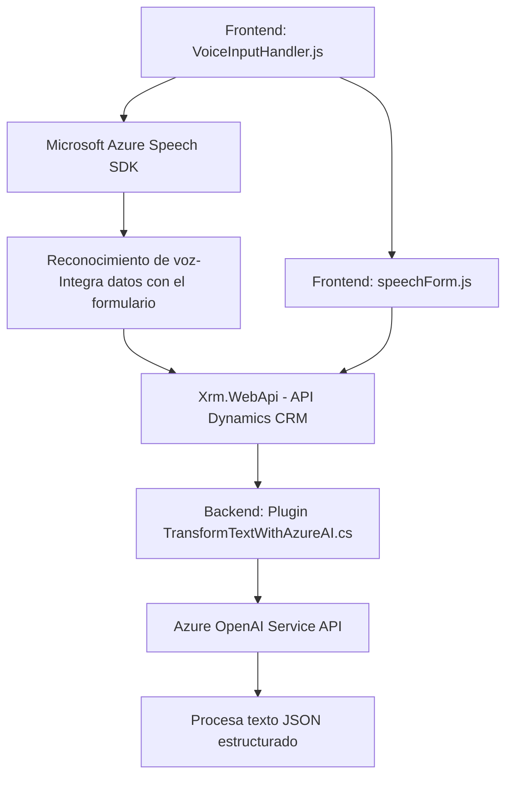

### Breve resumen técnico:
El repositorio contiene un sistema que integra la funcionalidad de manejo de entradas de voz, procesamiento de texto con inteligencia artificial y actualización dinámica de formularios en Microsoft Dynamics. Este sistema utiliza **Azure Speech SDK** y **Azure OpenAI Service API** para implementar reconocimiento y síntesis de voz, y transformarlas en datos estructurados para su aplicación en los formularios de Dynamics.

### Descripción de arquitectura:
La solución parece adoptar un modelo de arquitectura híbrida:
1. **Extendido sobre un monolito:** Aprovecha el framework de Microsoft Dynamics CRM utilizando **plugins** y programación basada en eventos específicas (como `IPlugin` ejecutada sobre el servidor).
2. **Distribuido por servicios externos:** Se integran recursos de **Azure Speech SDK** y **Azure OpenAI Service API**, lo que la hace una solución dependiente de servicios externos en la nube (híbrido con microservicios).
3. **N-Capas:** La organización del código podría realizar separación de la lógica en capas, aunque los puntos de acoplamiento hacia Dynamics pueden concentrar responsabilidades en una sola capa.

### Tecnologías usadas:
- **Frontend:** 
  - Lenguaje: JavaScript (organización modular en módulos separados).
  - Navegador para eventos y manipulación de DOM.
  - Framework de datos: Dynamics CRM context (`formContext`, `Xrm.WebApi`).
  - SDKs externos: **Azure Speech SDK** para reconocimiento y síntesis de voz.
  
- **Backend:** 
  - Lenguaje: C# con .NET Framework.
  - Dependencias:
    - **Azure OpenAI Service API** (IA para procesamiento de texto).
    - **Microsoft.Xrm.Sdk** (Gestión de plugins y acceso a datos en Dynamics CRM).
  - Otras librerías: `Newtonsoft.Json.Linq`, `System.Net.Http`.

### Dependencias o componentes externos:
- **Azure Cognitive Services Speech SDK:** Utilizado para manejar reconocimiento y síntesis de voz.
- **Azure OpenAI Service API:** Integración de IA para procesamiento de texto y responder con datos JSON.
- **Dynamics 365 CRM Environment:** Fundamental como el motor principal del monolito donde se realizan las interacciones con formularios y datos.
- **Http libraries (System.Net.Http, Newtonsoft.Json.Linq):** Manejo de solicitudes HTTP y transformación JSON.

### Diagrama Mermaid válido para GitHub:

### Conclusión final:
La solución representada por este repositorio está compuesta por dos componentes principales: un frontend en JavaScript que interactúa con Microsoft Dynamics CRM a través de la integración con **Azure Speech SDK**, y un backend escrito en C# que extiende la funcionalidad del monolito de Dynamics mediante un plugin capaz de enviar datos a **Azure OpenAI Service API** para procesar texto. La arquitectura fusiona un enfoque monolítico extendido con una integración basada en microservicios (Azure SDKs), utilizando una estructura basada en eventos y modularidad funcional para las operaciones de síntesis y reconocimiento de voz, y transformación de texto.

Esta integración puede mejorarse con una arquitectura orientada a eventos (Event-Driven), un sistema de seguridad para las claves de acceso a los servicios de Azure y pruebas robustas para manejo de excepciones. Sin embargo, como solución específica para Dynamics, representa un diseño eficiente para la transformación de datos hablados en información estructurada aplicable en formularios.