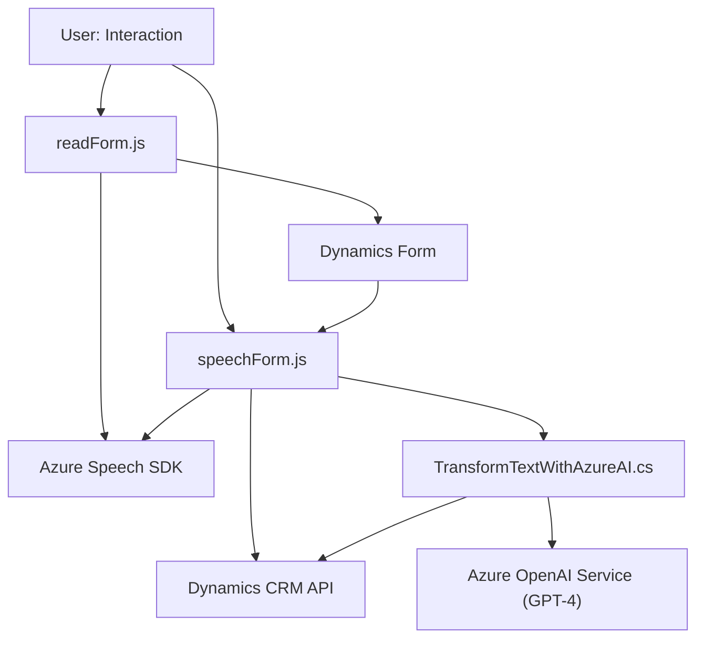

### Breve resumen técnico:
El repositorio contiene tres archivos que forman parte de una solución orientada a la integración de entrada/salida de voz y texto con formularios en Microsoft Dynamics 365. Utilizan servicios como **Azure Speech SDK** y **Azure OpenAI (GPT-4)** para incorporar capacidades avanzadas de reconocimiento de voz, síntesis de voz y procesamiento de texto.

### Descripción de arquitectura:
La arquitectura sigue un **modelo en capas**, donde cada componente tiene una responsabilidad específica:
1. **Frontend/JS**: Implementa la interacción con los usuarios a través de la síntesis y reconocimiento de voz para manipular formularios en Dynamics 365. Contiene dos archivos principales:
   - `readForm.js`: Sintetiza por voz los datos visibles en un formulario.
   - `speechForm.js`: Transcribe comandos de voz y actualiza los formularios.
2. **Backend/plugin**: El archivo `TransformTextWithAzureAI.cs` implementa un plugin de Dynamics CRM para procesar de forma avanzada los datos a través de llamadas al Azure OpenAI Service.

El diseño modular del código, con funciones encapsuladas y atención al intercambio de datos en formato JSON mediante APIs, y el plugin desarrollado con la interfaz estándar de **Dynamics CRM `IPlugin`**, apuntan a una arquitectura de **integración basada en servicios** con separación de responsabilidades.

### Tecnologías usadas:
1. **Frontend**:
   - **JavaScript**: Lenguaje principal para el frontend.
   - **Azure Speech SDK**: Utilizado para síntesis y transcripción de voz.  
   - **Microsoft Dynamics API**: Para manipulación de formularios y atributos.
2. **Backend/Plugin**:
   - **Microsoft Dynamics CRM SDK** (`IPlugin`).
   - **Azure OpenAI Service (GPT-4)**: Proceso de texto estructurado.
   - **HTTP Client Libraries**: Para consumo del servicio de Azure.
   - **Newtonsoft.Json** y **System.Text.Json**: Manejo de JSON.
3. **Patrones utilizados**:
   - **Capa de acceso a datos**: Encapsulación de la lógica de recuperación y asignación de atributos del formulario.
   - **Inyección de dependencias en tiempo de ejecución**: Uso dinámico del SDK de Speech.
   - **Plugin Architecture**: Dinámicas propias de Dynamics CRM.

### Diagrama Mermaid:

### Conclusión Final:
La solución en el repositorio parece ser un sistema **de integración entre entrada/salida de voz y manejo de formularios dentro de Dynamics 365**, basado en tecnologías de **Azure Speech SDK** y **Azure OpenAI Service (GPT-4)**. La arquitectura emplea capas y un enfoque híbrido entre **servicios y plugins**, lo que permite una alta modularidad y facilidad para la integración. Aunque el diseño es técnico y funcionalmente sólido, podría beneficiarse de una revisión más centrada en evitar referencias innecesarias y mejorar aspectos de robustez en la gestión de errores.