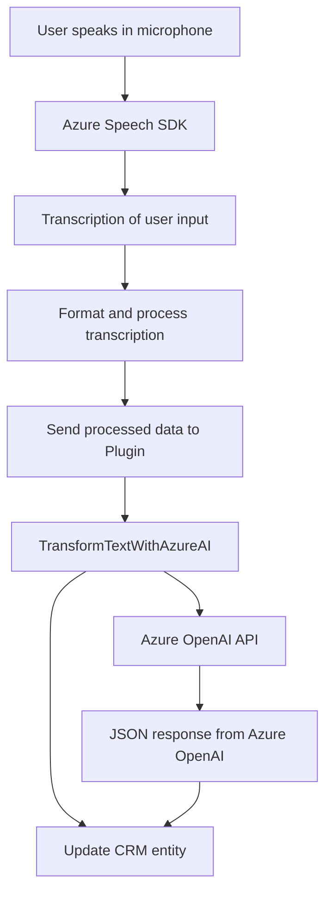

### Breve Resumen Técnico

El repositorio parece ser parte de un sistema integrado con Microsoft Dynamics 365, que proporciona funcionalidades relacionadas con la entrada de voz y la transformación dinámica de datos mediante APIs externas como **Azure Speech SDK** y **Azure OpenAI API**. Los archivos analizados contienen lógica para interactuar con formularios, actualizar campos en el CRM y realizar operaciones de síntesis y reconocimiento de voz, así como transformar los datos usando inteligencia artificial.

---

### Descripción de Arquitectura

La arquitectura sigue un modelo basado en **SOA (Service-Oriented Architecture)**. Cada componente implementa funciones específicas y orquestación de servicios para interactuar con sistemas externos como Dynamics 365, Azure Speech SDK, Azure OpenAI API, y usando patrones como:

1. **Modular Architecture**: El frontend está dividido en archivos JavaScript independientes con funcionalidades claras.
2. **Plugin Architecture**: Al usar la interfaz `IPlugin` en Dynamics 365, el archivo `.cs` permite extender las capacidades nativas del CRM mediante la ejecución de lógica específica en eventos definidos.
3. **Client-API Pattern**: El frontend actúa como un cliente que consume las APIs externas mientras interactúa con el backend.
4. **Event-driven Programming**: Uso de callbacks y promesas para gestionar eventos asíncronos, como la carga de SDKs y resultados de síntesis de voz.

El sistema funciona como una solución **web-based**, con **Frontend** en JavaScript para la interfaz de usuario y lógica que interactúa con Dynamics 365. El backend (basado en C# y plugins) actúa como intermediario entre el CRM y la API de Azure OpenAI.

---

### Tecnologías Usadas

1. **Frontend**:
   - **JavaScript**: Manejo del DOM y lógica de interacción con el formulario.
   - **Azure Speech SDK**: Para entrada y síntesis de voz, carga dinámica de scripts y ejecución en navegador.
   - Pode incluir **jQuery** si se detectan manipulaciones avanzadas en el DOM (aunque no se mencionan directamente en el código).

2. **Backend / Plugins**:
   - **C#**: Desarrollo de plugins para Dynamics CRM.
   - **Microsoft.Xrm.Sdk**: Interacción con entidades CRM y frameworks específicos.
   - **Newtonsoft.Json.Linq**: Manipulación de JSON para API response.
   - **System.Net.Http**: Solicitudes HTTP hacia APIs externas.
   - **Azure OpenAI API**: Generación de texto procesado utilizando modelos GPT.
   - **System.Text.Json**: Serialización/deserialización de objetos JSON.

3. **Infrastructure**:
   - **Microsoft Dynamics 365**: Proporciona el contexto del formulario y el modelo de datos que se manipula.
   - **Azure Platform**: Servicios de IA y reconocimiento de voz.

---

### Diagrama **Mermaid**

---

### Conclusión Final

El repositorio está diseñado como una solución integrada con **Microsoft Dynamics 365**, aprovechando APIs de **Azure Speech SDK** para entrada de voz y **Azure OpenAI API** para el reconocimiento y transformación de texto basado en IA. La arquitectura es **service-oriented**, conectando el frontend con Dynamics CRM y servicios externos a través de una combinación de SDKs y plugins C#. La división entre el frontend y backend asegura una separación de responsabilidades que permite actualizar y escalar los componentes de manera independiente.

Este enfoque modular y basado en servicios garantiza que cada parte del sistema (sintetización de voz, normalización de texto, integración con Dynamics CRM, etc.) funcione en conjunto para cumplir objetivos específicos, como mejorar la experiencia de usuario mediante datos procesados por IA. Sin embargo, es fundamental manejar correctamente las dependencias externas (como el SDK y API) para asegurar la fiabilidad y ejecución continua del sistema.