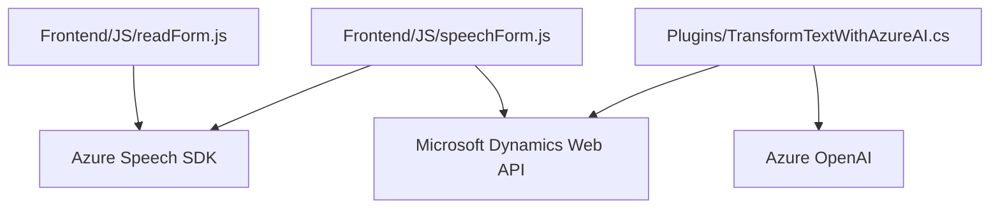

### Breve resumen técnico

El repositorio alberga tres componentes principales:
1. **Frontend/JS/readForm.js y speechForm.js**: Scripts orientados al procesamiento de formularios y reconocimiento de voz mediante Azure Speech SDK.
2. **Plugins/TransformTextWithAzureAI.cs**: Plugin de Dynamics CRM que utiliza Azure OpenAI para transformar texto en JSON estructurado.
   
La solución parece integrarse con Microsoft Dynamics CRM para habilitar capacidades avanzadas de interacción vía voz (Azure Speech SDK) y procesamiento de datos (Azure OpenAI).

---

### Descripción de arquitectura

La arquitectura es una **modular de n capas**, con las siguientes características:
- **Capa frontend**: Contiene los scripts que interactúan con los formularios del CRM, implementando entrada de voz y procesamiento de texto, además de servicios asincrónicos como Azure Speech.
- **Capa de negocio**: Un plugin de CRM encapsula la lógica para la transformación y enriquecimiento de datos.
- **Integración con servicios externos**: Azure Speech SDK y Azure OpenAI actúan como microservicios externos, mostrando una dependencia fuerte del ecosistema Azure.

En términos generales, la arquitectura del sistema combina patrones de capa de servicio, modularidad y event-driven programming en el frontend, junto con integración directa con servicios REST y de inteligencia artificial en el backend.

---

### Tecnologías usadas

- **Frontend**:
  - JavaScript.
  - Azure Speech SDK para entrada y síntesis de voz.
  - Dynamics Web API para integración con los formularios del CRM.

- **Backend**:
  - **Microsoft Dynamics CRM SDK** para definir plugins y manejar eventos.
  - **Azure OpenAI** para transformación de datos utilizando modelos de lenguaje (GPT-4).
  - Librerías .NET (`System.Net.Http`, `Newtonsoft.Json`) para interactuar con servicios REST públicos.

---

### Dependencias o componentes externos presentes

1. **Azure Speech SDK**:
   - Permite la interacción con servicios de voz para entrada y síntesis.
   - Declarado en el frontend.

2. **Dynamics Web API**:
   - Representa la capa de datos en el CRM, interactuando con los objetos y formularios.
   - Utilizado para acceder y modificar los atributos de los formularios.

3. **Azure OpenAI**:
   - Servicio REST para transformar textos con algoritmos avanzados IA, como los proporcionados por GPT.
   - Implementado en el plugin usando llamadas HTTP.

4. **Microsoft Dynamics CRM SDK**:
   - Framework de backend para manejar eventos y ejecutar lógica personalizada dentro del CRM.

---

### Diagrama Mermaid válido para GitHub

---

### Conclusión final

Esta solución está desarrollada como **extensiones personalizadas de Microsoft Dynamics CRM**, diseñadas para habilitar interacción avanzada entre usuarios y el sistema. El uso de **Azure Speech SDK** mejora la accesibilidad al permitir entrada de voz y síntesis de texto, mientras que la integración con **Azure OpenAI** agrega capacidades IA para transformar y optimizar la información.

La arquitectura modular y dependencias con servicios externos convierten este proyecto en una pieza altamente eficaz para ampliar las funcionalidades del CRM mediante procesamiento de voz y datos, aprovechando los potentes servicios de Azure.