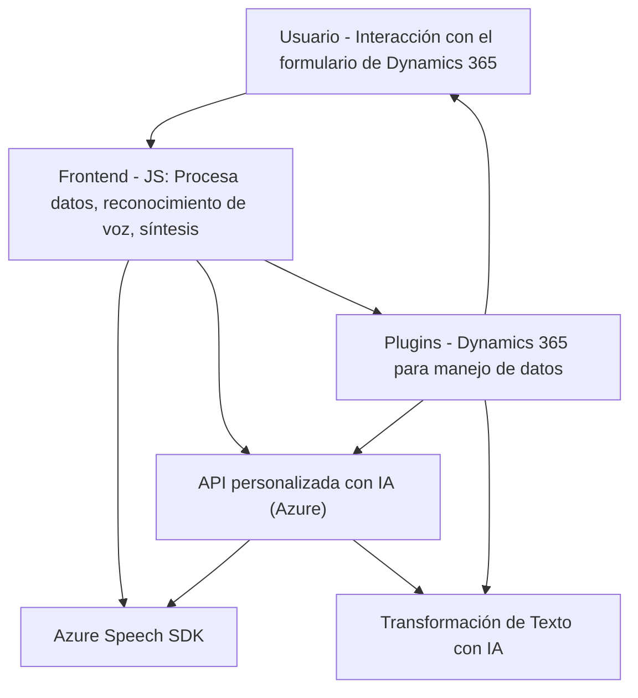

## Breve resumen técnico

El repositorio contiene tres archivos que interactúan con un Dynamics 365 CRM y la nube de Azure para implementar funcionalidades avanzadas mediante reconocimiento de voz, síntesis de texto a voz, y transformación de texto con IA:

1. **Frontend** (JavaScript): Proporciona interacción directa entre el usuario y los formularios en Dynamics. Utiliza **Azure Speech SDK** para reconocimiento de voz, síntesis de texto y API personalizada basada en IA.
2. **Backend Plugin** (C#): Integra la **Azure OpenAI API** con Dynamics 365 para realizar operaciones de transformación de texto en el contexto del CRM mediante un plugin de Dynamics (`IPlugin`).

---

## Descripción de arquitectura

El repositorio describe una solución basada en **arquitectura de n-capas**, donde las capas incluyen:
- **Presentación**: Interfaz de usuario que gestiona los datos del formulario a través de scripts JavaScript (Frontend/JS).
- **Aplicación (Middleware):** Manejadores de eventos y plugin en Dynamics 365 (Plugins/TransformTextWithAzureAI.cs) utilizan servicios de Azure para realizar integraciones externas.
- **Backend**: Dynamics 365 sirve como capa principal de datos, mientras que Azure Speech SDK y OpenAI API ofrecen funcionalidad adicional.

Al integrar servicios como Azure Speech SDK y Azure OpenAI, la solución se orienta hacia una **arquitectura dependiente de servicios externos**.

---

## Tecnologías usadas

1. **Frontend**:
   - **Lenguaje:** JavaScript.
   - **Framework/SDK:** Azure Speech SDK.
   - **API Dinámica:** Dynamics 365 API para consultas y manipulación del formulario.
   - Patrones: Separación de responsabilidades, Cargador dinámico, y Modularización funcional.

2. **Backend Plugin (Dynamics 365)**:
   - **Lenguaje:** C#.
   - **Frameworks:** .NET Framework.
   - **API:** Microsoft.Xrm.Sdk y Azure OpenAI API.
   - **Protocolos:** HTTP REST para comunicación con Azure OpenAI.
   - Patrones: Plugin architecture, Service-oriented architecture (SOA), Facade para interacción con API externa.

---

## Dependencias o componentes externos

1. **Azure Speech SDK**:
   - Reconocimiento y síntesis de texto a voz.
   - CDN: `"https://aka.ms/csspeech/jsbrowserpackageraw"`.

2. **Azure OpenAI API**:
   - Procesamiento de texto y generación de contenido estructurado con IA.

3. **Dynamics 365 CRM**:
   - Plataforma base para interacción con datos y gestión de formularios.

4. **Libraries**:
   - `System.Net.Http`, `Newtonsoft.Json.Linq` (en el plugin backend).
   - Importaciones estándar de Dynamics 365 (`Microsoft.Xrm.Sdk`) para plugins.

---

## Diagrama Mermaid

---

## Conclusión final

Este proyecto establece una **n-capas arquitectura**, donde el frontend basado en JavaScript actúa como intermediario entre la interfaz y los servicios externos. La solución se apoya de Microsoft Dynamics 365 como plataforma de datos, mientras delega tareas como reconocimiento de voz y texto a servicios de Azure como **Speech SDK** y **OpenAI API**. Las dependencias están organizadas adecuadamente, aplicando principios de separación de responsabilidades y modularización. Sin embargo, el plugin C# podría beneficiarse de mejores prácticas para la gestión de configuraciones sensibles como las claves API.