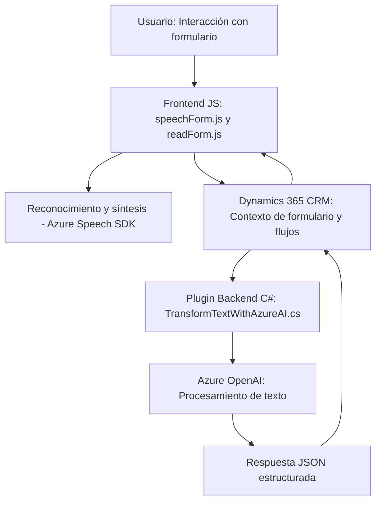

### Breve resumen técnico

El conjunto de archivos descritos corresponde a una solución que incluye un **frontend basado en JavaScript** y un **plugin backend en C# para Dynamics 365 CRM**, conectándose a servicios en la nube como **Azure Cognitive Services** y **Azure OpenAI API**. La solución está centrada en:
1. **Reconocimiento y síntesis de voz** (Azure Speech SDK con frontend).
2. **Procesamiento IA de texto estructurado** usando Azure OpenAI desde el plugin backend.

Por lo tanto, es un sistema híbrido que combina interacción con usuario (voz y formularios) y procesamiento avanzado de texto con integración directa a servicios de Azure.

---

### Descripción de arquitectura

1. **Tipo:** Arquitectura basada en n capas, donde:
   - El frontend realiza la interacción con el usuario (reconocimiento/síntesis de voz y manipulación de formularios dinámicos).
   - El backend (Dynamics 365 Plugin) ejecuta una lógica de negocio más compleja apoyado en servicios como AI.
  
2. **Relación entre capas:** Las interacciones del usuario, recogidas en el frontend, son procesadas y enviadas al backend, que a su vez utiliza APIs externas, y la respuesta puede dirigirse nuevamente al frontend.

3. **Patrones aplicados:**
   - **Patrones comunes:**
     - **Diseño por eventos:** Uso de callbacks en el frontend para cargar SDKs e iniciar diferentes procesos.
     - **Plugin-Based Design:** En el backend, mediante los eventos de Dynamics CRM cuando se activan flujos de negocio.
   - **Arquitectura de servicios externos:** Incorporación directa de APIs (Azure Speech y Azure OpenAI).
   - **Modularidad:** Cada función en el frontend y método en el backend tiene una responsabilidad específica.

---

### Tecnologías usadas

1. **Frontend:**
   - **JavaScript:** Funciones organizadas y modulares para interacción con el usuario y APIs.
   - **Azure Speech SDK:** Para reconocimiento y síntesis de voz.
   - Manejo del contexto y API de Dynamics CRM (`Xrm.WebApi.online`).

2. **Backend:**
   - **C# (.NET Framework):** Desarrollo del plugin para Dynamics CRM.
   - **Azure OpenAI API:** Transformación de texto en objetos JSON.
   - **Newtonsoft.Json y System.Text.Json:** Manipulación de datos en formato JSON.
   - **HTTP Client:** Implementación de APIs REST.
   - **Dynamics SDK:** Gestión del contexto CRM.

3. **Bases de datos y APIs:**
   - Dynamics CRM como fuente de datos.
   - Azure Cognitive Services para servicios de voz.
   - Azure OpenAI API para procesamiento de lenguaje natural.

---

### Diagrama Mermaid

---

### Conclusión final

La solución representa un diseño híbrido cliente-servidor basado en n capas. El **frontend** es una aplicación basada en **JavaScript**, con una fuerte integración al SDK de Dynamics CRM y **Azure Speech SDK** para capturar y procesar datos del usuario, mientras que el **backend** en **C#** actúa como un plugin de Dynamics CRM que interactúa con servicios de AI como **Azure OpenAI** para procesamiento avanzado del texto.

#### Pros:
- **Modularidad:** Componentes desacoplados, cada uno con un objetivo específico.
- **Extensibilidad:** Fácil incorporación de nuevas APIs o funcionalidades.
- **Integración avanzada:** Uso de tecnologías de Azure que amplían capacidades del sistema.
- **Interfaz natural:** Interacción por voz mejora la experiencia del usuario.

#### Contras:
- **Carga de dependencias:** Dependencia de múltiples servicios externos (Azure), lo que aumenta costos y complejidad.
- **Robustez:** Necesidad de mayor manejo de errores para garantizar estabilidad en producción.

Es una solución idónea para entornos empresariales que requieran interacción dinámica y procesamiento automatizado de texto, como podría ser un CRM con integración de IA.