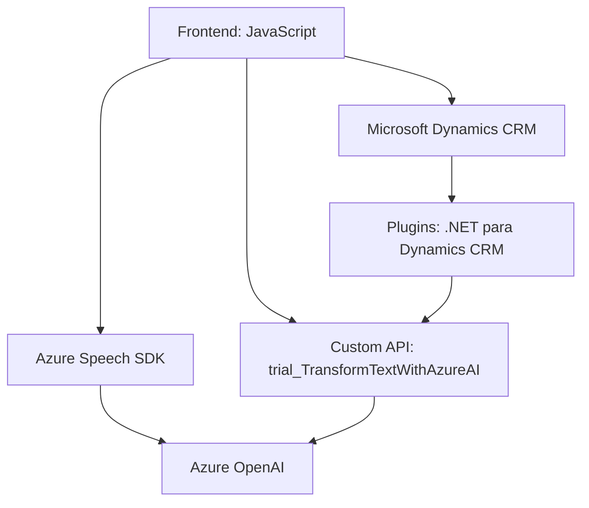

### Breve resumen técnico
El repositorio alberga diferentes módulos y componentes que integran tecnologías de reconocimiento de voz (Azure Speech SDK), transformaciones de texto con inteligencia artificial (Azure OpenAI via Custom API), y plugins para Microsoft Dynamics CRM. La solución busca facilitar la interacción asistida de usuarios con formularios a través de transcripción de voz y procesamiento de texto estructurado en JSON.

---

### Descripción de la arquitectura
La solución tiene una arquitectura híbrida de **componentes modulares**. 
1. **Frontend en JavaScript**: Se emplean archivos como `readForm.js` y `speechForm.js` para interactuar con documentos HTML y manejar formularios mediante Azure Speech SDK. Estos archivos implementan flujos asincrónicos y son responsables tanto de lectura como entrada automatizada de datos.
2. **Capas de Servicios/API**: Un plugin en .NET (Dynamics CRM) con integración a Azure OpenAI realiza transformaciones avanzadas de texto y genera salidas en JSON para su uso directo en el CRM.
3. **Flujo y comunicación externa**: Aprovecha servicios de terceros como el Azure Speech SDK y Azure OpenAI para realizar tareas más complejas. Esto sigue el patrón de integraciones externas. 

La solución utiliza patrones **n-capas**, donde:
- **Capa de presentación**: Archivos JavaScript manejan vistas y flujos.
- **Capa lógica de negocio**: Implementada en plugins mediante Dynamics CRM + OpenAI.
- **Capa SDK/Integraciones**: Azure Speech SDK y APIs de Dynamics CRM facilitan acceso a datos y funcionalidades específicas.

---

### Tecnologías usadas
1. **Frontend**:
   - **JavaScript** para scripts.
   - **Azure Speech SDK** para síntesis y reconocimiento de voz.
2. **Backend**:
   - **C# (.NET Framework)** para Plugins CRM.
   - **Azure OpenAI** para procesamiento avanzado de lenguaje.
   - **Microsoft Dynamics CRM SDK** para manejar lógica interna del CRM.
3. **Dependencias**:
   - Internas: `Xrm.WebApi`, SDK de Dynamics CRM.
   - Externas: API REST de Azure Speech SDK y OpenAI.

---

### Diagrama Mermaid válido para GitHub

---

### Conclusión final
La arquitectura representa una solución moderna orientada a la **automatización de entrada de datos y procesamiento avanzado con IA**. Es ideal para sistemas empresariales que emplean Microsoft Dynamics CRM, integrado con servicios avanzados de Azure como Speech SDK y OpenAI para transformar datos de formularios y habilitar lazada por voz interactiva.

Aunque el diseño es funcional, puede beneficiarse de una mayor abstracción en puntos cruciales como configuraciones dinámicas de credenciales y endpoints para las integraciones. Establecer mayor control sobre seguridad y configuración externa reforzaría robustez operativa, especialmente en entornos multiusuarios.