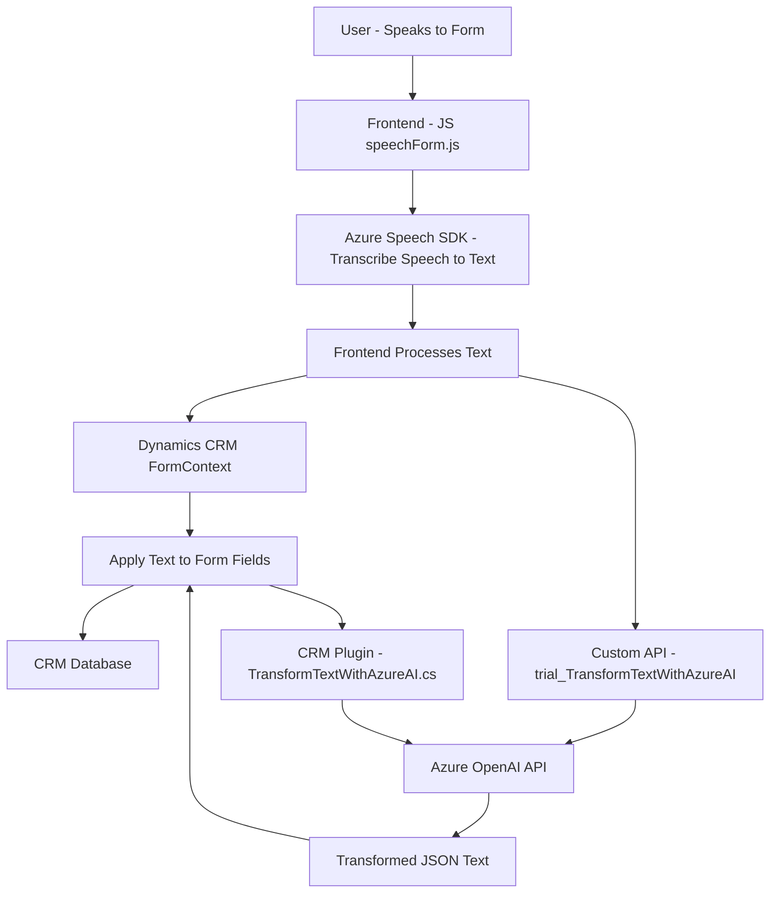

### Breve Resumen Técnico
El repositorio contiene una solución que integra procesamiento de voz (mediante Azure Speech SDK) y servicios de inteligencia artificial (Azure OpenAI) en un contexto de CRM Dynamics para la automatización de formularios y personalización de datos. La funcionalidad central gira en torno a la interacción de usuarios mediante entrada de voz y el mapeo de datos al formulario del CRM, adaptados a formatos JSON mediante procesamientos avanzados de lenguaje.

---

### Descripción de Arquitectura
La solución está dividida en tres capas principales:
1. **Frontend**: Realizado en JavaScript, gestiona las interacciones con el usuario en el navegador. Utiliza API externas como Azure Speech SDK para entrada y salida de voz.
2. **Servicios Backend**: Incluye plugins personalizados creados para Dynamics CRM, implementando patrones como Plugin Pattern, y delega tareas de procesamiento de texto a APIs de Azure OpenAI.
3. **Plataforma CRM**: Dynamics CRM actúa como base para la persistencia y gestión de datos empresariales, conectada directamente con las operaciones del backend.

La arquitectura general es una **arquitectura en capas** que utiliza integraciones con servicios específicos (Azure Speech y OpenAI) para extender la funcionalidad del CRM, con particular enfoque en patrones de modularidad, integración de servicios, y el uso de eventos asincrónicos en la capa frontend.

---

### Tecnologías y Frameworks Usados
1. **Frontend:**
   - **JavaScript** con programación modular.
   - **Asynchronous JavaScript**: Promesas y callbacks para manejar SDK y APIs externas.
   - **Azure Speech SDK**: Para inferencia de voz a texto y síntesis de texto a voz dinámicamente.
   
2. **Backend:**
   - **Microsoft Dynamics CRM SDK (`Microsoft.Xrm.Sdk`)**: Común en la creación de plugins y extensiones en el ecosistema Dynamics.
   - **Azure OpenAI SDK**: Para análisis e inferencia en formato JSON.
   - **Newtonsoft.Json**: Procesamiento avanzado de objetos JSON.
   - **System.Net.Http**: Comunicación con servicios externos de Azure OpenAI API.
   
3. **External Dependencies/Components:**
   - Azure SDKs (Speech y OpenAI).
   - Custom APIs montadas en el entorno del CRM bajo la arquitectura Dynamics.

---

### Diagrama Mermaid

---

### Conclusión Final
La solución representada en el repositorio es una integración de servicios diseñada para enriquecer la experiencia de CRM mediante reconocimiento de voz, síntesis de audio y procesamiento de lenguaje natural. La arquitectura es de tipo **n capas**, dividiendo la solución en frontend (manejo de interacción usuario-formulario), backend (procesamiento y extensión vía plugins), y servicios (Azure Speech SDK y OpenAI).

Además, el diseño aprovecha patrones como modularidad, asincronía y delegación de tareas en servicios, lo que garantiza que las operaciones sean eficientes y adaptables al flujo de datos dinámicos del CRM. Una posible mejora sería diferenciar más claramente entre las operaciones de IA y las operaciones tradicionales para permitir configuraciones más específicas según cada cliente.