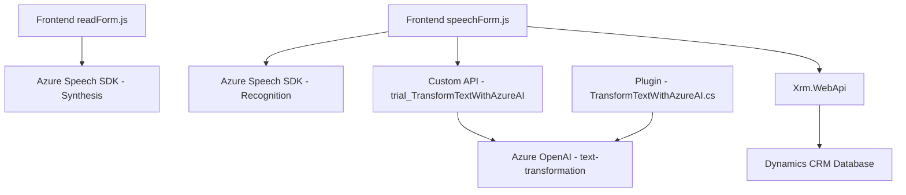

### Breve Resumen Técnico
El repositorio en cuestión implementa una solución de software integrada con Microsoft Dynamics 365 y Azure. Hay tres componentes con diferenciadas funcionalidades:
1. **Frontend/JS/readForm.js**: Proceso de lectura y síntesis vocal de un formulario mediante el Azure Speech SDK.
2. **Frontend/JS/speechForm.js**: Captura y procesamiento de entrada de voz con la integración del Azure Speech SDK y APIs personalizadas de Dynamics CRM.
3. **Plugins/TransformTextWithAzureAI.cs**: Plugin en C# para Dynamics CRM que utiliza Azure OpenAI para transformar texto en JSON estructurado a partir de normas específicas.

---

### Descripción de Arquitectura
La solución implementa una arquitectura híbrida basada en:
1. **Componentes y microservicios externos**: La solución interactúa con módulos externos:
   - **Azure Speech SDK** bajo el concepto de servicios "Software as a Service" para facilitar reconocimiento de voz y síntesis vocal.
   - **Azure OpenAI** para el procesamiento de texto.
   - **Dynamics CRM** como sistema central y controlador de flujo de datos del negocio.
2. **Integración basada en APIs**: Las APIs permiten comunicación entre la lógica de negocio de Dynamics y servicios de Azure. Esto corresponde a un patrón de arquitectura basada en servicios.
3. **Patrón Plugin (Dynamics CRM)**: Sistema extensible mediante plugins, que encapsulan funcionalidades específicas (en este caso, transformaciones basadas en IA).
4. **Modularidad**: El frontend separa tareas en múltiples módulos y usa patrones como `Façade`, `Callback` y separación de responsabilidades.

---

### Tecnologías Usadas
1. **Frontend (JavaScript):**
   - **Azure Speech SDK** para síntesis vocal y reconocimiento de voz.
   - JavaScript como lenguaje principal.
   - Lógica de mapeo de datos entre interfaz y backend.
2. **Backend (C# Plugin):**
   - Microsoft Dynamics CRM SDK para eventos y operaciones de la base de datos.
   - Azure OpenAI API para procesamiento avanzado con IA.
   - Framework .NET y dependencias estándar (`System.Net.Http`, `System.Text.Json`, etc.).

---

### Dependencias o Componentes Externos
1. **Azure Speech SDK** (importación desde URL proporcionada): Proporciona capacidades de inteligencia artificial para voz.
2. **Azure OpenAI API**: Integra capacidades avanzadas de procesamiento de texto.
3. **Dynamics CRM Custom API**:
   - `trial_TransformTextWithAzureAI` para transformación con IA.
   - Entidades y campos (lookup queries y mapeos) personalizados.
4. Dependencias de librerías típicas de .NET Framework para solicitud HTTP, JSON, etc.

---

### Diagrama **Mermaid**

---

### Conclusión Final
La solución descrita en el repositorio tiene como objetivo aprovechar servicios de voz y procesamiento de texto para facilitar la interacción y automatización en formularios de Microsoft Dynamics CRM. Utiliza tecnologías de Microsoft Azure (Speech SDK y OpenAI API) y sigue una arquitectura modular con integración externa mediante APIs y plugins. 

La conexión entre los módulos muestra una alta cohesión y baja acoplamiento, algo positivo para mantenimiento y extensibilidad. Los principales desafíos a considerar serían la latencia en las interacciones con las APIs externas y la configuración segura de claves y regiones de Azure para operar los servicios de IA.

Una posible mejora incluiría mecanismos más robustos para manejar errores en las APIs externas y procesos de reintento en caso de fallos de red o del SDK.