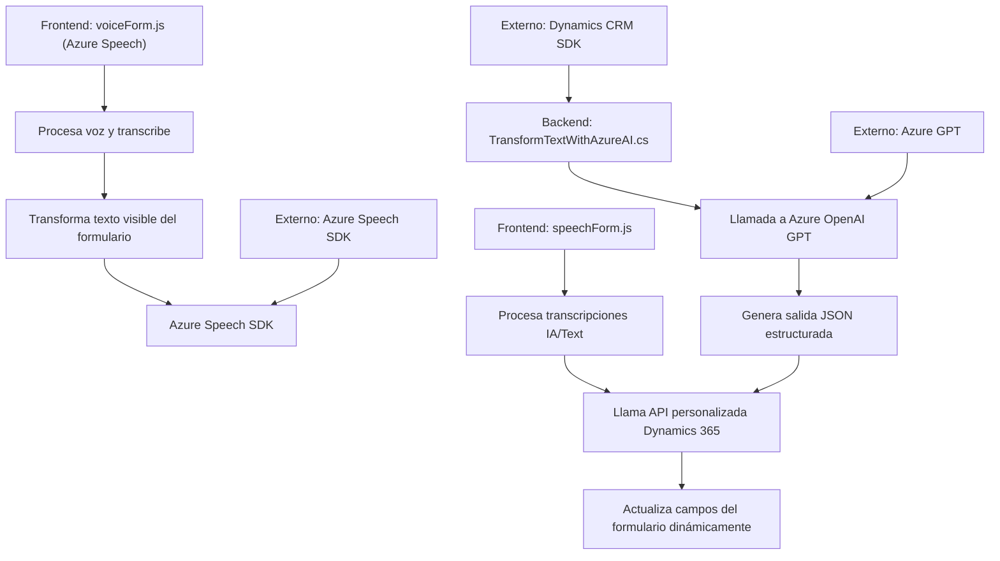

### Análisis del Repositorio

**Breve resumen técnico:**  
Este repositorio presenta una solución que integra procesamiento de datos de voz y texto utilizando tecnologías como Azure Speech SDK, Dynamics 365, y Azure OpenAI GPT para interactuar con formularios y personalizar respuestas. Se maneja desde varias perspectivas: frontend en JavaScript para procesar voz, procesamiento con plugins en C# para Dynamics CRM, y transformación de datos con IA.

---

### 1. Descripción de Arquitectura:
La solución está enfocada principalmente en la **interacción entre usuario y sistema mediante procesamiento de texto y voz**. Combina dos capas principales:
  - **Frontend (JS)**: Traduce voz a texto, transforma formularios dinámicamente y realiza integración directa con Azure Speech SDK.
  - **Backend (Plug-in en Dynamics CRM con C#)**: Procesa datos transformados mediante APIs externas como Azure OpenAI GPT y facilita interacciones con servicios de Dynamics 365.

La arquitectura utiliza un enfoque de **n capas**:
1. **Frontend**: Captura datos desde el usuario (voz y datos en formularios).
2. **Backend (Plug-ins)**: Encargado de lógica de negocio y transformación.
3. **Integración con servicios externos**: Uso de SDKs y APIs de Azure (Speech SDK y OpenAI GPT).

Este modelo n-capas busca modularizar roles de procesamiento, delegar tareas especializadas a sus componentes y facilitar escalabilidad para interactuar con varias plataformas (Dynamics CRM).

---

### 2. Tecnologías, Frameworks, y Patrones Usados:

**Frontend (JS):**
- Tecnología: `JavaScript ES6`.
- Frameworks/SDKs: Azure Speech SDK, DOM Manipulation.
- Patrones:
  - **Facade Pattern** en el archivo `readForm.js` (entrada única para orchestración del sistema).
  - **Delegación de tareas** en funciones como `ensureSpeechSDKLoaded`, `startVoiceInput`.

**Backend (C#):**
- Tecnología: `C#.NET Core`.
- Frameworks: Dynamics CRM SDK, Newtonsoft.Json, System.Net.Http.
- Patrones:
  - **Plugin Architecture** (extensibilidad en Dynamics).
  - **Adapter Pattern** para interactuar con APIs externas (Azure OpenAI GPT).
  - **Single Responsibility Principle (SRP)**: Cada clase/método tiene una tarea específica.

---

### 3. Dependencias y Componentes Externos:

**Frontend:**
1. **Azure Speech SDK (JS)** para reconocer voz, transcribirla a texto y generar reportes de la información.
2. **Dynamics 365 Web API**: Sustracción y lectura de datos desde formularios.

**Backend:**
1. **Azure OpenAI GPT API:** Generación de respuestas dinámicas basadas en IA.
2. **Newtonsoft.Json:** Para manipulación y estructura JSON.
3. **Dynamics CRM SDK:** Para ejecutar lógica y asociar texto procesado a objetos de formulario.

---

### 4. Diagrama Mermaid válido para GitHub Markdown:

---

### 5. Conclusión Final:
Este repositorio implementa una solución modular con arquitectura de **n capas**, que aprovecha tecnologías **Cloud** como Azure Speech SDK y OpenAI GPT para diseñar aplicaciones inteligentes orientadas al procesamiento de datos de voz, texto y formularios. Es idónea para usar en entornos corporativos como Dynamics 365, aplicando principios sólidos de programación como SRP, delegación y patrones de plugins.

La solución es escalable y robusta, pero podría beneficiarse de detalles como autenticación segura y manejo de errores explícito en las llamadas de APIs (para fortalecer la resiliencia en entornos críticos).