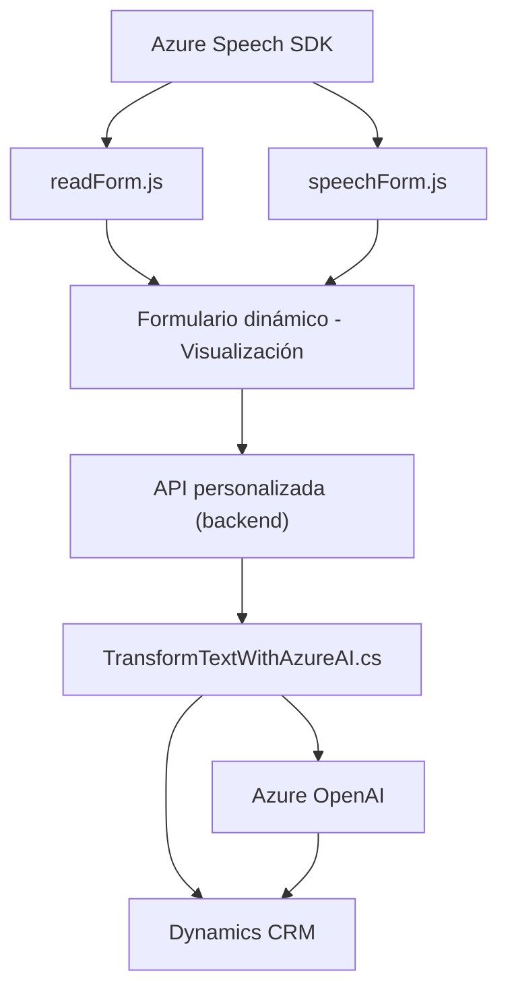

**Breve resumen técnico:**

El repositorio contiene tres archivos principales: dos para manejo de datos en el frontend (`readForm.js` y `speechForm.js`) y uno correspondiente a un plugin del backend (`TransformTextWithAzureAI.cs`). El propósito general del proyecto parece ser la implementación de funcionalidades relacionadas con entrada y salida de voz, transformación de texto mediante IA (Azure OpenAI), y manejo dinámico en formularios de Dynamics CRM. La arquitectura combina integración en frontend y backend, aprovechando servicios de Azure.

---

**Descripción de arquitectura:**

1. **Arquitectura general**: La solución sigue un enfoque **client-server** con una funcionalidad repartida entre el cliente (frontend) y el servidor (plugin backend). El frontend usa APIs de Azure Speech SDK para captura y síntesis de voz, mientras que el backend se encarga de procesamiento avanzado con Azure OpenAI. Potencialmente, podría describirse como una **arquitectura distribuida** con un **modelo híbrido** (cliente y servidor) que utiliza un patrón basado en dependencias externas.

2. **Plugins en Dynamics CRM**: En el backend, el archivo `TransformTextWithAzureAI.cs` utiliza el patrón común de **plugins** en Dynamics CRM para añadir lógica personalizada.

3. **Dependencias cargadas dinámicamente**: Tanto en el frontend como el backend, se integran servicios externos (Azure Speech SDK y Azure OpenAI), lo que indica una **arquitectura ligada a servicios externos** con puntos críticos de dependencia en la conectividad y configuración.

---

**Tecnologías usadas:**

1. **Frontend**: 
   - **Azure Speech SDK**: Captura y síntesis de voz.
   - **Browser APIs**: Para manipulación dinámica del DOM y recursos externos.
   - **JavaScript**: Código modular basado en funciones con enfoque en operaciones en tiempo real y eventos de voz.

2. **Backend**: 
   - **Dynamics CRM**: Integración directa mediante plugins que implementan la interfaz `IPlugin`.
   - **Azure OpenAI**: Para procesamiento de texto via IA (GPT-4o).
   - **C#**: Lenguaje de programación usado para la lógica del plugin.
   - **Newtonsoft.Json**, **System.Net.Http**, **Microsoft.Xrm.Sdk**: Manipulación de datos y acceso al contexto del CRM.

3. **Servicios externos**:
   - API REST de Azure OpenAI para delegar procesamiento inteligente.
   - `Xrm.WebApi` para consultas en Dynamics CRM.

4. **Patrones**:
   - **Modularidad**: Cada archivo encapsula el comportamiento relacionado con sus funcionalidades específicas.
   - **Event-driven**: En el frontend, las funciones son desencadenadas por eventos como voz o carga de SDK.
   - **Dependencia de servicios externos**: Enfoque centrado en delegar cargas complejas (IA y voz) a servicios especializados.

---

**Diagrama Mermaid válido para GitHub:**

---

**Conclusión final:**

La estructura del repositorio representa una solución integrada enfocada en la interacción con voz y texto que se sincroniza con formularios dinámicos de Dynamics CRM. El **frontend** usa un enfoque modular y dependencias cargadas dinámicamente como Azure Speech SDK para entrada/salida de voz. El **backend** está basado en plugins de Dynamics CRM que extienden la funcionalidad con Azure OpenAI para procesamiento avanzado de texto.

La arquitectura es una combinación de **event-driven** en el frontend y **plugin-oriented** en el backend conectado a servicios externos. Si bien es eficiente en cuanto a modularidad y dependencia hacia servicios como Azure, también se enfrenta a riesgos como la necesidad de conectividad robusta, gestión adecuada de claves API, y una posible dependencia excesiva de servicios externos para funcionalidad crítica.