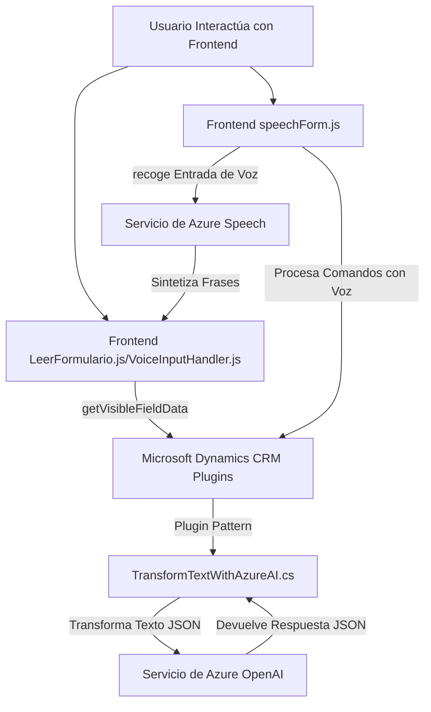

### Análisis del Repositorio

#### Breve resumen técnico
El código analizado abarca varios archivos que ofrecen dos funcionalidades principales: un frontend con soporte de reconocimiento de voz y síntesis vocal mediante **Azure Speech SDK**, y un backend que integra con **Azure OpenAI** desde Microsoft Dynamics CRM. Esta solución está diseñada para manipular y gestionar formularios en tiempo real, apoyándose en APIs y servicios para el procesamiento de texto y datos.

---

### Descripción de arquitectura
- **Tipo de solución**: Mixta. Incluye un frontend basado en JavaScript orientado a la interacción con formularios web y un backend operativo como **plugin de Microsoft Dynamics CRM** para trabajar con la API de Azure OpenAI en transformación de textos. Puede considerarse un middleware para una plataforma CRM basada en Microsoft Dynamics con integración de servicios Azure.
- **Arquitectura general**: 
  - **Frontend**: Arquitectura modular, siguiendo una estructura separada de funciones que implementan lógica de manejo de eventos y servicios.
  - **Backend**: Plugin Pattern, típico de Dynamics CRM, con invocación hacia servicios externos bajo el patrón de microservicio o servicio externo complementario.

---

### Tecnologías usadas
1. **Frontend**:
   - Lenguaje: JavaScript.
   - SDKs: **Azure Speech SDK** (sintetización y reconocimiento de voz).
   - Plataforma: Microsoft Dynamics CRM (gestión de formularios y entidades).

2. **Backend**:
   - Lenguaje: C#.
   - Frameworks y librerías:
     - `Microsoft.Xrm.Sdk` (para integrar plugins en Dynamics).
     - `System.Net.Http` y `System.Text.Json` (peticiones HTTP y procesamiento de JSON).
     - `Newtonsoft.Json.Linq` (manipulación avanzada de objetos JSON).
   - Servicios: Azure OpenAI (`gpt-4o` y procesamiento de texto complejo).
   - Arquitectura de plugin y uso del patrón Facade para encapsular la interacción con Dynamics CRM.

3. **Servicios Externos**:
   - **Azure Speech SDK** para síntesis y entrada de voz.
   - **Azure OpenAI** para transformar texto según reglas específicas, ejecutadas como microservicios externos.

---

### Diagrama Mermaid 100% compatible con GitHub Markdown

---

### Conclusión final
El repositorio presenta un sistema de integración entre frontend y backend para una solución diseñada a operar en el contexto de formularios, con soporte para interacción por voz. Se utiliza el **Azure Speech SDK** para funcionalidad de reconocimiento y síntesis de voz, complementado con el **Azure OpenAI** para reglas avanzadas de transformación de texto desde el backend. La arquitectura destaca por su modularidad y utiliza patrones como **Plugin Pattern** y **Microservicios**.

Las dependencias principales (Azure APIs y Microsoft Dynamics CRM) confirman que la solución está diseñada para aprovechar las capacidades de plataformas de terceros, asegurando extensibilidad y escalabilidad. Sin embargo, sería recomendable revisar y mejorar los aspectos de seguridad del manejo con las claves de acceso en el código del frontend para mantener la integridad de los datos y las credenciales.