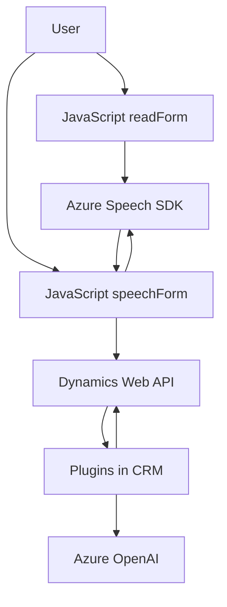

### Breve resumen técnico
La solución en el repositorio es un sistema basado en Dynamics CRM, complementado por funcionalidades de entrada y salida de voz. Integra capacidades de síntesis y transcripción de voz mediante Azure Cognitive Services Speech SDK y procesamiento avanzado de texto con Azure OpenAI. El sistema se enfoca en accesibilidad, interacción con formularios y automatización con inteligencia artificial.

---

### Descripción de arquitectura
1. **Componentes**:
   - **Frontend**: Consiste en scripts JavaScript (`readForm.js` y `speechForm.js`) para manejar la interacción del usuario con formularios usando voz (lectura, transcripción y actualización de campos).
   - **Backend**: Plugins desarrollados en C# (`TransformTextWithAzureAI.cs`) para interactuar con Dynamics CRM y Azure OpenAI, transformando texto en JSON estructurado mediante normas específicas.

2. **Arquitectura**:
   - **Capas principales**:
     - Presentación: JavaScript frontend que interactúa con el usuario y envía datos al backend.
     - Lógica personalizada: Plugins en Dynamics CRM para función de procesamiento avanzado.
     - Servicios externos: Integración con Azure Cognitive Services y Azure OpenAI para síntesis de voz y texto.
   - **Patrones de diseño**:
     - **Modularización**: Las funcionalidades están separadas en archivos específicos.
     - **API-Driven Architecture**: Uso intensivo de servicios REST externos (Azure APIs).
     - **Event-Driven Architecture**: Los eventos de CRM y los flujos de interacción del usuario activan lógica específica.

3. **Integración con APIs**:
   - El sistema interactúa con:
     - Azure Cognitive Services Speech SDK para gestionar síntesis y transcripción de voz.
     - Azure OpenAI API para realizar transformaciones complejas de texto mediante inteligencia artificial.

---

### Tecnologías usadas
- **Frontend**:
  - **JavaScript** para lógica de interacción con formularios.
  - Azure Speech SDK para síntesis y transcripción de voz.
  - Dynamics 365 Web API para manipulación de datos.

- **Backend**:
  - **C#** para desarrollo de Plugins de Dynamics CRM.
  - Microsoft.Xrm.Sdk para interacción con el contexto de ejecución de CRM.
  - Azure OpenAI para procesamiento avanzado de texto.

- **Patrones**:
  - Modularización de funciones según roles (lectura, síntesis, transcripción).
  - Lógica orientada a eventos para operar sobre contextos de formularios.
  - Integración de servicios externos con DTO y APIs REST.

---

### Diagrama Mermaid (compatible con GitHub Markdown)

---

### Conclusión final
Este repositorio muestra una solución bien integrada entre frontend, backend y servicios externos con un enfoque en accesibilidad mediante voz y automatización con inteligencia artificial. La arquitectura está organizada por capas: un frontend dinámico para interacción con formularios y un backend basado en Dynamics CRM extendido con plugins personalizados. Las dependencias clave son el Azure Speech SDK para manejar síntesis/transcripción de voz y Azure OpenAI para el procesamiento de texto avanzado. Aunque adecuada, el manejo de seguridad y tolerancia a errores podría mejorarse, especialmente considerando la integración intensiva de servicios externos.

