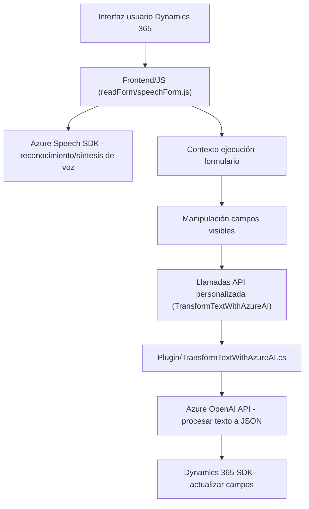

### **Breve resumen técnico**
El repositorio contiene funcionalidades destinadas a integrar Azure Speech SDK y Azure OpenAI API en el contexto de Microsoft Dynamics 365. Los scripts en JavaScript manejan interacción con formularios, reconocimiento de voz y procesamiento de datos por IA, mientras que el plugin en C# transforma entradas textuales en formatos estructurados JSON mediante Azure OpenAI.

---

### **Descripción de arquitectura**
La arquitectura implementa una **estructura híbrida** con los siguientes elementos principales:
1. **Microservicio:** Uso de Azure OpenAI para la transformación de texto y Azure Speech SDK para síntesis/reconocimiento de voz.
2. **Plugin-based architecture:** El plugin en C# se ajusta al modelo de extensibilidad de Dynamics 365.
3. **N-capas (en el contexto de Dynamics 365):**
   - **Capa de presentación:** Manipulación de formularios en Dynamics 365.
   - **Capa de negocio:** Procesamiento de datos por IA y operaciones en base a eventos del usuario.
   - **Capa de datos:** Acceso a campos y entidades de Dynamics 365 mediante el modelo de datos Xrm.
4. **Event-driven:** Activación de funcionalidades en tiempo real según las interacciones del usuario.

---

### **Tecnologías usadas**
1. **Backend/Plugins:**
   - **C#:** Para la creación de plugins en Dynamics 365 (ejemplo: `TransformTextWithAzureAI.cs`).
   - **Microsoft Dynamics SDK:** Gestión y manipulación de datos en la plataforma CRM.
   - **Azure OpenAI API:** Procesamiento avanzado de texto mediante inteligencia artificial.
2. **Frontend:**
   - **JavaScript (ES6):** Para interacción de formularios y síntesis de voz.
   - **Azure Speech SDK:** Reconocimiento y síntesis de voz.
   - **Dynamics 365 Web API:** Manipulación de campos y datos dinámicos.
3. **Patrones establecidos:**
   - Singleton (`HttpClient` para conexión eficiente y reutilizable).
   - Plugin-driven y modular para lógica específica de Dynamics.
   - Modelo de Capas, enfocándose en una interacción controlada entre presentación, negocio y datos.

---

### **Dependencias o componentes externos**
1. Azure Speech SDK (`https://aka.ms/csspeech/jsbrowserpackageraw`) para reconocimiento y síntesis de voz.
2. Azure OpenAI API (`https://openai-netcore.openai.azure.com`) para transformación textual avanzada.
3. Dynamics 365 SDK:
   - `Xrm.WebApi.online.execute` y otros para comunicación directa con las APIs de la plataforma CRM.
   - `IOrganizationService` para manejar servicios internos de Dynamics.
4. Librerías externas:
   - `System.Net.Http` y `Newtonsoft.Json.Linq` para manejo de conexión con Azure OpenAI y procesamiento de JSON.
   - API personalizada (`trial_TransformTextWithAzureAI`) en Dynamics para integración específica.

---

### **Diagrama Mermaid**

---

### **Conclusión final**
El repositorio representa una **solución integrada para reconocimiento de voz y procesamiento avanzado de textos en Dynamics 365**, utilizando tecnologías modernas como Azure Speech SDK y Azure OpenAI API. La arquitectura demuestra un enfoque híbrido: **microservicio** para API externas y **n-capas** para la interacción interna en Dynamics. Esta implementación potencia las capacidades dinámicas y automatizadas de sistemas CRM mediante IA y servicios de voz.