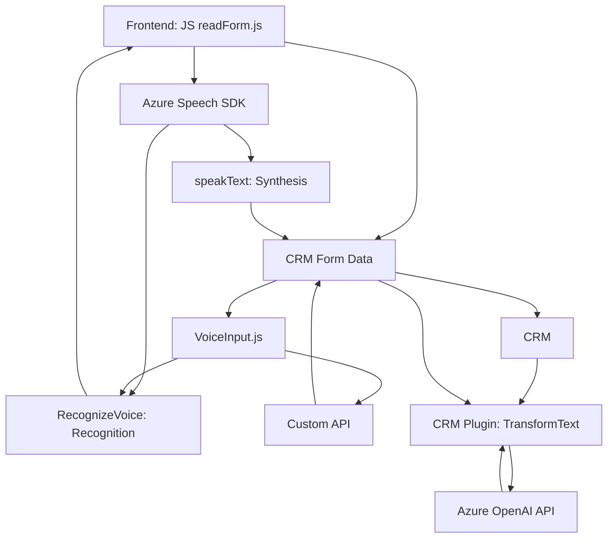

### Breve resumen técnico:
El repositorio parece estar diseñado para integrar entrada de voz en un sistema CRM (gestión de relaciones con clientes) usando tecnologías avanzadas como **Azure Speech SDK** y **Azure OpenAI**. Se divide en varias partes principales:
- **Frontend/JavaScript**: Manejo de entradas de voz, síntesis de texto y procesamiento en formularios dinámicos.
- **Plugins C# (Dynamics CRM)**: Extensión del CRM, con integración con Azure OpenAI para transformar texto en objetos estructurados.

---

### Descripción de arquitectura:
La arquitectura propuesta combina los siguientes aspectos:
1. **Cliente-servidor**:
   - El frontend maneja interacción directa con el usuario, entrada de voz y manipulación de datos.
   - El backend configura el contexto CRM y delega tareas complejas (como la integración con Azure OpenAI) en servicios externos a través de plugins C#.

2. **Servicios externos**: 
   - **Microsoft Azure Speech SDK**: Reconocimiento y síntesis de voz.
   - **Microsoft Azure OpenAI**: Reconocimiento avanzado y transformación de texto en JSON para el CRM.
   - Possiblemente APIs personalizadas de CRM para realizar funciones específicas (integración con distintos módulos del sistema).

3. **Patrón n-capas**:  
   - Mientras no hay evidencia directa de separación estricta en capas (según la codificación analizada), las funciones definen roles claros de entrada/interpretación de voz (capa presentación), especificación del CRM (lógica de negocio) y acceso a datos (API externas para entidades del CRM).

4. **Plug-in y modularidad**:
    - El código C# para el CRM sigue el **Patrón Plugin** de Dynamics, desacoplando la lógica del CRM de las integraciones externas de AI como Azure OpenAI, esencial para la extensibilidad y claridad del sistema.

---

### Tecnologías, frameworks y patrones usados:
1. **Frontend (JavaScript):**
   - **Azure Speech SDK**: API para reconocimiento y síntesis de voz.
   - **Patrón de carga dinámica**: Garantiza la disponibilidad de dependencias cruciales como el SDK.
   - **Eventos asincrónicos**: Procesamiento basado en callbacks y promesas para integración.
   - **SDK Web del CRM**: Para manipular formularios y atributos dinámicos (`Xrm.WebApi`).

2. **Backend (Plugins en C#):**
   - **Dynamics CRM SDK**: Core para extender funcionalidades del CRM.
   - **Azure OpenAI API**: Reconocimiento avanzado e IA para transformar texto en estructuras customizadas.
   - **Newtonsoft.Json y HttpClient**: Para manipulación de JSON y realizar solicitudes HTTP.

3. **Patrones observados:**
   - **Patrón Plugin**: C# CRM extensible.
   - **Modularidad**: Diseño de funciones independientes para manejo de tareas específicas.
   - **Modelo asincrónico (JavaScript)**: Se utiliza para gestionar tiempos de respuesta de servicios remotos (Azure Speech SDK y APIs del CRM).
   - **API Gateway**: Los plugins actúan como una capa de delegación para las tareas de IA y transformación de texto.

---

### Diagrama Mermaid:
El siguiente diagrama simplifica la interacción de componentes identificados en los archivos mencionados:

---

### Conclusión final:
La solución representa un sistema integrador basado en **n-capas** que une frontend dinámico con una capa de backoffice (backend) extensible y conectado a servicios externos en la nube. Es ideal para sistemas CRM que necesitan automatización avanzada en la captura, síntesis y procesamiento de información textual utilizando inteligencia artificial. Está diseñado con claridad modular y principios arquitectónicos robustos, permitiendo escalabilidad y mantenibilidad del código.