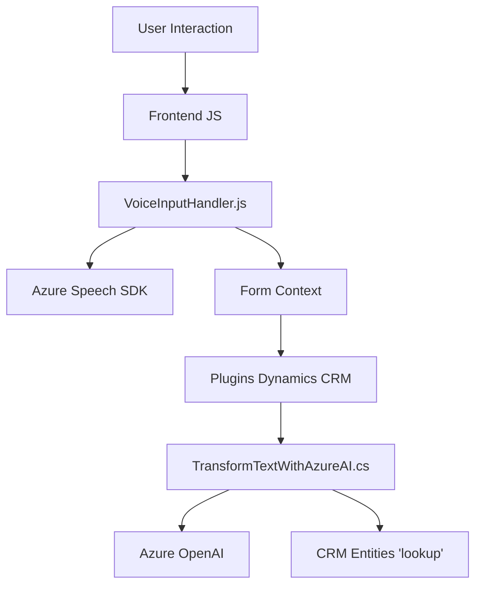

## Breve resumen técnico
La solución presentada muestra una arquitectura que integra múltiples piezas tecnológicas para gestionar la entrada de voz, procesar formularios dinámicamente y conectar servicios externos mediante APIs. Consta de un frontend (JavaScript) y un backend basado en plugins para Dynamics CRM y servicios externos, como el Azure OpenAI y Speech SDK.

---

## Descripción de arquitectura
La solución parece estar diseñada para aplicaciones empresariales, con una arquitectura **n capas** y elementos externos de inteligencia artificial. Se observa una implementación mixta que combina un frontend basado en JavaScript y un backend conectado a entornos Dynamics CRM. La interacción entre componentes utiliza patrones como **SOA** (Service-Oriented Architecture), donde cada servicio cumple una responsabilidad específica (como reconocimiento por voz o transformación de texto).

### Componentes y estructura:
1. **Frontend:**
   - Procesa la entrada de voz/síntesis de voz y gestiona dinámicamente formularios.
   - Se basa en Azure Speech SDK y posiblemente funciona dentro de un navegador.

2. **Backend (Dynamics CRM Plugins):**
   - Realiza transformaciones avanzadas del texto mediante Azure OpenAI utilizando un paradigma de evento en CRM (basado en la interfaz `IPlugin`).
   - Implementa lógica específica para la integración con Dynamics CRM, como búsqueda en campos `lookup` y actualización dinámica de entidades.

---

## Tecnologías usadas
1. **Frontend:**
   - Lenguaje: JavaScript.
   - Dependencias principales: 
     - Azure Speech SDK: Para entrada y síntesis de voz.
     - Dinamismo en aplicaciones empresariales como Dynamics CRM.

2. **Backend:**
   - Lenguaje: C#.
   - Framework/Entorno: Dynamics CRM SDK.
   - Dependencias importantes:
     - Microsoft.Xrm.Sdk: Interacción con entidades CRM.
     - Azure OpenAI: Transformación avanzada de texto en estructura JSON.
     - System.Net.Http: Comunicación HTTP.

3. **Servicios Externos:**
   - **Azure Speech SDK:** Reconocimiento/Síntesis de voz.
   - **Azure OpenAI:** Procesamiento de texto inteligente basado en IA.

---

## Diagrama Mermaid

---

## Conclusión Final
Este repositorio implementa una solución híbrida donde el frontend maneja interacción en tiempo real con voz y formularios, y el backend utiliza plugins de Dynamics CRM para integrar lógica empresarial y servicios avanzados de IA, como el Azure OpenAI. La arquitectura es principalmente **n capas** con integración de servicios externos (SOA), lo que permite escalabilidad, modularidad, y la separación de responsabilidades tecnológica.

Esto sería ideal para aplicaciones empresariales que necesiten entradas de usuarios mediante voz y capacidades de procesamiento con inteligencia artificial, como sistemas CRM que optimicen el flujo de datos y mejoren la experiencia del usuario.