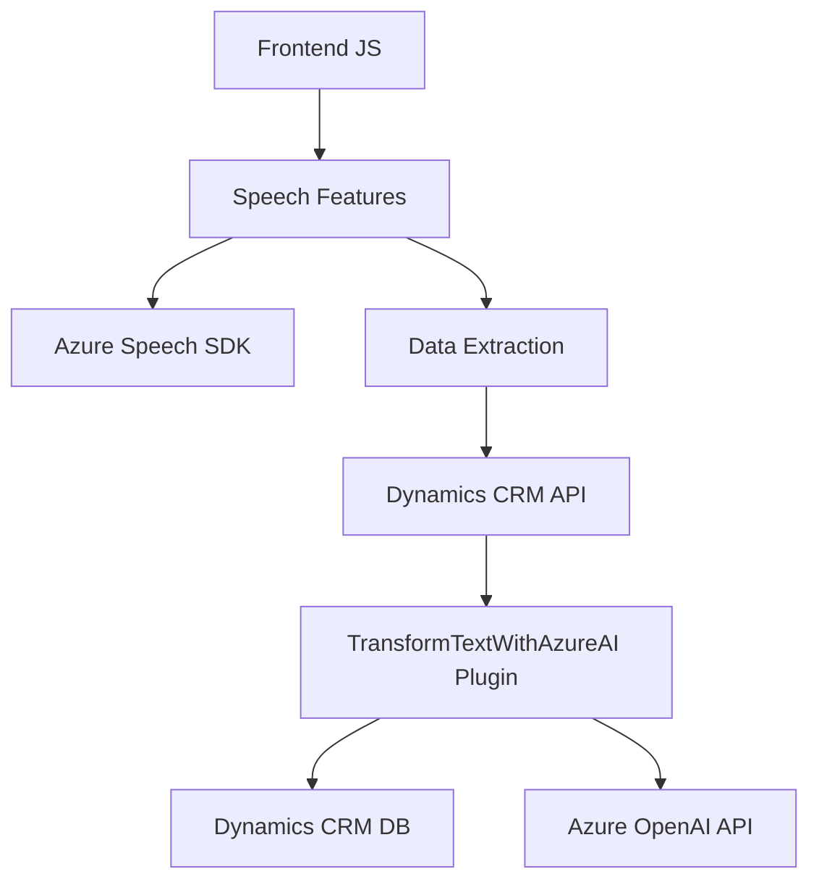

### Breve resumen técnico

El repositorio tiene tres áreas clave:
1. **Frontend (`readForm.js`, `speechForm.js`)**: Implementa funciones para interacción de usuario mediante síntesis y reconocimiento de voz. Utiliza el SDK de Azure Speech junto con el contexto de formularios de Dynamics 365.
2. **Plugin (`TransformTextWithAzureAI.cs`)**: Es un componente backend que cumple con la arquitectura de Microsoft Dynamics CRM siguiendo el patrón de plugin. Actúa como puente entre los datos provenientes del CRM y el servicio de Azure OpenAI para transformar texto.

---

### Descripción de arquitectura

La arquitectura es híbrida, incluye elementos **cliente-servidor** y funcionalidades centradas en **microservicios**. El frontend interactúa directamente con Azure Speech SDK para entrada/salida por voz, y el backend (`TransformTextWithAzureAI.cs`) delega la transformación de texto a Azure OpenAI. Dynamics CRM organiza y gestiona la relación entre estos componentes mediante un diseño basado en **n-capas** (cliente -> CRM -> plugin/API).

---

### Tecnologías usadas

1. **Frontend:**
   - **JavaScript**: Idioma principal para la lógica en el cliente.
   - **Azure Speech SDK**: Uso de la API de speech para síntesis y transcripción.
   - **Dynamics 365 Web API (`Xrm.WebApi`)**: API del lado cliente para manipular datos dentro de formularios de Dynamics.

2. **Backend:**
   - **C# (.NET Framework)**: Implementación del plugin.
   - **Microsoft Dynamics CRM SDK**: Para integración de la lógica dentro de la plataforma Dynamics CRM.
   - **Azure OpenAI**: Servicio utilizado para transformar texto mediante IA.
   - **REST API**: Comunicación entre el plugin y Azure OpenAI.

3. **Patrones:**
   - **Modularidad**: Las funciones están bien separadas por responsabilidad.
   - **Integración de servicios externos**: Delegar trabajo pesado a Azure Speech y OpenAI.
   - **Decoupling & Callback**: Uso de callbacks en el frontend para manejar la carga del SDK.
   - **Plugin Architecture**: Implementación de un modelo definido por Dynamics CRM.

---

### Diagrama Mermaid

---

### Conclusión final

Este repositorio showcases una arquitectura colaborativa basada en tecnologías de Microsoft y Azure. La funcionalidad de síntesis y transcripción de voz en el frontend (JavaScript) está bien estructurada y se integra directamente con un plugin backend en Dynamics CRM. En particular:
- **Frontend** se encarga de interactuar con el usuario, procesar eventos relacionados con formularios y usar servicios externos como Azure Speech SDK.
- **Backend y Plugins:** Dynamics CRM actúa como middleware entre los datos estructurados y servicios IA de Azure OpenAI, siguiendo una arquitectura basada en **n-capas**, con elementos de integración **microservicio** en la interacción con Azure.

Recomendaciones futuras incluyen:
- **Seguridad:** Desplazar claves sensibles (como la API key de Azure OpenAI) a elementos de configuración protegidos en lugar de codificarlos directamente.
- **Escalabilidad:** Considerar migrar hacia un modelo completamente independiente con microservicios en contenedores para desacoplar aún más la lógica del plugin del CRM.