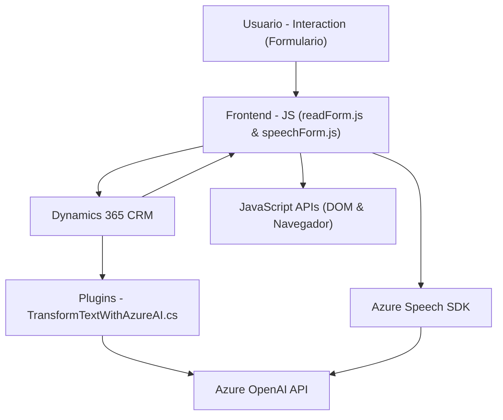

### Resumen técnico
El repositorio presenta una solución que integra **Microsoft Dynamics 365** con Azure APIs y servicios cognitivos para realizar una síntesis y procesamiento avanzado de voz y texto. Está orientado a mejorar la accesibilidad y automatización en la interacción con formularios del frontend (Dynamics UI) y la comunicación con servicios externos (Azure Speech y OpenAI) mediante un plugin y un conjunto de archivos JavaScript.

---

### Descripción de arquitectura

La solución usa una arquitectura híbrida que combina:
1. **Frontend dinámico** (JavaScript): Manejo del contexto de formularios en Dynamics 365 y funciones de interacción con **Azure Speech SDK**.
2. **Plugin backend** (C# para Dynamics 365): Procesamiento avanzado a través de un plugin que utiliza **Azure OpenAI**.
3. **Integración de servicios externos**: La arquitectura aprovecha APIs externas para proporcionar síntesis de voz (Azure Speech) y procesamiento de texto avanzado (Azure OpenAI).

El sistema tiene características de una arquitectura **n capas**:
- **Capa de presentación**: Frontend basado en JavaScript que interactúa con los usuarios.
- **Capa de negocio**: Implementada en plugins de Dynamics 365 utilizando C#.
- **Capa de servicios externos**: Azure Speech y Azure OpenAI procesan solicitudes complejas.

---

### Tecnologías usadas
1. **Frontend**:
   - JavaScript.
   - Azure Speech SDK.
   - APIs del navegador (gestión de formularios y controles).
2. **Backend**:
   - C# (**Microsoft Dynamics Plugins**).
   - **Microsoft Dynamics SDK** (consulta y modificación de datos en el contexto CRM).
3. **Servicios conectados**:
   - **Azure Speech** para reconocimiento y síntesis de voz.
   - **Azure OpenAI** para transformación de datos.
   - HTTP APIs para integración con servicios en la nube.
4. **Otras herramientas y librerías**:
   - `Newtonsoft.Json` y `System.Text.Json` para manejo de JSON.
   - **IPlugin Framework** para la ejecución de plugins en Dynamics 365.

---

### Diagrama Mermaid (válido para GitHub Markdown)

---

### Conclusión final

- Este repositorio forma parte de una **aplicación híbrida** que dota al entorno de Dynamics 365 con capacidades avanzadas de accesibilidad y automatización mediante **procesamiento de voz y texto**.   
- Utiliza un enfoque **modular** y de **n capas**, integrando frontend (JS), servicios externos de Azure y capacidades backend basadas en Dynamics 365 plugins.  
- Es ideal para casos donde la interacción entre usuarios y datos requiere accesibilidad, procesamiento automático y colaboración entre múltiples servicios cloud.  
- La solución demuestra buenas prácticas como modularización, manejo de dependencias dinámicas y uso de un ecosistema homogéneo (Microsoft Azure y Dynamics).