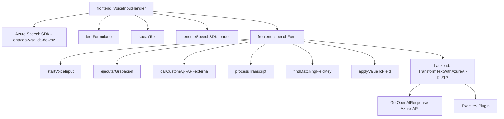

### Breve resumen técnico:
El repositorio contiene varios archivos que implementan integración entre Microsoft Dynamics CRM y servicios de Azure, específicamente para entrada, procesamiento, y síntesis de voz junto con estructuración semántica. Utiliza APIs externas como Azure Speech SDK y Azure OpenAI para interacciones inteligentes. Los patrones modularidad, orientación a servicios, y eventos están presentes en toda la estructura.

---

### Descripción de la arquitectura:
La solución tiene una arquitectura **Service-Oriented Architecture (SOA)** con integración de servicios externos, combinado con **MVC** (Model-View-Controller) en su estructura de lógica en las capas frontend (JavaScript) y backend (C# Plugins). El sistema está dividido en componentes que interactúan mediante APIs y SDKs para realizar tareas específicas, como síntesis de voz y procesamiento de texto con inteligencia artificial.

- **Frontend (JavaScript):**
  Ofrece interacción con Dynamics CRM, donde se extraen datos del formulario e interactúan con usuarios mediante reconocimiento de voz y síntesis. Diseñado modularmente, aplica principios de gestión eficiente de dependencias y separación de responsabilidades.
  
- **Backend (C# Plugin):**
  Realiza transformaciones semánticas del texto para su uso en Dynamics CRM mediante interacción con una API de inteligencia artificial Azure OpenAI. Maneja eventos de ejecución y utiliza dependencias específicas para CRM y servicios externos.

---

### Tecnologías, frameworks y patrones usados:
#### Tecnologías/Frameworks utilizados:
1. **Azure Speech SDK:** Para reconocimiento y síntesis de voz.
2. **Azure OpenAI Service API:** Para procesamiento semántico usando un modelo preentrenado de OpenAI.
3. **Microsoft Dynamics CRM SDK:** Para extender el CRM con lógica personalizada.
4. **JavaScript:** Manipulación del DOM y lógica frontend para interacción con Dynamics CRM.
5. **C# (.NET Framework):** Desarrolla plugins personalizados vinculados a Dynamics CRM y externaliza lógica hacia servicios Azure.
6. **Newtonsoft.Json:** Manejo estructurado de JSON en backend.

#### Patrones de diseño:
1. **Service-Oriented Architecture (SOA):** La integridad del sistema reside en aprovechar servicios Azure y APIs externas.
2. **Modular Design:** Código organizado en bloques funcionales para garantizar escalabilidad y facilitan mantenimiento.
3. **Evento-Driven:** Muchos procesos se ejecutan en función de eventos dinámicos como carga del SDK o disparos de eventos de plugins.
4. **Adapter Pattern:** Comunicación entre Dynamics CRM y Azure APIs mediante conectores.

---

### Dependencias o componentes externos:
1. **Azure Speech Services SDK**:
   - Reconocimiento y síntesis de voz.
   - URL de carga: `https://aka.ms/csspeech/jsbrowserpackageraw`
   - Clave API y región son requeridos como credenciales de integración.

2. **Azure OpenAI Service API**:
   - Utilizada para procesamiento inteligente del texto.
   - Interfaz basada en HTTP con claves de API.

3. **Microsoft Dynamics CRM SDK**:
   - Para la integración de plugins y manipulación del contexto de los formularios (utilización de `IPluginExecutionContext`, etc.).

4. **Newtonsoft.Json**:
   - Serialización y deserialización de objetos JSON en C#.

5. **Frontend JavaScript Libraries**:
   - Bibliotecas internas para manipulación del DOM y Dynamic Script Loading.
   - Xrm.WebApi para integrarse al entorno de CRM.

---

### Diagrama Mermaid válido para GitHub:

---

### Conclusión final:
La solución representa una arquitectura altamente modular basada en SOA, diseñada para enriquecer las funcionalidades de un sistema Microsoft Dynamics CRM. Usa tecnologías modernas como Azure Speech SDK para interacción verbal en tiempo real y Azure OpenAI para procesamiento semántico avanzado. La alta cohesión interna y la separación de responsabilidades hacen que este sistema sea escalable y efectivo para sistemas de automatización empresarial basados en voz y procesamiento de texto.