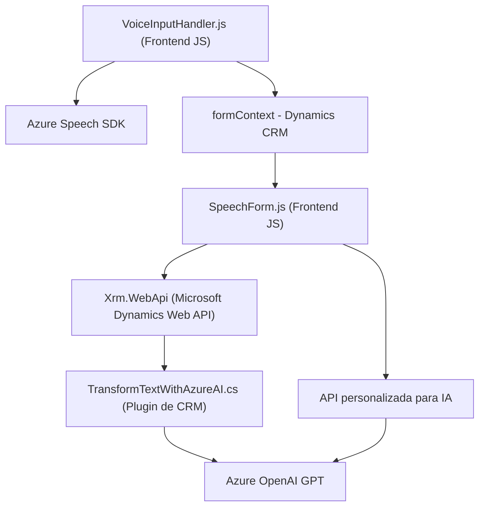

### Resumen técnico
La solución presentada se centra en la implementación de un sistema que integra funcionalidad de voz y procesamiento de texto mediante servicios externos de Microsoft Azure, aplicado en Microsoft Dynamics CRM. Las funcionalidades incluyen:

1. **Entrada y salida de voz** para interactuar con usuarios mediante el **Azure Speech SDK**.
2. **Procesamiento de formularios para Dynamics CRM**, con mapeo entre campos visibles y atributos del formulario.
3. **Integración con Azure AI**, utilizando GPT de OpenAI para normalizar y transformar textos, retornando datos estructurados (formato JSON).

---

### Descripción de arquitectura
La solución emplea una **arquitectura de múltiples capas** basada principalmente en el flujo de control entre un **frontend web**, **backend APIs** y lógica de negocio extendida mediante **plugins de Dynamics CRM**, con una integración profunda al ecosistema de **Microsoft Azure**. Los componentes identificados son altamente modulados y específicos a tareas.

1. **Backend:** Representado por el **plugin de Dynamics CRM** que actúa como un mediador para la transformación de textos mediante Azure OpenAI GPT.
2. **Frontend:** Componente basado en JavaScript que utiliza el SDK de Azure para entrada/salida de voz y actualización directa del formulario en Microsoft Dynamics CRM a través de sus Web APIs.
3. **Servicios:** Comunicación directa con el **Azure Speech SDK** y **Azure OpenAI** para funcionalidades de síntesis de voz y procesamiento inteligente de texto.

#### Patrones fundamentales
- **Modularización:** Las funciones están diseñadas para cumplir tareas específicas con desacoplamiento entre componentes.
- **Arquitectura N capas:** Distinción clara entre los módulos frontend, backend (plugin) y servicios externos en Azure.
- **Integración de servicios externos:** Utilización de SDKs y APIs para interacción con Azure y Dynamics CRM es clave.
- **Asincronía y programación orientada a eventos:** Uso extensivo de `async/await` y promesas para manejar operaciones no bloqueantes, principalmente relacionadas con llamadas a servicios externos.

---

### Tecnologías y componentes usados
1. **Frontend:**  
   - **Azure Speech SDK**: Para manejo de entrada y salida de voz.  
   - **JavaScript**: Desarrollo de lógica frontend, modular y con soporte para promesas y asincronía.  
   - **Microsoft Dynamics CRM context API**: Utilizado para interactuar directamente con los formularios del sistema.  

2. **Backend (Plugin):**  
   - **Microsoft Dynamics CRM SDK**: Interacción con el contexto del CRM mediante `IOrganizationService`, `IPluginExecutionContext` y parámetros de entrada/salida.  
   - **Azure OpenAI GPT:** Transformación de texto mediante modelo AI para generar contenido JSON estructurado.  

3. **Patrones y prácticas:**  
   - **Carga dinámica de dependencias:** El SDK de Azure no se carga de forma predeterminada sino según requerimiento en tiempo de ejecución.  
   - **Integración de servicios de nube/asíncronos:** Uso de HTTP REST para servicios provenientes de Azure.  

---

### Diagrama Mermaid  

---

### Conclusión final
Este repositorio entrega una solución orientada a **automatización de la interacción usuario-aplicación mediante entrada y salida de voz** y transformación estructurada de texto con ayuda de servicios externos, integrados al ecosistema de **Microsoft Dynamics CRM y Azure**. Su arquitectura modular y multicapas asegura separación de responsabilidades y escalabilidad, vista en sus componentes Frontend y Backend.