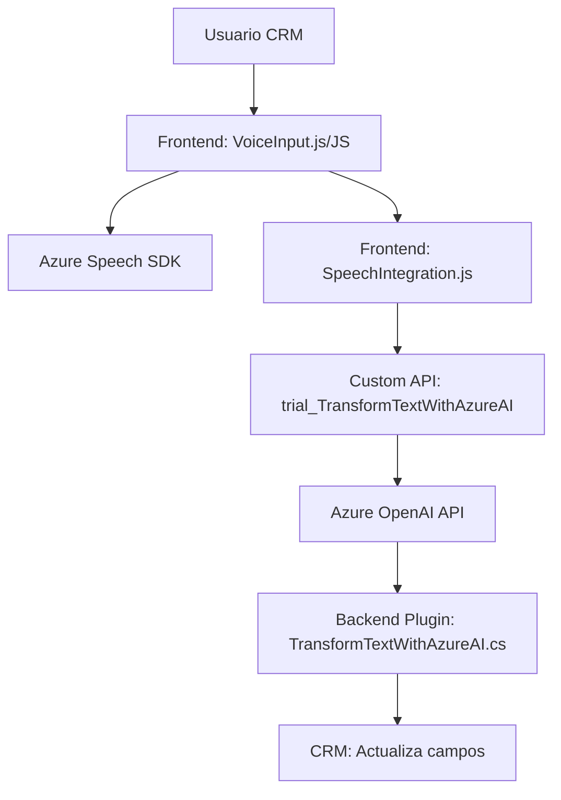

### Breve resumen técnico
Este repositorio contiene componentes de software enfocados a la integración entre sistemas CRM/Dynamics (en el frontend y backend) y servicios de Azure (Azure Speech SDK y Azure OpenAI) para implementar funcionalidades de síntesis y reconocimiento de voz, además de transformación dinámica de texto mediante IA. Las soluciones involucran una estructura híbrida que incluye lógica de plugin en Dynamics, procesamiento externo (API/SDK), y un cliente frontend para la interacción del usuario.

---

### Descripción de arquitectura
La arquitectura puede describirse como **híbrida** y **n-capas** con integración de **API externas**. Es híbrida porque combina elementos de diferentes sistemas: el frontend interactúa directamente con Azure Speech SDK y los datos del CRM; mientras que el backend aprovecha la arquitectura de plugins en Dynamics 365 junto con peticiones hacia Azure OpenAI via API. Esta combinación fomenta modularidad y separación de preocupaciones.

Cada componente:
1. **Frontend (JavaScript)**:
   - Gestión de formularios: extrae datos visibles y sintetiza voz con Azure Speech SDK.
   - Reconocimiento y transcripción de voz: utiliza Azure Speech SDK para identificar el texto y lo procesa para actualizar formularios en CRM.
   - Interacción con APIs auxiliares: se comunica con una Custom API que aplica transformación vía IA.

2. **Backend (C#, plugin)**:
   - Procesa texto utilizando la API de Azure OpenAI para devolver contenido validado y estructurado.
   - Se engancha en la arquitectura de plugins de Dynamics para extender la funcionalidad del sistema.

---

### Tecnologías utilizadas
1. **Frontend (JavaScript)**:
   - **Vanilla JavaScript** para la lógica y DOM manipulación.
   - **Azure Speech SDK**: API de voz para sintetizar texto y reconocer voz.

2. **Backend (C#, Dynamics Plugin)**:
   - **Microsoft Dynamics 365 CRM API**: Extensión del comportamiento del sistema mediante plugins.
   - **Azure OpenAI**: Servicio para transformación de texto en JSON estructurado.
   - **Newtonsoft.Json** y `System.Text.Json`: Manipulación de datos JSON para la interacción entre servicios.
   - .NET Framework/SDK.

3. **Integración con servicios externos**:
   - **Azure Speech SDK**: Interacción directa para reconocimiento y síntesis.
   - **Azure OpenAI API**: Transformación dinámica de texto basado en IA.

---

### Diagrama Mermaid válido para GitHub

---

### Conclusión final
El repositorio refleja una arquitectura híbrida escalable que integra funcionalidad avanzada de síntesis y reconocimiento de voz junto con servicios de procesamiento de texto basado en IA. Esto permite una experiencia mejorada para los usuarios del sistema CRM/Dynamics, automatizando tareas tediosas como la actualización de formularios mediante reconocimiento y transcripción de voz procesada con APIs externas. La solución muestra una adecuada separación de responsabilidades y modularidad en las implementaciones frontend y backend. Sin embargo, podrían mejorarse aspectos como el manejo de errores y la seguridad en las claves API usadas para interactuar con servicios externos.