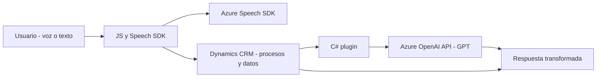

### Breve Resumen Técnico

Este repositorio comprende principalmente tres tipos de archivos:
1. Archivos relacionados con frontend para interacción por voz con formularios usando **Azure Speech SDK**.
2. Plugins específicos para Microsoft Dynamics CRM que integran **Azure OpenAI** para transformación de texto y otros servicios.
3. Una solución orientada a la integración de servicios de voz e inteligencia artificial (IA) dentro de sistemas empresariales para mejorar accesibilidad y automatización.

### Descripción de Arquitectura

La arquitectura general parece emplear **n capas**:
1. **Capa de presentación (Frontend):**
   - Archivos JS (`readForm.js`, `speechForm.js`) implementados para la interacción de usuarios con formularios a través de comandos de voz.
   - Uso de servicios de voz de **Azure Speech SDK** mediante llamadas y respuesta en tiempo real.
   
2. **Capa de lógica de negocio (Plugins):**
   - Implementación de plugins en la plataforma Dynamics CRM usando **C#** (ej.: `TransformTextWithAzureAI.cs`).
   - Los plugins interactúan con servicios externos de Azure como **OpenAI GPT** para procesamiento de texto según normas empresariales específicas.
   
3. **Integración con servicios externos:**
   - Conexión explícita con **Azure Speech SDK** y **Azure OpenAI API**.

Esta solución tiene **componentes de microservicios** gracias al uso del Azure OpenAI API y al lenguaje de programación utilizado para una **integración dinámica con servicios externos**. Sin embargo, la implementación en Dynamics CRM sigue las bases de la arquitectura **n capas**, donde las dependencias entre capas están bien definidas.

### Tecnologías y Frameworks Usados

- **Frontend**:
  - **JavaScript**:
    - Implementación de funciones para manejar eventos y manipular formularios.
  - **Azure Speech SDK**:
    - Entrada de voz y síntesis de texto.

- **Plugins (backend)**:
  - **C#**:
    - Desarrollo en el marco de **Dynamics CRM**.
  - **Azure OpenAI API**:
    - Servicios basados en GPT para procesamiento de texto.

- **Dependencias generales**:
  - **Newtonsoft.Json**: Gestión de datos JSON para respuestas y peticiones.
  - **Dynamics SDK**: Extensión nativa para lógica empresarial en Microsoft Dynamics CRM.
  - **APIs externas (Azure Speech SDK / Azure OpenAI)**: Explicitan el uso de microservicios para procesamiento avanzado.

### Diagrama **Mermaid** para GitHub

El diagrama describe los componentes principales y su interacción con dependencias externas:

### Conclusión Final

Este repositorio establece una solución **híbrida** que combina arquitectura **n capas** con integraciones de **microservicios**. La capa de presentación y lógica de negocio están separadas, mientras las funcionalidades de procesamiento de voz y texto se delegan a servicios externos (Azure Speech SDK y Azure OpenAI). Esto facilita una solución modular y escalable para sistemas empresariales, especialmente en el contexto de interacción mediante reconocimiento de lenguaje natural y automatización de tareas.

Para optimizar, se podría:
1. Refactorizar la lógica redundante en las funciones de JS y C# (ej.: métodos de carga condicional, valores legibles, conversiones).
2. Implementar medidas de seguridad adecuadas para gestionar claves de API y variables de configuración.