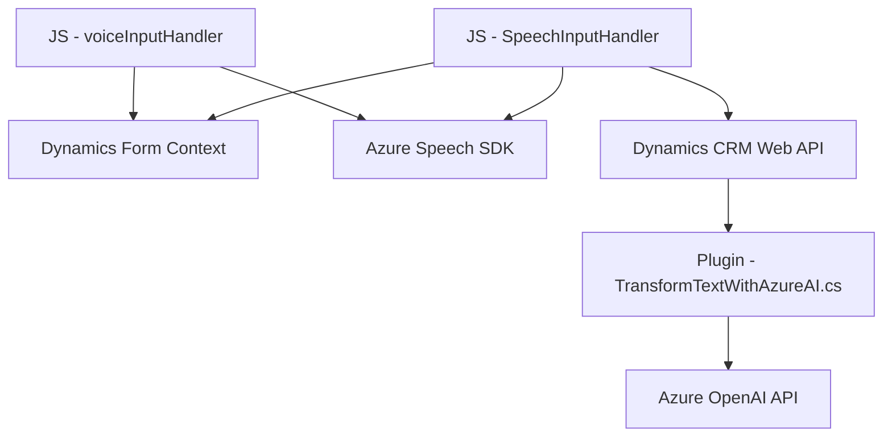

# Breve resumen técnico:
El repositorio define una solución compuesta por un frontend (JavaScript y Dynamics CRM) y un plugin backend (C#) que interactúan con servicios de Azure (Speech SDK y OpenAI) y un Dynamics CRM para la gestión e integración de datos. Está diseñada para procesar datos mediante reconocimiento de voz, síntesis de texto a voz, y transformación de datos mediante inteligencia artificial. El sistema incluye un enfoque modular tanto en el frontend como en el backend, con una arquitectura orientada a servicios y eventos.

---

# Descripción de arquitectura:
La solución sigue un enfoque de **arquitectura de n capas** con elementos de **microservicios**:
1. **Capa de presentación:** Compuesta por el frontend en JavaScript, que proporciona interacción con usuarios (como formularios y reconocimiento de voz).
2. **Lógica de negocio:** Implementada principalmente en los _plugins_ de Dynamics CRM en C#, que procesan datos y delegan a servicios externos.
3. **Capa de datos:** Constituida por el almacenamiento y manejo de datos en la plataforma Dynamics CRM, junto con consultas y manipulación de registros.
4. **Capa de integración:** La solución utiliza SDK y APIs externas (Azure Speech SDK, Azure OpenAI y Dynamics Web API) con un enfoque hacia servicios REST y cargas condicionales para demandas específicas.

---

# Tecnologías usadas:
Las principales tecnologías en este proyecto son:
- **Frontend:**  
  - **JavaScript:** Para implementar la lógica de reconocimiento de voz, síntesis y procesamiento de formularios.  
  - **Azure Speech SDK:** Para reconocer y sintetizar voz, por medio de un cliente web.
  - **Dynamics CRM JavaScript SDK:** Para manejar el contexto del formulario y sus campos.
  - **HTTP Requests:** Para integración con APIs como Azure AI.

- **Backend:**  
  - **C#** (con .NET Framework): Implementa un plugin que extiende la lógica de Dynamics CRM.  
  - **Microsoft Dynamics CRM SDK:** Para integrar la lógica de negocio con el CRM.  
  - **Azure OpenAI API:** Para utilizar modelos de IA (GPT-4) mediante peticiones HTTP REST.  
  - **JSON y propuestas de normativa:** Para estructuración y envío de datos.  

### Patrones utilizados:
- **Modularidad:** Divisiones claras entre funciones y responsabilidad.  
- **Event-driven:** Basado en eventos del sistema Dynamics CRM y callbacks en el frontend.  
- **Integración de SDK y APIs:** Aprovechando servicios externos, como Azure Speech SDK y Azure OpenAI API.  
- **RESTful communication:** Uso de peticiones HTTP para interactuar con servicios externos.  
- **n-Capas:** Separación lógica en frontend, backend, servicio y capa de datos en múltiples capas.

---

# Diagrama **Mermaid** válido para GitHub:

---

# Conclusión final:
La solución representa un sistema basado en **n capas** con integración de servicios de reconocimiento de voz y procesamiento de texto mediante IA, orientado a la gestión inteligente de formularios en Dynamics CRM. Se distribuyen responsabilidades separadamente entre el frontend (para interacción con usuarios y síntesis/reconocimiento de voz) y el backend (para transformación avanzada vía Azure OpenAI). La integración con SDKs y APIs impulsadas por Azure refleja un diseño moderno y flexible utilizando tecnologías líderes en el mercado.